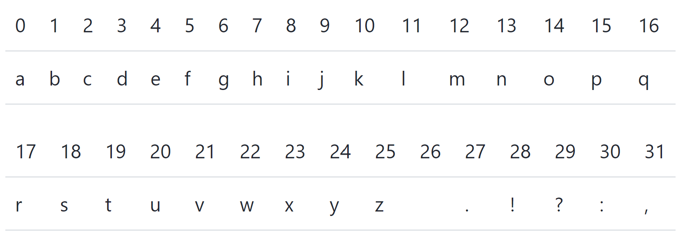
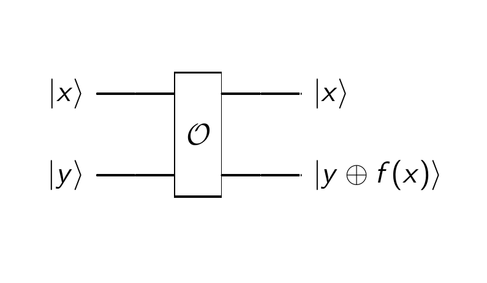

.. _1stprogramming:

Easy Quantum Programming with Qrisp
===================================

Now that we had a first look at general rules of quantum computing, we
finally stop beating around the bush and introduce Qrisp to you. Qrisp
is a high-level quantum programming language, which means that you don’t
need to deal with the underlying qubit management and can just program
away. We highly encourage you to try out the coding examples yourself,
to get a good grasp of what Qrisp is about. But enough talking, let’s
dive right in!

Repetition: the QuantumVariable
-------------------------------

In :ref:`Baby's first Quantum Computing <babys_first_qc>`, we first learned about
the QuantumVariable. Let’s recap what we already know: It is the main
building block of Qrisp algorithms, initialized with the number of
qubits and inherits to other classes. We initialize a QuantumVariable
with:

.. code:: python

    from qrisp import QuantumVariable
    qv = QuantumVariable(5) 

You can now call gate applications on the whole variable or specific
qubits.

.. code:: python

   from qrisp import h, x
   h(qv)       # apply Hadamard gate to all qubits of qv 
   x(qv[3])      # apply X gate only on the 4th qubit (we start all indices with 0)
   print(qv.qs)    # see the circuit for yourself 

We can also delete this variable and free up the qubits for later use:

.. code:: python

   qv.delete(verify = True)

By using ``verify = True`` we let Qrisp check for possible entanglements
before deleting. However, you don’t have to do this, especially in
complicated algorithms this takes a lot of computational power and time.
When verify is set to true, only qubits in the state :math:`\ket 0` get
deleted. This can be helpful during debugging, since a successful
uncomputation should guarantee that.

| But what is **uncomputation**? During uncomputation, all auxiliary
  qubits are reset to their original state. This is important to delete
  unwanted information and avoid errors.
| With Qrisp, the ``@auto_uncompute`` command is used for functions.
  However, care must be taken to ensure that the quantum gate is qFree,
  i.e. that a superposition is neither created nor destroyed.
| To perform the uncomputation with Qrisp, we use ``@auto_uncompute`` and
  ``@gate_wrap``. ``@gate_wrap`` is used in order to be able to use a non-qFree
  object for uncomputation anyway.

In our example, the error “Exception: Tried to delete qubits not in
:math:`\ket{0}` state” will be raised, since we didn’t do any
uncomputation. We can fix that by writing our code into a function that
is always uncomputed:

.. code:: python

   from qrisp import auto_uncompute

   @auto_uncompute
   def ourfirstfunction(qv):
       h(qv)       # apply Hadamard gate to all qubits of qv
       x(qv[3])      # apply X gate only on the 4th qubit
       
   ourfirstfunction(qv)
   print(qv)

| The ``auto_uncompute`` decorator, as the name suggests, automatically
  uncomputes all used variables in the function. (If youre not familiar
  with the concept of the decorator: you can imagine it as a bigger
  function, that takes a smaller function as input and modifies it. In
  this example, our self-defined function ``ourfirstfunction`` gets
  altered to automatically uncompute the qubits.) In addition, it also
  includes the delete method, so now we don’t need to worry about that.
  Uncomputation is the quantum equivalent of garbage collection, the
  process of freeing up used (qu)bits, to reuse them later. However, the
  deleting of qubits isn’t an easy task, which is why we automated the
  job for you. Most times, it applies the inverse steps of the
  algorithm. There is also `a more clever way <https://arxiv.org/abs/2307.11417>`_ to do that, which is implemented in Qrisps ``auto_uncompute``
  decorator.
| Another option is to call the ``uncompute()`` method of the
  QuantumVariable class:

.. code:: python

   def ourfirstfunction(qv):
       local_result = QuantumVariable(5)
       h(qv)       # apply Hadamard gate onto all qubits of qv
       cx(qv, local_result)
       print( local_result)
       x(qv[3])      # apply X gate only on the 4th qubit
       local_result.uncompute()

   ourfirstfunction(qv)
   print(qv)

Keep in mind that after uncomputation, you cannot use the
QuantumVariable anymore, since we detangle and therefore change the
qubit. This is also the reason why we didn’t uncompute ``qv`` in this
example:

.. code:: python

   from qrisp import QuantumVariable

   qv = QuantumVariable(5)

   from qrisp import h, x

   def ourfirstfunction(qv):
       h(qv)       # apply Hadamard gate onto all qubits of qv
       x(qv)
       x(qv[3])      # apply X gate only on the 4th qubit
       qv.uncompute()

   ourfirstfunction(qv)
   h(qv)
   print(qv)

::

   Exception: Tried to uncompute non-qfree instruction h(Qubit(qv_0.4))

“Hello World!” but Quantum!
---------------------------

We also learned in :ref:`the last chapter <intro_qrisp>` that the
QuantumVariable is the super class of many more quantum classes. Now, we
are looking at one of them: the QuantumChar. The initialization is quite
similar to the QuantumVariable:

.. code:: python

   from qrisp import QuantumChar 
   q_ch = QuantumChar() # declaration 
   q_ch[:] = "q" # initialization

This is fine so far, but quite often we want to use more than one
character and ideally also consecutively. For this purpose, we could
create an array of QuantumChars or we simply use the already implemented
QuantumString class (which is nothing else than a QuantumArray of
QuantumChars). Let’s take a look on how to use this class (we have
already done this before, too):

.. code:: python

   from qrisp import QuantumString # we already took care of the array compiling 
   q_str = QuantumString(size = len("hello world! ")) # declaration 
   q_str[:] = "hello world! "  # initialization 
   print(q_str)

Congrats! You just greeted the quantum world all by yourself, welcome to
the club! Now let’s make things more interesting and perform some
operations on your previously created QuantumString:

.. code:: python

   q_str_1 = QuantumString()
   q_str_1[:] = " its me, hi!"
   q_str += q_str_1    # classic concatenation 
   print(q_str)

We glued together our new and previous string via a classic
concatenation. As you can see, you don’t have to solely rely on quantum
operations, but can also perform classical actions.

On default, a QuantumChar is initialized as a NISQ Char. That way, it
can only take on a limited set of values, but also saves qubits.

   nisq_mode

If you want to use capitalize letters or include more signs, you need to
set ``nisq_char = False``; however this will considerably increase the
qubit count from 5 to 8 for EACH character. So it is advisable to only
use them when necessary. This will encode the char with the full Ascii
code character:

|Alt text| Source: “Table of ASCII values”, Wikimedia Comons,
https://commons.wikimedia.org/wiki/File:ASCII-Table-wide.svg

The standard Ascii code includes 128 characters and therefore needs 7
(qu)bits. The nisq characters additionally support the extended Ascii
Code, which in Europe contains language specific letters like ä and ê,
and additional symbols.

Note that if you want a readable output, you can only concatenate
nisq_char strings or non niqs_char strings.

.. code:: python

   q_str_2 = QuantumString(size = len("Hello world!"), nisq_char=False)    # declaration
   q_str_2[:] = "Hello world!"  # initialization
   print(q_str_2)
   q_str_3 = QuantumString(nisq_char=False) 
   q_str_3[:] = " It's me, hi!"
   q_str_2 += q_str_3  # you can try to concatenate q_str_2 with q_str_1 and see what happens 
   print(q_str_2)
   print(len(q_str_1.qs.qubits))       # length of nisq_char string 
   print(len(q_str_3.qs.qubits))       # length of non nisq_char string 

| Now it gets to the fun part: we can also apply quantum operations to
  our string. Our star is the Hadamard gate: We introduced it formally
  in :ref:`the last chapter <gates>`, and now you can see it in full action.
  Also commonly used is the Pauli X gate.
| Both gates need to be explicitly imported, you can apply them on a
  specific qubit by writing it in the brackets behind the gate of your
  choice.

.. code:: python

   from qrisp import QuantumString
   q_str_h = QuantumString(size = len("Superposition action"), nisq_char=False)  
   q_str_h[:] = "Superposition action"  

   from qrisp import h
   h(q_str_h[5][0]) # superposition in the 1st qubit of the 6th letter of the string q_str_h
   print(q_str_h)

   from qrisp import x
   q_str_x = QuantumString()
   q_str_x[:] = "pauli x gate"
   x(q_str_x[6][4])    # the x gate performs a bitshift. The result is calculated in binary and translated via Ascii code
   print(q_str_x)

Both gates need two values from the string: the first is the position in
the string (so, the char) that the Hadamard gate is applied to. The
second value indicates the qubit which is put into superposition. We
choose the first qubit of the 6th letter (since numbering starts with 0)
and get the output:

``{'Superposition action': 0.5, 'Superqosition action': 0.5}``

The 6th letter p is represented by the number 112 in Ascii code,
01110000 in binary. The Hadamard gate does its usual job and puts the
qubit (that was previously 0) in an equal superposition of 0 and 1. This
leads to two different results: 01110000 and 01110001, the latter
converts to 113 and the letter q in the Ascii table.

The second example works quite similar: We can apply an X-gate to invert
the encoding of any specific qubit. The first value, in this case 6,
indicates the position on the array. Since in programming we start
counting at 0, we look at the 7th character in our string, which is the
``x``. With the second value, we address the qubit of this QuantumChar,
in this case the 5th qubit. The value of this qubit is changed and the
new letter is calculated. This gives us ``{'pauli h gate': 1.0}`` as
output. You get this result by using the Ascii code and binary
representation as before.

| You can also inspect the qubit structure yourself with
  ``print(q_str.qs)``.
| Keep in mind that we discovered earlier that strings in NISQ mode take
  up less qubits, which obviously means less qubit positions you can put
  into superposition.

Since QuantumStrings are built on QuantumChars, we can also apply the
same logic to them:

.. code:: python

   from qrisp import QuantumChar, cx, h
   qch_1 = QuantumChar()
   qch_1[:] = 'q'
   qch_2 = QuantumChar()
   qch_2[:] = 'c'
   h(qch_1[0])     # superposition on the 1st qubit: {'q': 0.5, 'r': 0.5}
   cx(qch_1[0], qch_2[0])      # entangle chars 
   print(qch_2)        # {'c': 0.5, 'd': 0.5}
   print(qch_1.qs.statevector())      # sqrt(2)*(|c>*|q> + |d>*|r>)/2

We use the structure of Hadamard gate and CNOT (``cx``) from :ref:`the last chapter <gates>` to entangle two qubits. 
The statevector shows
us that because of the Hadamard gate on the control qubit, we have the
options ``q`` (unchanged) and ``r`` (shifted). Based on that, the
target qubit also has two options: ``c`` with ``q`` as control (both
unchanged) and ``d`` from ``r`` (both shifted). The factor
:math:`\frac{\sqrt{2}}{2}` normalizes the statevector to 1.

The QuantumFloat
----------------

Another class inheriting from the QuantumVariable is the QuantumFloat.
It is the only class to represent numbers, as we don’t have a QuantumInt
or QuantumDouble. But don’t worry, you will be able to meet all your
needs with the QuantumFloat. It is initialized like any float: the first
argument indicates the mantissa qubits and second the exponent to the
basis 2 for precision (meaning how big are the steps between the
possible values). ``signed`` indicates if positive or negative numbers
are taken as value. For ``QuantumFloat(m, e)``, there are :math:`2^{m}`
different numbers it can represent.

.. code:: python

   from qrisp import QuantumFloat
   qf_0 = QuantumFloat(3, -1, signed=True)          # declaration 
   for i in range(2**qf_0.size): print(qf_0.decoder(i))  # shows all possible values for qf_0
   qf_0 = -3.5        # initialization 

If you set ``signed=True``, the possible values start at the smallest
negative number :math:`- 2^{3} \cdot 2^{-1} = - 4.0`.

All known operations like addition and division can be performed as
usual in the python syntax. Keep in mind that division and inversion are
approximated results.

.. code:: python

   qf_1 = QuantumFloat(3,-1)
   qf_2 = QuantumFloat(3, -2)
   qf_1[:] = 0.5
   qf_2[:] = 1.25
   qf_3 = qf_1/qf_2            
   print("division: " + str(qf_3))
   qf_3 = qf_1 * qf_2
   print("mutliplication: "+ str(qf_3) )
   qf_3 = qf_1 + qf_2
   print("addition: "+ str(qf_3))
   qf_3 = qf_1 - qf_2
   print("subtraction: "+str( qf_3))
   qf_3= qf_1**-1 
   print("inverse of qf_1" + str(qf_3))

Of course, we can also apply our beloved Hadamard gate. The number
indicates where the Hadamard gate is applied, and therefore how many
states are in superposition. For ``h(qv[:x])``, there are :math:`2^x`
different states in superposition, since you apply the gate on all
qubits up to the xth qubit. Their values will be determined by the
precision of the QuantumFloat that the Hadamard gate is applied to, and
the values will start at the value of the QuantumFloat:

.. code:: python

   qf_1 = QuantumFloat(3, -1)
   qf_1[:] = 1.0       # 1.0 will be the starting point for the states in superposition, counting up with the precision 0.5
   print(qf_1)
   h(qf_1[2])        # you can play around with different values other than 2
   #h(qf_1[:2])     # try both versions
   print(qf_1)
   print(qf_1.qs)      # Again, have a look at the circuit to understand it better

| If you write ``h(qf_1[2])``, the number given as argument (here 2) in
  combination with the precision of the QuantumVariable determine the
  size of the steps. In this example, the steps are
  :math:`2^{-1} *2^2 = 2` int big.
| However, if you use the form ``h(qf-1[:2])``, the argument not only
  specifies how many states will be in an equal superpostiion. The step
  size is only influenced by the precision of the QuantumFloat. In the
  example above, that equals :math:`2^{-1}` precision with :math:`2^2`
  states.

::

   {1.0: 1.0}
   {0.0: 0.25, 0.5: 0.25, 1.0: 0.25, 1.5: 0.25}
   QuantumCircuit:
   ---------------
           ┌───┐     
   qf_0.0: ┤ H ├─────
           ├───┤┌───┐
   qf_0.1: ┤ X ├┤ H ├
           └───┘└───┘
   qf_0.2: ──────────
                     
   Live QuantumVariables:
   ----------------------
   QuantumFloat qf_0

And all previous operations are still possible in superposition:

.. code:: python

   from qrisp import QuantumFloat, h
   qf_2 = QuantumFloat(4, -2)
   qf_2[:] = 0.25
   qf_3 = QuantumFloat(3, -1)
   qf_3 = 1.5
   h(qf_2[2])
   qf_sum = qf_3 + qf_2  
   print(qf_sum)

Most of these structures like floats, the Ascii code and even the
quantum gates were not new (at least since last chapter) and some are
even very similar to classical computing. The next section will bring
you a rather new concept: the quantum oracle.

Quantum Oracle
--------------

| An oracle can be seen as a black box, that takes some input and
  returns an output, quite similar to classical functions or methods. To
  make the “black box” concept a little more trustworthy, we can define
  them as a function :math:`f : \{0, 1\}^n \rightarrow \{0,1\}^m`,
  meaning that a bitstring of arbitrary length is modified into another
  bitstring (that can be of a different length). Technically, oracles
  are allowed to stay black boxes, meaning that we don’t need to exactly
  know what’s going on to use them in an algorithm. Practically, you
  should know what you’re implementing.
| At many times, the oracle will be unknown and given to you to use as
  imput for an algorithm. You could imagine the oracle as some locked
  box you are trying to open via the algorithm to know what’s inside.

| At this point we should recall the reversibility of all quantum
  operations and that we therefore use unitary matrices, which obviously
  also applies to oracles. Because of this, it is unfortunately not
  possible to define an oracle as :math:`O(\ket x) = \ket{f(x)}`, since
  there technically could be an :math:`\ket y` so that
  :math:`\ket{f(x)} = \ket{f(y)}` and the oracle wouldn’t be reversible
  anymore. We hence need a way to preserve the input :math:`\ket x`. To
  do that, we introduce a second register:
  :math:`O(\ket{x} \otimes\ket{y}) = \ket{x}  \otimes \ket{y \oplus f(x)}`,
  with :math:`x \hspace{0.1 cm}\epsilon  \hspace{0.1 cm}\{0, 1\}^n`,
  :math:`y \hspace{0.1 cm} \epsilon \hspace{0.1 cm} \{0,1\}^m` (notice
  that the registers can be of different size) and :math:`O` as the
  oracle with its function :math:`f(x)`. This might look weird now, but
  when you see an example on :math:`\ket y = \ket 0` it might be
  clearer:
| :math:`U (\ket x\ket 0) = \ket x \ket{ 0 \otimes f(x)} = \ket x \ket{f(x)}`.
  Here, :math:`\ket y` acts as an ancilla qubit without much use, but it
  can also be used to induce phase kickback when
  :math:`\ket y = \ket -`\ (more on that in the later algorithm).
| For further uses, we differentiate between boolean oracles and phase
  oracles.

   oracle

| A **phase oracle** applies a phase onto the input state. Is the input
  state a computational basis state ( e.g. :math:`\ket{0}` or
  :math:`\ket{1}`), it only adds a non-measurable global phase. Is the
  input state in superposition, we get a :ref:`relative phase <phases>` that influences
  the overall result. This is why most algorithms use a
  Hadamard gate to put the concerning qubits into superposition before
  calling the subroutine.
| The general form of a phase oracle of often described as:
  :math:`O(\ket x) = (-1)^{f(x)} \ket x`.
| A famous algorithm using a phase oracle is Grover’s search algorithm,
  that we will have a look at in a future chapter.

Another example is a **boolean oracle**, since it doesn’t change the
phase but returns a truth value. It can be defined as:
:math:`O(\ket{x, 0}) = \ket{x, f(x)}`, and therefore requires ancilla
qubits to store the output. A well known algorithm involving a boolean
oracle is the Deutsch-Jozsa algorithm, which we will have a look at now.

Deutsch-Jozsa Algorithm
-----------------------

Now, we want to actually use these oracles. Most times, their benefit
when implemented alone is… arguable, but we can integrate them into a
bigger algorithm. Our first oracle, the Deutsch-Jozsa algorithm, is a
simple routine to demonstrate the superiority of quantum computing by
offering an exponentional speedup compared to possible classical
solutions.

| In the problem solved by Deutsch-Jozsa, we receive a black box oracle,
  that takes a bitstring of arbitrary length as an input and returns
  either 0 or 1: :math:`f: \{0, 1\}^n \rightarrow \{0,1\}.` The output
  stems from a boolean function :math:`g: \{0, 1\} \rightarrow \{0,1\}`;
  that is either constant (same output value regardless of input) or
  balanced (50% output 0, 50% output 1). We don’t know anything else
  about :math:`g` (hence it is a black box) and our goal is to determine
  in which category the function belongs. Classically, you would have to
  send at least two queries, for input value 0 and 1. (If we expand to
  :math:`N` possible inputs, we generally need :math:`\frac{N}{2}+1`
  queries). If both are the same, the function is constant, but you
  couldn’t determine that with only one query.
| The quantum oracle however has an incredible runtime of :math:`O(1)`,
  no matter the input size. The secret lies in utilizing the Hadamard
  gate and an auxiliary qubit. For an input of length 1, we therefore
  initialize 2 qubits: one in the state :math:`\ket 0`, the auxiliary
  qubit in the state :math:`\ket 1`. We start by using a Hadamard gate
  to put our query in all possible states at once (I know, we said
  before quantum computing won’t solve all our problems by doing this…
  let it slide this one time).

| Now, the black box oracle is applied, taking all qubits as input. The
  input :math:`\ket x \ket y` (x bitstring, y auxiliary qubit) is
  transformed to :math:`\ket x \ket{ y\otimes f(x)}` via the oracle,
  with :math:`\otimes` as addition modulo 2.
| Wait, modulo 2? For now, we don’t have to worry about that. This step
  is ensuring that the only numbers we work with are 0 and 1 (we are
  staying in a mathematical group, if you are a nerd).

With this initialization, we ensure that :ref:`phase kickback <kickback>` occurs. By
applying the Hadamard gate to the auxiliary qubit in :math:`\ket 1`, it
is transformed to :math:`\ket -`. Using it now as input to the oracle
with the bitstring qubit, we get the phase kickback and the value of :math:`f(x)` influences the outcome of
:math:`\ket y`. To understand this in depth, let’s have a look at the
mathematics when the oracle is applied:

| :math:`O(\ket x \ket y)=\frac{1}{\sqrt{2}}(O(\ket x\ket 0) - O(\ket x\ket 1))`,
| because :math:`\ket y = \frac{1}{\sqrt{2}}\ket 0 -\ket 1`. Since
  :math:`\ket x` is also in superposition, we can substitute that to
| :math:`\frac{1}{\sqrt{2}}(O((\frac{1}{\sqrt{2}}\ket 0 + \ket 1) \ket 0) - O((\frac{1}{\sqrt{2}}\ket 0 + \ket 1)\ket 1))`
| Next, we apply the oracle
  :math:`O(\ket x \ket y)= \ket x \ket{y \otimes f(x)}`:
| :math:`\frac{1}{\sqrt{2}}(( \frac{1}{\sqrt 2}(\ket 0 + \ket 1) \ket{ 0\otimes f(x)}) - (\frac{1}{\sqrt 2}(\ket 0 + \ket 1) \ket{ 1\otimes f(x)}))=`
  :math:`\frac{1}{2}(\ket 0 \ket{ 0 \otimes f(x)} +\ket 1 \ket{ 0\otimes f(x)} - \ket 0 \ket{ 1 \otimes f(x)} - \ket 1 \ket{ 1 \otimes f(x)})`

What is :math:`f(x)`? The next calculations depend on wether
:math:`f(x)` is constant or balanced. Since every possible solution is
different, the output tells us which it is.

| 1st case: constant oracle with :math:`f(0) =  f(1) = 0`
| :math:`\frac{1}{2}(\ket 0 \ket{ 0 \otimes 0} +\ket 1 \ket{ 0\otimes 0} - \ket 0 \ket{ 1 \otimes 0} - \ket 1 \ket{ 1 \otimes 0})`
| Now, we can apply that :math:`\otimes` is addition module 2, meaning
  that we have these four possible results:
| :math:`0 \otimes 0 = 0`
| :math:`0 \otimes 1 = 1`
| :math:`1 \otimes 0= 1`
| :math:`1 \otimes 1= 0`
| So our equation simplifies to:
| :math:`\frac{1}{2}(\ket 0 \ket{0} +\ket 1 \ket{ 0} - \ket 0 \ket{ 1} - \ket 1 \ket{ 1})=`
  :math:`\frac{1}{2} (\ket 0 (\ket 0 - \ket 1) + \ket 1 (\ket 0 - \ket 1)) = \frac{1}{\sqrt{2}}(\ket 0 + \ket 1)\frac{1}{\sqrt{2}}(\ket 0 - \ket 1)`
| If you recall the statevector form of the states :math:`\ket +` and
  :math:`\ket -`, you will find that this equals to
| :math:`\ket + \ket -`

| 2nd case: constant oracle with :math:`f(x) = f(1) = 1`
| Analogous to the first case, we can solve this by the same steps, we
  just have to be careful to substitute :math:`f(x)` different now:
| :math:`\frac{1}{2}(\ket 0 \ket{ 0 \otimes 1} +\ket 1 \ket{ 0\otimes1} - \ket 0 \ket{ 1 \otimes 1} - \ket 1 \ket{ 1 \otimes 1})`
| We again perform the addition mod 2:
| :math:`\frac{1}{2}(\ket 0 \ket{ 1} +\ket 1 \ket{1} - \ket 0 \ket{ 0} - \ket 1 \ket{0})`
  :math:`=\frac{1}{\sqrt 2} (\ket 0 + \ket 1) - \frac{1}{\sqrt{2}} (\ket 0 - \ket 1) = -\ket + \ket -`
| Note that the global phase of :math:`-1` now belongs to the first
  qubit because of phase kickback.

| 3rd case: balanced oracle with :math:`f(0) \neq f(1): f(0) = 0` and
  :math:`f(1) = 1`
| This one might look tricker, since we have to identify when to
  substitue 0 and 1. To correctly identify the :math:`x` in
  :math:`f(x)`, we simply have a look at the previous qubit, since the
  oracle output is in the form :math:`\ket x \ket{ y \otimes f(x)}`:
  :math:`\frac{1}{2}(\ket 0 \ket{ 0 \otimes 0} +\ket 1 \ket{ 0\otimes 1} - \ket 0 \ket{ 1 \otimes 0} - \ket 1 \ket{ 1 \otimes 1})`
| perform addition modulo 2:
| :math:`\frac{1}{2}(\ket 0 \ket{  0} +\ket 1 \ket{ 1} - \ket 0 \ket{ 1 } - \ket 1 \ket{0})`
| And summarize the states:
| :math:`\frac{1}{2} (\ket 0 (\ket 0 - \ket 1) - \ket 1(\ket 0 - \ket 1))=`
  :math:`\frac{1}{\sqrt 2} (\ket 0 - \ket 1)\frac{1}{\sqrt 2} (\ket 0 - \ket 1) = \ket - \ket -`

| 4th case: balanced oracle with :math:`f(0) = 1` and :math:`f(1) = 0`
| :math:`\frac{1}{2}(\ket 0 \ket{ 0 \otimes 1} +\ket 1 \ket{ 0\otimes 0} - \ket 0 \ket{ 1 \otimes 1} - \ket 1 \ket{ 1 \otimes 0})=`
  :math:`\frac{1}{2}(\ket 0 \ket{ 1} +\ket 1 \ket{ 0} - \ket 0 \ket{0} - \ket 1 \ket{ 1 })=\frac{1}{2}( - \ket 0 (\ket 0 - \ket 1) + \ket 1(\ket 0 - \ket 1))=- \ket - \ket -`

In summary, for constant oracles the output is of the form
:math:`\pm \ket + \ket -`, while a balanced oracle spits out
:math:`\pm \ket - \ket -`.

If the function is constant, the input has no effect on the auxiliary
qubit. In a balanced function, the qubits get entangled (in pratice,
this is often implemented with a CNOT gate, with the bitstring as
control and auxiliary as target). This enables phase kickback, which
changes the control qubit, in our case the bitstring, if the target is
an eigenvalue of CNOT. Why do we want this? Phase kickback alters, as
the name suggests, the relative phase, hence the probability amplitudes
are not changed and we comply with the rules for an oracle. But the
phase can be measured and offers us the information we need to detect if
the function is constant or balanced. This will show up in our next
step, where we apply a Hadamard gate to the whole register again, to
uncompute the previous Hadamard gate (A Hadamard gate’s inverse is
itself). The bitstring qubit(s) are now measured and the output is
nicely readable.

| 1st case constant oracle:
| :math:`H(\pm \ket +) = \pm H(\frac{1}{\sqrt 2} \ket 0 + \ket 1) = \pm \frac{1}{2} (\ket 0 + \ket 1) \pm \frac{1}{2} (\ket 0 - \ket 1) = \ket 0`

| 2nd case balanced oracle:
| :math:`H(\pm \ket -) = \pm H(\frac{1}{\sqrt 2} \ket 0 - \ket 1) = \pm \frac{1}{2} (\ket 0 + \ket 1) \mp \frac{1}{2} (\ket 0 - \ket 1) = \ket 1`

Now we come to the fireworks of this section: the implementation with
Qrisp. To construct the oracle, you can use all quantum gates, the ones
that we have introduced so far and all others of course. The
implementation in Qrisp is similar to a function in python:

.. code:: python

   from qrisp import QuantumVariable, h, x

   bitstring = QuantumVariable(1) # assuming that the oracle takes one (qu)bit as input
   ancilla = QuantumVariable(1)
   x(ancilla)
   h(bitstring)
   h(ancilla)
   #print("ancilla before oracle", ancilla.qs.statevector())   #you can try these for your own understanding 
   #print("register before oracle", bitstring.qs.statevector())

   def balanced_function(qv, ancilla):     # in practice this oracle would be unknown
       x(qv)
       x(ancilla)
       return qv, ancilla

   balanced_function(bitstring, ancilla)
   h(bitstring)
   h(ancilla)
   print(bitstring) # 0 means balanced, 1 is constant

.. code:: python

   {'0': 1.0}

The problem originated as the Deutsch oracle, where the bitstring length
:math:`n =1`, and got extended to an arbitrary input length later on (So
technically, we implemented Deutsch’s algorithm in our example).

Congratulations! You have now learned your first real quantum algorithm,
here’s a digital pat on the back. If you just can’t get enough, dive
into the next example with me, which takes this newly learned algorithm
and finds a different usage.

Bernstein Vazirani algorithm
----------------------------

The idea of the Deutsch-Jozsa oracle can now be packaged into different
routines, for example the Bernstein-Vazirani algorithm, which is
currently researched as a possible cryptography algorithm.

In this game plan, we have to guess a secret bitstring consisting of 0
and 1. For that, we can send our own bitstrings to the oracle and it
will return the dot product  modulo 2 with the
secret string. In a classical setting, we would send :math:`n` queries
for a bitstring of length :math:`n`, with 0 all over except one
position. Is the dot product 1, we know that there is a 1 in that
position. Is it 0, we know that there’s a 0. In the quantum case, we
only need on query.

Formally, the problem can be defined as
:math:`f: \{0, 1\}^n \rightarrow \{0, 1\}` with the secret string
:math:`\{0, 1\}^n`, similar to Deutsch-Jozsa.

Let’s see an example: We want to find a 4-bit-long string. Classically,
we would send the following queries:

:math:`\left(\begin{array}{cc}
1 \\
0\\
0\\
0\\
\end{array}\right), \left(\begin{array}{cc}
0 \\
1\\
0\\
0\\
\end{array}\right),
\left(\begin{array}{cc}
0 \\
0\\
1\\
0\\
\end{array}\right)` and :math:`\left(\begin{array}{cc}
0 \\
0\\
0\\
1\\
\end{array}\right)`

If we get back a 1 after the dot product on the first and last query, we
know that the bitstring has to be :math:`\left(\begin{array}{cc}
1 \\
0\\
0\\
1\\
\end{array}\right)`. Unfortunately, we need 4 queries for that. But fear
not, quantum computing comes to the rescue!

We now want to code the Bernstein-Vazirani algorithm in Qrisp. For that,
we start by defining our oracle that performs the dot product. For
training purpose, we also define the hidden bitstring ourselves, but in
reality, we would receive that without knowing what it looks like.

.. code:: python

   from qrisp import *

   @auto_uncompute
   @gate_wrap(is_qfree=True)
   def bv_oracle(qv_r, qv_a, hidden_string):
       k=0
       for i in hidden_string:
           if i == '1':
               cx(qv_r[k], qv_a)   # CNOT gates are crutial for developing phase oracles
               # here, it is used to implement the dot product, similar to a XOR gate in classical computing
           k+=1

       return qv_r

   l = 4
   q_array = QuantumArray(qtype= QuantumVariable(1), shape = (l))

   ancilla = QuantumVariable(1) 

   x(ancilla)
   h(q_array)
   h(ancilla)

   hidden_string = '1001'      # in practice, we would receive that as input

   bv_oracle(q_array, ancilla, hidden_string)

   h(q_array)
   h(ancilla)

   print("The hidden bitstring: " , hidden_string)
   print("measured: ")
   print(q_array) 

.. code:: python

   The hidden bitstring:  1001
   measured: 
   {OutcomeArray(['1', '0', '0', '1'], dtype=object): 1.0}

Analogous to the Deutsch-Jozsa algorithm, the bitstring register is
initialized in the state :math:`\ket 0`, with the ancilla qubit as
:math:`\ket 1`. Next, a Hadamard gate is applied to all qubits
(remember, this leads to phase kickback):
:math:`\ket{\psi_1}= \frac{1}{\sqrt{2}^n} \sum \limits_{x \epsilon(0,1)^n} \ket{x} \ket{-}`

and the phase oracle works its magic:
:math:`\ket{\psi_2}=\frac{1}{\sqrt{2}^n} \sum \limits_{x \epsilon(0,1)^n} (-1)^{f(x)} \ket{x} \ket{-}`

The uncomputation is done via Hadamard gates again and the bitstring
qubits are measured, leaving us with:

:math:`\ket{\psi_3}=\ket{s} \ket{-}`

where we only measure :math:`\ket x`.

| To perform the uncomputation with Qrisp, we use the
  ``@auto_uncompute`` and ``@gate_wrap``\ decorator. ``@gate_wrap``
  enables us to use a non-qFree object.
| If you look at the formula for the Bernstein-Vazirani algorithm, it
  initially appears to be qFree:

:math:`\ket{00...0} \ket{-}  \underrightarrow{H^{\otimes n}}  \frac{1}{\sqrt{2}^n} \sum \limits_{x \epsilon(0,1)^n} \ket{x} \ket{-} \underrightarrow{U^f}  \frac{1}{\sqrt{2}^n} \sum \limits_{x \epsilon(0,1)^n} (-1)^{f(x)} \ket{x} \ket{-} \underrightarrow{h^{\otimes n}} \ket{s} \ket{-}`

However, the Hadamard gate is one of the gates that are only qFree in
the net effect. Let’s take a look at this from a mathematical point of
view: qFree means that the unitary matrix of a qfree gate can only have
one non-zero entry per column. This is not fulfilled by Hadamard gates.
Theoretically, it should still work, as there should be no entanglement
between the auxiliary qubit and the bitstring. This can be seen from the
fact that the auxiliary qubit remains in the state :math:`\ket -`.
Therefore, our construction using ``@auto_uncompute`` and
``@gate_wrap(is_qfree=True)``\ is good to go.

As you may have noticed, the string length influences the qubit count,
as opposed to the number of queries in the classical case. This is also
the case with the Deutsch-Jozsa algorithm and one big difference of
quantum computing. Also, this is why we are interested in the qubit
count when a new quantum computing hardware is launched.

The oracle proves that PP (probabilistic polynomial) is a subset of BQP
(bounded-error quantum polynomial), which is a subset of PSPACE. This
means that any polynomial problem can be solved on a quantum computer in
also polynomial time.

Summary
-------

- QuantumTypes in Qrisp are analogous to types in classical computing. You can use QuantumBools, QuantumChars, QuantumFloats or diy your own Quantumtype. 

- quantum oracles can be separated into two classes: phase oracles and boolean oracles. Both follow the form of  :math:`O(\ket{x} \otimes\ket{y}) = \ket{x}  \otimes \ket{y \oplus f(x)}` to ensure reversibility. 

- The Deutsch-Jozsa Algorithm was designed to determine wether a function is constant or balanced. It was one of the first quantum algorithm to propose an exponentially faster solution. 

- The Bernstein-Vazirani algorithm is a modification of Deutsch-Jozsa that finds a secret bitstring. Both algorithms harness phase kickback. 

After learning your two first quantum algorithms, we are now at the end
of this chapter. Next, we will study two fundamental suproutines, where
one might be familiar from classical physics and computing. Happy
coding, and may your qubits always stay entangled!

.. |Alt text| image:: https://upload.wikimedia.org/wikipedia/commons/1/1b/ASCII-Table-wide.svg
