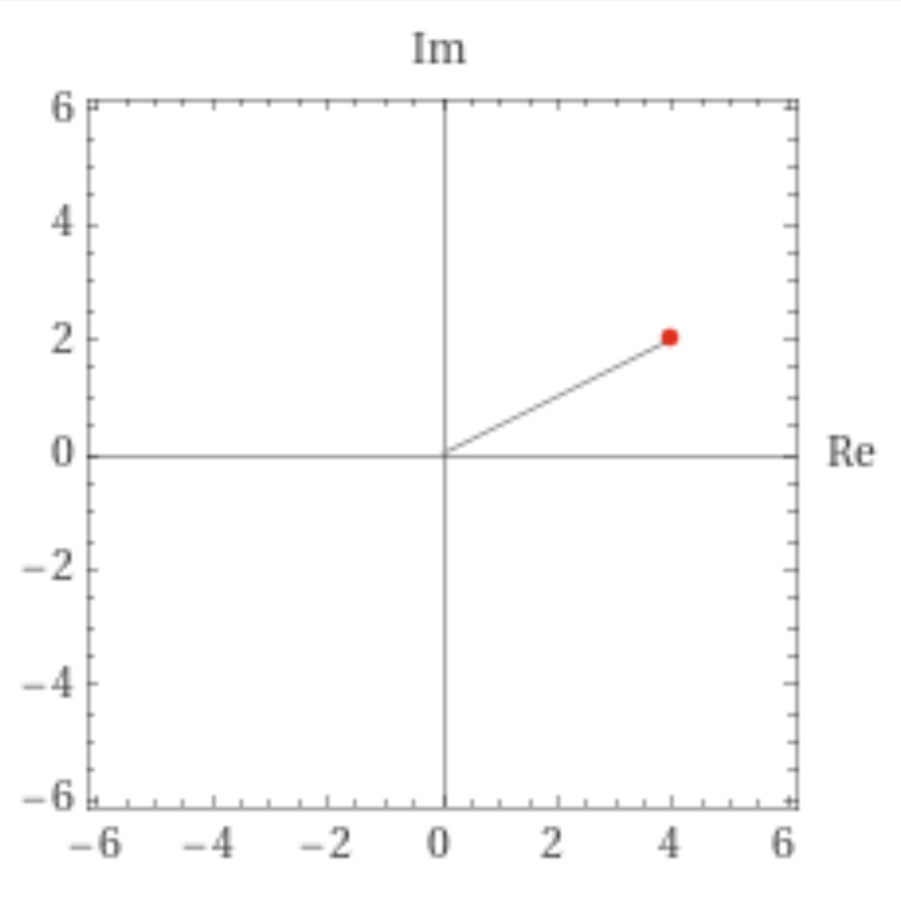
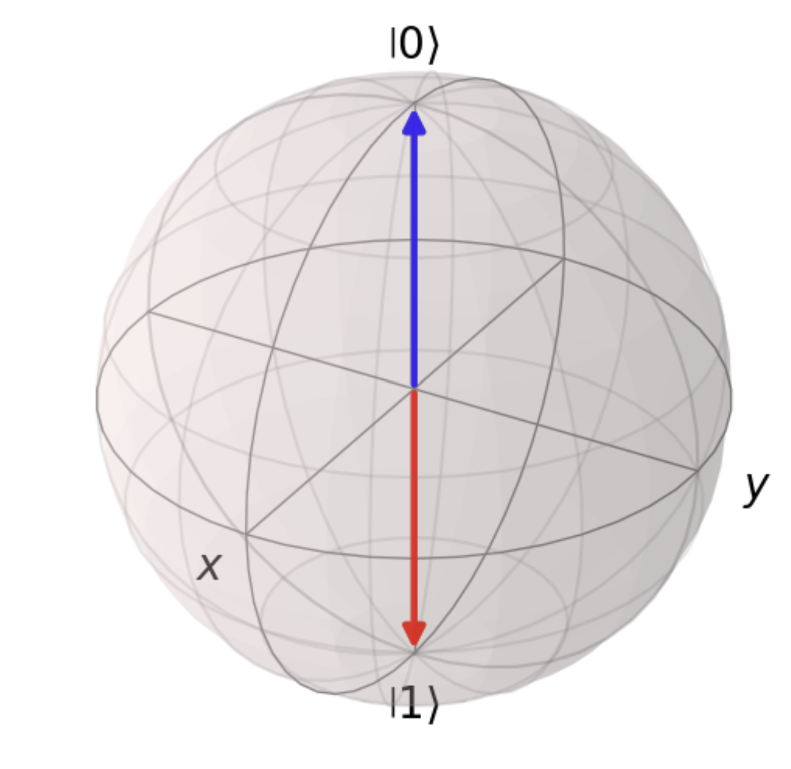
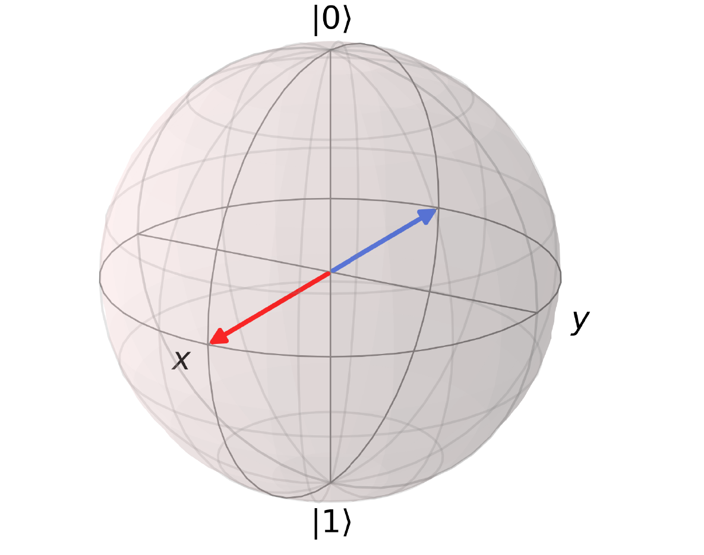
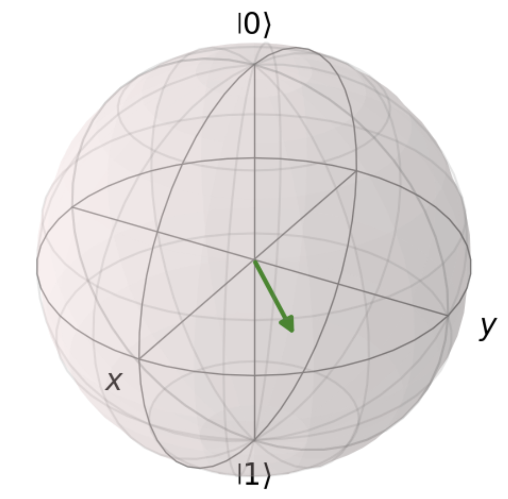

.. _math: 

Mathematical Basics
===================

To fully understand and envision the concepts of quantum computing, a
solid mathematical foundation is necessary.
In this section we want to give you the most important basics in
linear algebra, complex numbers and probability theory and also cover
on why we need them in quantum computing. If you’re already familiar
with the concepts presented here, you can directly go to the :ref:`next section <physics>`. If you however have the feeling
that you need some refreshing of your math skills before starting with
this section, you might want to take a look `here for linear
algebra <https://www.khanacademy.org/math/linear-algebra>`__. Our main
topics cover matrices, vectors, complex numbers and probability. If
one of these topics is completely unfamiliar to you, we suggest to
study the fundamentals elsewhere and come back. However, all sections
should be understandable with a high school degree.

repetition: complex numbers
~~~~~~~~~~~~~~~~~~~~~~~~~~~

Since some familiarity with complex numbers is required, we will quickly
skim the baiscs. Complex numbers use the imaginary unit
:math:`i=\sqrt -1` and are written in the form :math:`z= a+bi`. With
their real part :math:`a` and imaginary part :math:`b`, they can be
visualized:

From this plot, we can see that there is also another way to represent
complex number: by their polar form :math:`r e^{i \theta}`. :math:`r`
marks the absolute value and is calculated by
:math:`\sqrt{a^2 + b^2}`. The angle :math:`\theta` is calculated with
:math:`\theta = tan^{-1}(\frac{b}{a})`. Using Euler’s formular, we can
also express complex numbers as
:math:`r (cos(\theta) + i*sin(\theta))`. This will be useful later on
when expaining the Blochsphere, but for now this is all we need.
Another property we need is the complex conjugate, that changes the
sign before the complex value: :math:`\overline{z} = a - ib`. Notice that the
complex conjugate of a real number stays the same.

Linear Algebra
--------------

Vectors and Qubits
~~~~~~~~~~~~~~~~~~

| As we already learned in the first chapter, in quantum computing we are
  working with qubits. They are the equivalent to classical bits, with
  the same functionality as the smallest unit, but more values than just
  0 or 1. They are our basis for basically everything, so we want to
  start with how we can describe them.
| Qubit states are mathematically represented as state vectors. These
  vectors exist in a complex vector space and we can use the **Dirac
  notation** to represent them. This specialty of quantum mechanics is
  also called the braket (yes, I spelled that right). The ket-part
  represents a column vector and is denoted with a right kink:
  :math:`\left (\begin{array}{c}\alpha\\ \beta\\ \end{array} \right)= \ket{\psi}`
  . The corresponding dual vector, a row vector, forms the bra. It looks
  like a mirrored ket:
  :math:`\left (\begin{array}{c}\alpha& \beta\\ \end{array} \right)= \bra{\psi}`.
  The braket is, and you might have already guessed, the combination of
  both: :math:`\bra{\psi} *\ket{\psi}= \braket{\psi \mid \psi}`. Maybe
  you have seen the scalar product :math:`\braket{\psi, \phi}` before,
  which is mathematically the same thing.
 Unlike classical bits that can only be 0 or 1, quantum state vectors
  use complex numbers to express probability amplitudes, meaning that
  the coefficients :math:`\alpha` and :math:`\beta` in
  :math:`\ket{\psi} = \alpha \ket{0} + \beta \ket{1}`
  are complex numbers.
| 2-Dimensional vectors consist of two 2 components, similar to our
  quantum states. It seems logical to use this similarity and use
  vectors to visualize quantum states. The quantum state
  :math:`0 \ket{0} + 1 \ket{1}` would be represented in the vector
  :math:`\vec{v} =\left (\begin{array}{c}0 \\ 1\\ \end{array} \right)`.
  This vector is denoted as :math:`\ket{1}`, since it has a 100%
  probability to collapse to 1. Analogous, the state
  :math:`1 \ket{0} + 0 \ket{1}`, also
  :math:`\vec{v} =\left (\begin{array}{c}1 \\ 0\\ \end{array} \right)`
  or just :math:`\ket{0}`.

To conduct calculations, a basis is necessary. You might know the basis
of kartesian coordinates, which are just the vectors along the axes:
:math:`\left (\begin{array}{c} 1\\ 0\\ \end{array}\right)` and
:math:`\left (\begin{array}{c}0\\ 1\\ \end{array} \right)`. Other
vectors are possible as a basis, but they need to be orthogonal to each
other, that way one vector can’t be represented as a linear combination
of the other basis vectors. If you want to describe any vector now, you
would do it in regards to the basis and write your vector as a linear
combination of the basis vectors. Therefore, you need a basis to know
how to express all other vectors, and the same vector has different
notations in different bases. Another basis that is often used in
quantum mechanics is:

.. math:: 
    
    \ket{+} = \frac{1}{\sqrt{2}} \ket{0} +\frac{1}{\sqrt{2}} \ket{1}

.. math:: 
    
    \ket{-} = \frac{1}{\sqrt{2}} \ket{0} -\frac{1}{\sqrt{2}} \ket{1}

This basis makes sense to use when in superposition, hence when your
starting qubits already are in the state :math:`\ket+` or :math:`\ket-`.

| Two states are orthogonal, if
  :math:`\braket{\psi \mid\phi}= 0. \braket{0 \mid 1}` Satisfy this
  equation, hence why we chose them as basis vectors, but so do
  :math:`\braket{+ \mid-}`. We can write every other vector as a linear
  combination of these two. Other basis vectors can be chosen, and
  sometimes are, as long as they are linearly independent.
| Orthogonality can be used for way more than just finding a basis. It
  is integral to some algorithms, as explained in later chapters, but
  can also be utilized for (quantum) machine learning and neural
  networks.

visualization via the Bloch sphere
~~~~~~~~~~~~~~~~~~~~~~~~~~~~~~~~~~

We can visualize the qubit states on the Bloch sphere. It serves as a
geometrical representation of the quantum state of a single qubit.
Imagine a sphere where each point on the surface corresponds to a unique
quantum state. Qubit states can be visualized as points on this sphere,
allowing us to comprehend their superposition and entanglement
properties.

:math:`\ket{0}` (here blue) and \|1⟩ (red) denote the basis states, like
a north and south pole. Superposition allows qubits to exist in a
combination of these basis states, expressed as linear combinations of
state vectors. In the introduction, we discovered the state
:math:`\frac{1}{\sqrt{2}} \ket{0} + \frac{1}{\sqrt{2}} \ket{1}` for the
equal superposition. On the Blochsphere, this vector can be represented
as:

The resulting state is always the red arrow. The blue or red arrow are
given if we apply a Hadamard gate to 0 or 1 and only differ in phase. We
will show a calculation later.

How does the Bloch sphere come to represent quantum states, and how
can I find the corresponding spot to any state? Let me show you the
calculation.
Every complex number, like our coefficients :math:`\alpha` and
:math:`\beta`, can be represented in their polar form
:math:`re^{i\phi}`. If we use that to write our amplitudes:

.. math::
  
  r_\alpha e^{i\phi_\alpha}\ket{0} + r_\beta e^{i\phi_\beta}\ket{1} = 1

this is equivalent to (by multiplying :math:`e^{-i \phi_\alpha}`):

.. math:: 
    
    r_\alpha \ket{0} + r_\beta e^{i\phi_\beta - \phi_\alpha} \ket{1} = 1

Since our state vector has to be normalised, we know that
:math:`\mid r_\alpha \mid ^2 + \mid r_\beta \mid ^2 =1` and with
trigonometric relations (see the right triangle, :math:`r_\alpha` and
:math:`r_\beta` are now the legs along the axses :math:`\ket{0}/\ket{1}`
and :math:`\ket{+}/\ket{-}`), we can make both numbers dependent on
:math:`\theta`:

.. math:: cos(\frac{\theta}{2}) \ket{0} + sin(\frac{\theta}{2}) e^{i\phi} \ket{1} = 1

with :math:`\phi_\beta - \phi_\alpha=\phi`

These two angles :math:`\phi` and :math:`\theta` can now be interpreted
as the azimuth and polar angle of a sphere: the Blochsphere.
:math:`\theta` is associated with the elevation angle, while
:math:`\phi` is the rotation angle around the z-axis.

| All quantum states that we have considered so far are pure states and
  can represent them as a complex number or a vector pointing to the
  surface of the Blochspere. Mixed states on the other hand, usually
  described by a density operator :math:`\rho`, are a combination of
  pure states. The density matrix covers probabilities for the different
  pure states that mix together and their entanglement, since we don’t
  have complete knowledge how the mixed state is prepared. In real life,
  this can happen very easily, since the environment in the lab is not
  100% controllable and even small influences can alter our system.
| Mixed states are represented by an interior point in the sphere. The
  purity of a state can be visualized as the degree of closeness to the
  surface:

It is easy to get superposition and mixed states confused. To highlight
their difference, (equal) superposition
:math:`\ket{\psi} = \frac{1}{\sqrt{2}} \ket{0} +\frac{1}{\sqrt{2}} \ket{1}`
has a 100% chance of being in the state :math:`\ket{\psi}`, therefore
the superposition is a pure state. In contrast, a mixed state is in one
state, but we are not sure which one and can only statistically say
which state is likely from the density matrix. An example of a mixed
state is
:math:`\ket{\rho_{mixed}} = \frac{1}{{2}} \ket{0} \bra{0} +\frac{1}{2} \ket{1} \bra{1}`
, which has a 50% chance of being in the state :math:`\ket 0` and a 50%
chance of being in the state :math:`\ket 1`. We can see that this is not
a pure state since the amplitude squares don’t add up to 1, but the
coefficients do.

tensor product: multi qubit systems
~~~~~~~~~~~~~~~~~~~~~~~~~~~~~~~~~~~

So far, we have only talked about single-qubits systems, but to do
something useful on a quantum computer we need of course more than one!
If we want to combine multiple qubits, we will need a special product,
called the tensor product :math:`\otimes`. The same symbol is also
sometimes called the Kronecker product and in most cases, these are
interchangeable. While the Kronecker product defines the multiplication
of matrices, the tensor product is a more general approach and
multiplies linear maps. For us, matrices always represent linear maps,
so it doesn’t really matter.

The multiplication of two vectors is defined as:

:math:`\vec a \otimes \vec b=` :math:`\left( \begin{array}{rrr}
a_1  b_1 \\\
a_1  b_2  \\\
... \\\
a_1 b_n \\\
a_2 b_1 \\\
...\\\
a_m b_n \end{array}\right)`

You can, for example, take these two vectors:

:math:`\vec a \otimes \vec b=` :math:`\left( \begin{array}{rrr}
0\\\
1  \end{array}\right)
\otimes \frac{1}{\sqrt{3}}
\left( \begin{array}{rrr}
1\\\
1\\\
1  \end{array}\right) = \frac{1}{\sqrt{3}} \left( \begin{array}{rrr}
0*1 \\\
0*1 \\\
0*1\\\
1*1\\\
1*1 \\\
1*1\end{array}\right) = \frac{1}{\sqrt{3}} \left( \begin{array}{rrr}
0\\\
0\\\
0\\\
1\\\
1 \\\
1\end{array}\right)`

As you can see, the vectors don’t need to be of the same dimension
(opposing the rules of vector addition or cross product) and the new
vector’s dimension is the product of the dimension of the two
constituting vectors: :math:`dim(a*b) = dim(a)*dim(b)`, in our example
:math:`2*3=6`. We already saw :ref:`in the introduction chapter <qubits>` that adding qubits together results in exponential growth of
the system, and now we also know the reason: the tensor product!

Keep in mind that for the tensor product the order of qubits matter, or
in mathematical terms, that the tensor product doesn’t commute. And we
should also make sure to not confuse it with the Kronecker sum/ direct
sum :math:`\oplus` (which does not change dimensions).

.. _matrix: 

Matrices and Quantum Gates
~~~~~~~~~~~~~~~~~~~~~~~~~~

Now that we know how to describe qubit states, also of larger systems,
we want to do something with these qubits. And for that we need quantum
gates. At their core, all fundamental quantum gates can be represented
as a matrix. You can imagine a matrix like an operation acting on a
vector: It can change its direction, rotate it, shrink or elongate it.

To have a function (“gate”) act on a qubit, the mathematical formulation
is to take the vector corresponding to the qubit state and multiply the
matrix for the gate. For example, if we start in the state

.. math::

  \ket{0}= \left (\begin{array}{c}
  1\\ 0\\
  \end{array} \right)
    
and want to apply a X-gate, also called bitflip, we would multiply the equivalent matrix
:math:`X =\left(\begin{array}{rrr}0&1\\1& 0\\\end{array} \right)`:

.. math:: 

  \left (\begin{array}{c}
  0 & 1\\
  1 & 0\\
  \end{array} \right) *
  \left (\begin{array}{c}
  1\\ 0\\
  \end{array} \right ) =
  \left
  (\begin{array}{c}
  0*1+1*0 \\
  1*1 + 0*0\\
  \end{array} \right) =
  \left(\begin{array}{c}
  0 \\
  1\\
  \end{array}  \right)

If you look at the structure of the matrix and its effect on the vector,
you can see why it is called a bitflip. More about this matrix is to
find out in the next chapter.

The transpose of a matrix switches the rows and columns, often resulting
in a matrix of different dimension. For example:

:math:`B=` :math:`\left( \begin{array}{rrr}
a & b \\
c & d  \\
e & f \\
\end{array}\right)` :math:`B^T=` :math:`\left( \begin{array}{rrr}
a & c & e \\
b & d & f \\
\end{array}\right)`

As you can see, the diagonal stays identical, therefore the transpose
could also be described as a reflection at the diagonal.

The complex conjugate changes the signs before every complex number.
Real matrices stay unaffected by this measure. 
  
:math:`A=`
:math:`\left( \begin{array}{rrr}
4 & i \\
6+2i & 2  \\
\end{array}\right)`, :math:`\overline{A} =` :math:`\left( \begin{array}{rrr}
4 & -i \\
6-2i & 2  \\
\end{array}\right)`

To avoid confusion with the unitary symbol, the complex conjugate
(without transpose) is described with :math:`\overline{A}`.

| Now, let’s combine these two operations: A matrix is called
  **unitary** if their conjugate transpose equals its inverse. We can
  test this with :math:`UU^*= UU^{-1}= I`. In quantum mechanics, unitary
  matrices are often denoted with a dagger: :math:`U^{\dagger}`. For
  quantum computing, all matrices need to be unitary. That way, the norm
  is preserved, since we want all our probability vectors to have a norm
  of 1 (aka 100%).
 We can show this on our example matrix:

.. math:: 
  
  X = \left (\begin{array}{rrr}
  0 & 1\\
  1 & 0\\
  \end{array} \right), X^{*} =  \left (\begin{array}{rrr}
  0 & 1\\
  1 & 0\\
  \end{array} \right), XX^* =  \left (\begin{array}{rrr}
  0 & 1\\
  1 & 0\\
  \end{array} \right) *  \left (\begin{array}{rrr}
  0 & 1\\
  1 & 0\\
  \end{array} \right)=  \left (\begin{array}{rrr}
  1 & 0\\
  0 & 1\\
  \end{array} \right)

For a **Hermitian** matrix :math:`A = \overline{A}^T`, the complex conjugate
transpose equals the matrix itself (in contrast to the inverse for
unitary matrices). A simple example is the identity matrix, whose rows
and columns are identical and have no complex numbers. We can also see
in the previous line that our matrix :math:`X` fulfills this
requirement.

All of these operations are involutionary, meaning that doing them twice
results in the original matrix: :math:`(U^{\dagger})^{\dagger} = U` and
:math:`(U^T)^T = U`.

| So far, we only considered 2x2 matrices and therefore 1-qubit systems.
  Now, we want to look at a more complicated exmple and consider a gate
  that acts on two qubits.
| First, we need to determine the inital value of our qubits: Let’s say
  the first qubit has the value 1 andthe second the value 0. We use the
  tensor product to express them as one vector:
  :math:`q_1 = \left(\begin{array}{c}
      0 \\
      1\\
  \end{array}  \right), q_0 = \left(\begin{array}{c}
      1 \\
      0\\
  \end{array}  \right)`
  :math:`q_{10} = q_1 \otimes q_0 =\left(\begin{array}{c}
      0*1 \\
      0*0\\
      1*1 \\
      1*0
  \end{array}  \right) = \left(\begin{array}{c}
      0 \\
      0\\
      1\\
      0
  \end{array}  \right)`

The matrix we want to use describes the CNOT gate and is also a
fundamental for quantum computing. First, let’s test all the beforehand
mentioned properties. 

.. math:: 
  
  CNOT = \left (\begin{array}{rrr}
    1 & 0 & 0 & 0\\
    0 & 1 & 0 & 0\\
    0 & 0 & 0 & 1\\
    0 & 0 & 1 & 0\\
  \end{array} \right)

With its complex conjugate transpose:

.. math:: 
  
  CNOT^* = \left (\begin{array}{rrr}
    1 & 0 & 0 & 0\\
    0 & 1 & 0 & 0\\
    0 & 0 & 0 & 1\\
    0 & 0 & 1 & 0\\
  \end{array} \right)

We can immediately see that the conjugate transpose equals the matrix
and its therefore hermitian. We can test if it's unitary:

.. math:: 
  
  \left (\begin{array}{rrr}
    1 & 0 & 0 & 0\\
    0 & 1 & 0 & 0\\
    0 & 0 & 0 & 1\\
    0 & 0 & 1 & 0\\
  \end{array} \right) * \left (\begin{array}{rrr}
    1 & 0 & 0 & 0\\
    0 & 1 & 0 & 0\\
    0 & 0 & 0 & 1\\
    0 & 0 & 1 & 0\\
  \end{array} \right) = \left (\begin{array}{rrr}
    1 & 0 & 0 & 0\\
    0 & 1 & 0 & 0\\
    0 & 0 & 1 & 0\\
    0 & 0 & 0 & 1\\
  \end{array} \right)

Now after making sure this matrix is suitable for quantum computing, we
can multiply our 2-qubit state vector with it:

.. math:: 
  
  \left (\begin{array}{rrr}
    1 & 0 & 0 & 0\\
    0 & 1 & 0 & 0\\
    0 & 0 & 0 & 1\\
    0 & 0 & 1 & 0\\
  \end{array} \right) * \left(\begin{array}{c}
    0 \\
    0\\
    1\\
    0
  \end{array}  \right) =  \left(\begin{array}{c}
    0 \\
    0\\
    0\\
    1
  \end{array}  \right)

When measuring a quantum system, the result will be one of the
eigenvalues of the observable. Therefore, for every matrix, an
**eigenvalue** :math:`\lambda` can be determined, expressed as
:math:`M * v = \lambda * v`, meaning that the eigenvector scales the
eigenvector :math:`v` the same way that the matrix :math:`M` does.
Typically, the eigenvalue is calculated by solving the characteristic
equation :math:`| M - \lambda I | = 0` with the identity matrix
:math:`I`. For example, the characteristic equation for the matrix
:math:`C=` :math:`\left( \begin{array}{rrr}3  & 7 \\
1 & 3  \\
\end{array}\right)`

.. math:: 
  
  | M - \lambda I | = 0=
  \left( \begin{array}{rrr}3  & 7 \\
  1 & 3  \\
  \end{array}\right)-\left( \begin{array}{rrr} \lambda  & 0 \\
  0 & \lambda  \\
  \end{array}\right) =
  \left( \begin{array}{rrr}3 - \lambda  & 7 \\
  1 & 3 - \lambda  \\
  \end{array}\right) =(3-\lambda)^2 -7

.. math:: 
  
  \lambda = 3 \pm \sqrt{7}

Eigenvectors, on the other hand, are the vectors that remain in the same
direction (up to scaling) when multiplied by the matrix. They are
crucial in quantum computing because certain quantum gates are
essentially rotations or transformations that operate on the
eigenvectors of a quantum system. The eigenvectors are found by
completing the equations :math:`(M - \lambda I) *v =0`.

Probability and Measurement
---------------------------

In the last section we learned how to describe qubit states and how to
manipulate them with gates aka matrices. Now the only thing left to have
a full quantum computation is to read out the result.

When we measure a qubit, infinitely many quantum states
undeterministically collapse to one bit (either 0 or 1). The probability
of 1 or 0 translate to the complex coefficients of the wave function:

| :math:`\mid \alpha \mid ^2` equals the probability for the state to
  collapse to 0 upon measuring.
| :math:`\mid \beta \mid ^2` equals the probability for the state to
  collapse to 1 upon measuring.

This connection explains why
:math:`\mid \alpha \mid ^2 + \mid \beta \mid ^2 = 1`, since both
probabilites combined shall add up to 1.

Quantum states, such as those of qubits, are akin to Schrödinger’s
wavefunctions and are inherently probabilistic. These states are
typically represented as probability vectors. This representation is a
consequence of the fundamental principle in quantum mechanics that
states that, before measurement, a quantum system can exist in a
superposition of multiple states. Probability vectors precisely capture
this superposition.

All vectors we considered so far are probability vectors, meaning that
their components carry the probability for the wave function to collapse
in this specific state. Therefore, all state vectors are normalized, to
sum up to 100%. In other words, it guarantees that when you measure a
quantum system, one of the possible outcomes will indeed occur. It’s a
fundamental requirement for quantum states.

Probability amplitudes, denoted by :math:`\alpha` and :math:`\beta` in
our example, are complex numbers that underlie quantum probability
vectors. They encapsulate not only the probability of measuring a
particular outcome but also the phase information, a key aspect of
quantum states. This complex nature of amplitudes is crucial in quantum
interference phenomena.

When you measure a quantum system, the probability vector dictates the
likelihood of each possible measurement outcome. The Born rule (named
after physicist Max Born) quantifies this relationship between
probability amplitudes and measurement probabilities. It states that the
probability of measuring a state :math:`|\psi⟩` in a basis state
:math:`|x⟩` is given by :math:`|⟨x|ψ⟩|^2`.

If we want to calculate the probability of a qubit :math:`\ket \psi` to
be in the state :math:`\bra 1`, we determine
:math:`\mid \braket{ 1 \mid \psi} \mid ^2`. With the example state
:math:`\psi =  \frac{1}{\sqrt{2}} \ket 0 + \frac{1}{\sqrt{2}} i \ket 1`,
we would compute
:math:`\mid \braket{ 1 \mid \psi} \mid ^2 = \mid \frac{1}{\sqrt{2}} i \mid ^2 = (\sqrt{\frac{1}{\sqrt{2}}^2})^2 = \frac{1}{2}`.
The :math:`i` has no effect and can be seen as a relative phase.
Similarly, the probability for this qubit to collapse to the state
:math:`\ket 0` upon measuring:
:math:`\mid \braket{ 0 \mid \psi} \mid ^2 = \mid \frac{1}{\sqrt{2}}  \mid ^2 = (\sqrt{\frac{1}{\sqrt{2}}^2})^2 = \frac{1}{2}`.
Here again we can see that both states are equally likely and the
:math:`i` has no effect for the probability. Also,
:math:`\mid \alpha \mid ^2 + \mid \beta \mid ^2\frac{1}{2} + \frac{1}{2} = 1`.

Interlude: Phases and amplitudes
~~~~~~~~~~~~~~~~~~~~~~~~~~~~~~~~

We have already been throwing around these words, without actually
explaining them and now we’ll make up for it.

Amplitudes are more potent than regular probabilities and therefore
necessary to describe complex quantum phenomena. Like any probability,
probability amplitudes have a magnitude, implying how likely an event
occurs. Additionally, amplitudes have an angle and a direction. You can
imagine the amplitude like a vector, having a specific length
(magnitude), direction, and an angle measuring from a basis vector
(phase). This phase will be very useful later on, so don’t forget it!

Relative phase refers to the phase difference between the probability
amplitudes of different quantum states of one qubit. It emerges when a
qubit is in superposition, meaning is exists in a combination of basis
states. The relative phase is the relative angle or phase shift between
the probability amplitudes of these states. It can take any value
between :math:`0- 2\pi` and it influences the interference of quantum
states during measurements. In quantum algorithms, manipulating the
relative phase is a fundamental technique.

The global phase doesn’t change the physical state, but rather shifts
the entire solution for a constant factor. The states
:math:`\braket{\psi}` and :math:`e^{i \theta}\braket{\phi}` describe the
same observable state (in this case, the phase is :math:`\theta`. We
know that it is a global phase since it is multiplied on the outer side
of the wave funtion). Often times, global phase is neglected for that
reason.

If we have a look at these examples, we can determine wether it is a
global or relative phase: :math:`\ket 0 + e^{i \frac{\pi}{2}}\ket 1` has
a relative phase, but :math:`e^{i \frac{\pi}{2}} (\ket 0 + \ket 1)` a
global phase and therefore is equal to :math:`\ket 0 + \ket 1`. Keep in
mind that the relative phase affects the solution, but the probability
magnitude stays the same. This is rooted in the fact that all complex
numbers we use to describe quantum states have a magnitude of 1, since
:math:`\mid r \mid = \sqrt{a^2 + b^2} = 1`.

As promised earlier, we will now go through the Hadamard gate and its
effects. When we start in the state :math:`\ket{0}` and apply the
H-gate:

.. math::

    \frac{1}{\sqrt{2}}\left (\begin{array}{rrr}
         1 & 1\\
         1 & -1\\
     \end{array} \right) * \left (\begin{array}{rrr}
         1 \\
         0\\
     \end{array} \right) = \frac{1}{\sqrt{2}} \left (\begin{array}{rrr}
         1 \\
         1\\
     \end{array} \right) = \frac{1}{\sqrt{2}} (\ket 0 + \ket 1)

The probability to measure :math:`\ket 0 : \mid \braket{ 0 \mid \psi} \mid ^2 = \mid \frac{1}{\sqrt{2}}  \mid ^2 = (\sqrt{\frac{1}{\sqrt{2}}^2})^2 = \frac{1}{2}`
The probability to measure :math:`\ket 1 : \mid \braket{ 1 \mid \psi} \mid ^2 = \mid \frac{1}{\sqrt{2}}  \mid ^2 = (\sqrt{\frac{1}{\sqrt{2}}^2})^2 = \frac{1}{2}`

Now, if we start in the state :math:`\ket 1`:

.. math::

     \frac{1}{\sqrt{2}}\left (\begin{array}{rrr}
         1 & 1\\
         1 & -1\\
     \end{array} \right) * \left (\begin{array}{rrr}
         0 \\
         1\\
     \end{array} \right) = \frac{1}{\sqrt{2}} \left (\begin{array}{rrr}
         1 \\
         -1\\
     \end{array} \right) = \frac{1}{\sqrt{2}} (\ket 0 - \ket 1)

The probability to measure
:math:`\ket 0 : \mid \braket{ 0 \mid \psi} \mid ^2 = \mid \frac{1}{\sqrt{2}}  \mid ^2 = (\sqrt{\frac{1}{\sqrt{2}}^2})^2 = \frac{1}{2}`
The probability to measure
:math:`\ket 1 : \mid \braket{ 1 \mid \psi} \mid ^2 = \mid  - \frac{1}{\sqrt{2}}  \mid ^2 = (\sqrt{-(\frac{1}{\sqrt{2}})^2})^2 = \frac{1}{2}`

We can see that the only difference is the minus sign in from of
:math:`\ket 1`. This can also be written in exponential form, where we
see the angle:

.. math:: \frac{1}{\sqrt{2}} \ket 0 - \ket 1 = \frac{1}{\sqrt{2}}( \ket 0 + e^{i \pi}\ket 1) 

The solution is rotated round :math:`\pi`. This is a relative phase, as
you cannot factor it out. It is also the reason why on the Bloch sphere,
both vectors are on the same level, but face in different directions.
For further computing tasks, this can be a defining difference. This
phase would be non-detectable by classical computers and is one of the
tools that makes quantum computing so powerful.

Summary
-------

-  the coefficients :math:`\alpha` , :math:`\beta` :math:`\epsilon`
   :math:`\mathbb{C}` in the equation
   :math:`\ket{\psi}=\alpha\ket{0}+\beta\ket{1}` can be represented as a
   state vector :math:`\vec v = \left (\begin{array}{c} \alpha \\\ \beta\end{array} \right)` and visualized on the
   Blochsphere
-  to combine multiple qubits, the tensor product
   :math:`\vec a \otimes \vec b` is used
-  all operations in quantum computing can be broken down to unitary
   matrices: :math:`U^*= U^{-1}`
-  To apply an operation onto a qubits, the multiplication
   :math:`\ket{\psi'}=U\ket{\psi}` is performed
-  the probability of a qubit collapsing to the state 0 or 1 upon
   measuring is determined by :math:`\mid \alpha \mid^2` or
   :math:`\mid \beta \mid^2`, while fulfilling the requirement
   :math:`\mid \alpha \mid ^2 + \mid \beta \mid ^2 = 1`
-  The relative phase of a qubit is a specialty of quantum mechanics and
   influences the overall result after measurement, while the global
   phase can be factored out and ignored.