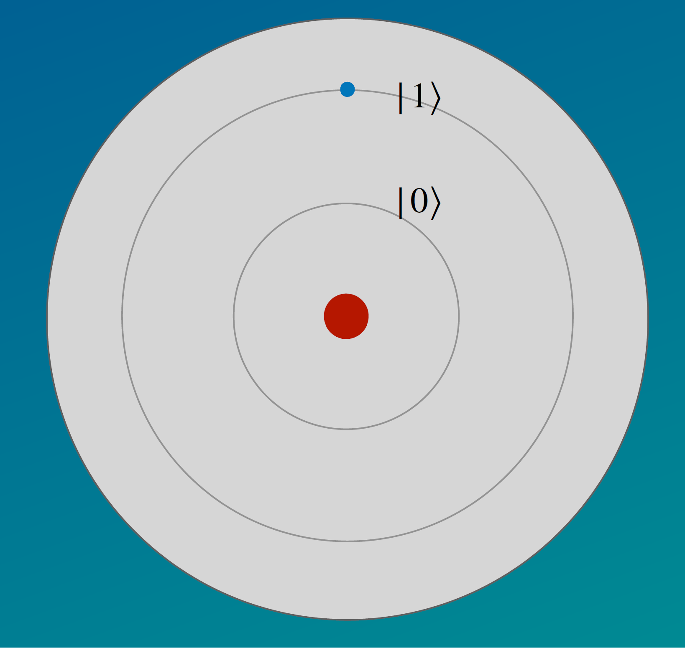

.. _physics: 

Fundamental Physics
===================

To get a maximum coherence time of your quantum understanding, we will
go over some necessary quantum mechanics concepts to build a foundation
on all phenomena quantum computing uses. Most will be explained at a
fundamental level, so you can understand it even if you have no physics
background. However, we recommend to have read the math introduction
before.

Quantum? I hardly know her
--------------------------

| Let’s start with the most pressing question: What is a quantum,
  anyway? A quantum refers to the smallest discrete quantity involved in
  an interaction.
| To understand that definition better, have a look at Einstein’s
  photoelectric effect: He discovered that light isn’t a continuous
  stream or wave, but instead made up from little packages, the photons.
  The outer photoelectric effect appears when electromagnetic beams
  strike a dense object and electrons break out. To simplify: Light
  shines at a metal and electrons bounce off the metal. However, this
  effect only starts to occur at a certain frequency (that frequency is
  connected to the colour) of the light. Below that threshold, no
  electrons are emitted, no matter the intensity (brightness) of the
  light. Furthermore, frequency is the only variable affecting the
  emmission rate: Intensity plays no role, counter-intuitive to
  classical mechanics. From this result, Einstein concluded that light
  is “chunky” and its energy is defined by :math:`E = h\nu`. Energy can
  only be absorbed or transmitted in disctrete steps, multiples of
  :math:`h` (Planck’s constant). The particles of light, called photons,
  are the quantum pieces of light. To summarize: Photons with a distinct
  energy hit electrons in metal, transmit their energy and if the
  frequency :math:`\nu` exceeds the metal-specific threshold, the
  electron is emitted (that minimum energy is metal-specific).

| The photoelectric effect belongs in the bigger picture of the
  experiments conducted at that time, including the double-slit
  experiment. It states that light is a wave and that would predict that
  no such threshold should exist.
| Originally conducted with electrons, the double-slit experiment shows
  that particles like electrons (and light, as we know now) show a
  wave-like interference pattern when sent through a double slit. To
  conduct the experiment, singular electrons where shot at a wall with
  two distinct slits. The electrons would be marked behind the wall.

|Alt text| Source: By Ebohr1.svg: en:User:Lacatosias,
User:Stanneredderivative work: Epzcaw (talk) - Ebohr1.svg, CC BY-SA 3.0,
https://commons.wikimedia.org/w/index.php?curid=15229922

| While you might expect a simple addition of two Gaussian curves behind
  each slit (if you think of electrons as “balls”), the experiment
  showed an interference pattern with its highest peak at the middle
  between the slits. This is characteristic for a wave, but not discrete
  particles.
| The only explanation that makes both experiments work: small objects
  (think electrons, photons…) are both a particle and a wave
  simultaneously. This particle-wave-duality was one of the key
  realizations to start the field of quantum physics.

Postulates of Quantum Mechanics
-------------------------------

This gives us the perfect connection to the postulates of quantum
mechanics, breaking the concepts down to their essence:

1. **Every physical system can be described as its wavefunction**
   :math:`\psi`. Yes, this includes all physical systems, so
   technically, you can be described as your statefunction. However, for
   large systems (like humans), the quantum properties are so small they
   can be ignored, hence why classical mechanics even is a thing. **The
   probability of a particle being in the place** :math:`(x, y, z)` **at the
   time** :math:`t` **can be calculated by**
   :math:`\mid \psi(x, y, z, t) \mid ^2`. Since the wavefunction is
   complex, :math:`\mid \psi(x, y, z, t) \mid ^2 = \psi (x, y, z, t) \psi  ^* (x, y, z, t)`.
   Every wavefunction exists in a complex vector space with inner
   product (a Hilbert space) known as the state space of the system. The
   system is completely described by its state vector, which is a unit
   vector in the system’s state space. :math:`\ket{0}` is called the
   ground state, as it represents the least energy. Other states, such
   as :math:`\ket{1}` or :math:`\ket{2}`, are called excited and require
   energy to put a particle into them. For quantum computing, we only
   consider two states, that we call :math:`\ket{0}` and
   :math:`\ket{1}`.

2. **The state space of a composite physical system is the tensor
   product of the state spaces of the component physical systems.**
   Moreover, if we have systems numbered 1 through :math:`n`, and system
   number :math:`i` is prepared in the state :math:`\ket{\psi_i}`, then
   the joint state of the total system is
   :math:`\ket{\psi} = \ket{\psi_1} \otimes \ket{\psi_2} \otimes ...\ket{\psi_i} \otimes... \ket{\psi_n}= \ket{\psi_1\psi_2...\psi_i ...\psi_n}`.

3. **The time dependence of a quantum system is given in Schrödinger’s
   equation**
   :math:`i \hbar \frac{\partial \psi}{\partial t} = \hat{H}\psi`.
   :math:`\hat{H}` is the operator of the Hamiltonian function
   :math:`H = T +V`, usually describing the energy of a system. This is
   barely relevant for quantum computing, so we can skip over the
   details. (If you want to understand Quantum Variational Eigensolvers,
   having a closer look would be useful, but that is a journey for
   another day).

4. **Every observable has a corresponding operator** :math:`\hat{A}`.
This operator is linear:
:math:`\hat{A} (\alpha \ket{\psi} + \beta\ket{\phi}) = (\alpha \hat{A} \ket{\psi}) + (\beta \hat{A} \ket{\phi})`,
to represent the change in the statevector, which is a linear
combination of the basis vectors, and hermitian. While the
wavefunction describes the state of a system, the observables are
something to be extracted from it, like a measurement. Operators
are mathematical functions to represent these observables, that can
act on the state vector to extract information about the observable
properties of the system. The state vector of a system changes
after applying an operator on it:
:math:`\hat{A} \ket{\psi} = \ket{\phi}`, while staying in the same
Hilbert space. Operators are non-commutative. Since they are
hermitian and don’t commute, matrices are a natural choice to
represent them.
Why do they need to be hermitian? Usually, a non-hermitian operator
that holds :math:`\hat{A}\ket{\psi} = \ket{\phi}` would not satisfy
:math:`\bra{\psi}\hat{A}  = \bra{\phi}`, but
:math:`\bra{\psi} \hat{A}^\dagger= \bra{\phi}` does. Considering
that the bra is the complex conjugate and transpose of the ket,
this connection hold up for hermitian vectors
:math:`\hat{A} = \hat{A}^\dagger`.
**Upon measuring an observable** :math:`A`, **the measured value is one
of the eigenvalues of** :math:`\hat{A}`. If you repeat the
measurement, a statistical mean can be calculated. That is found by
:math:`\left\langle \psi \middle| A \middle| \psi \right\rangle =  \int \psi ^* \hat{A} \psi dV`.
After measurement, the state of the system collapses to
:math:`\frac{A \ket{\psi}}{\sqrt{\bra{\psi}A ^\dagger A \ket{\psi}}}`.

Superposition
-------------

| In classical mechanics, a particle can be described by its position
  and momentum at any given time. We might not always know these
  properties, but this is a human problem and not an issue of the
  physical system. Quantum mechanics, however, introduces the concept of
  superposition, where a system can exist in mutliple states
  simultaneously, making it impossible to determine certain attributes.
| We already established the vector
  :math:`c_1 \ket{0} + c_2 \ket{1} = \ket{\psi}`, where
  :math:`\mid c_1 \mid ^2` and :math:`\mid c_2 \mid ^2` show the
  probabilites of the quantum entitiy to be in the state :math:`\ket{0}`
  and :math:`\ket{1}` respectively. Nevertheless, these probabilites
  should not be interpreted as a sign that the particle is clearly in
  one of these states, we just don’t know which one and therefore have
  to rely on a statistical probability. Prior to the measurement, the
  qubit exists in both states at the same time, called superposition,
  emphasizing the probabilistic nature of quantum machanics.
| In our previous introduction to quantum particles, we saw that light
  behaves as a wave and as a particle, depending on the situation. This
  behaviour is not forseeable. A photon is therefore in a superposition:
  :math:`\ket{photon} = c_1 \ket{wave} + c_2 \ket{particle}`\ (this
  isn’t very mathematical, but I hope it gets the point across). In the
  double slit experiment, the electrons are in a supersposition of
  multiple wavefunctions with different wavelengths and frequency,
  observable by the interference pattern. (This explanation is part of
  the Copenhagen interpretation.)

When we measure a quantum particle, its superposition collapses. You can
imagine that the photon has to “decide” on a property, we call this
“deciding” the collapse of the wave function. In the collapse, the wave
function takes u one of the eigenvalues with 100% certainty. In our
:math:`\ket 0` :math:`\ket 1` basis, that is either 0 or 1. If you
repeat the same experiment for many times, you can keep a statistic how
often the result is 0 or 1. These statistical outcomes determine our
coefficients :math:`c_1` and :math:`c_0`.

| Even though the collapse might sound useful now, it is a bummer in
  calculations: When you combine multiple qubits, this leads to
  exponential growth of possible qubits states (mathematically, you can
  check that with the tensor product we introduced earlier).
  Unfortunately, the wavefunction collapse takes this away. When you
  combine 7 qubits, you get :math:`2^7= 128` dimensions (and possible
  states). Measurement collapses these down to only 7 classical bits,
  each one either 0 or 1.
| In the real world, atoms don’t exist alone in a vacuum. The
  interactions with other particles can act as a measurement and lead to
  decoherence, meaning the atom’s wavefunction collapses and the
  superposition is lost. This happens very easily and is an ongoing
  hardship for efficient quantum hardware.

| Mathematically, superposition is visualized through a linear
  combination of basis vectors, as seen in the principle of
  superposition :math:`\ket \alpha =\sum_{x}c_n \ket{x}`. Basis vectors
  represent the fundamental states of a quantum system, and any other
  state of the system can be expressed as a combination of these basis
  vectors. One example we have used so far is
  :math:`\ket{\psi} = \frac{1}{\sqrt{2}}\ket{0} +\frac{1}{\sqrt{2}}\ket{1}`.
  Here, the state :math:`\psi` is expanded as a sum of the eigenstates
  :math:`\ket 0` and :math:`\ket 1` of an Hermitian operator (e.g. the
  Hamiltonian), since the eigenstates of any Hermitian operator form a
  complete basis. If :math:`x` isn’t discrete (for example the time or
  position), an integral is calculated instead, with :math:`\psi(x)` as
  the wavefunction: :math:`\psi(x) = \int \ket{x'} \bra{x'} dx'`.
| Most time, we do our calculations in the computational basis,
  :math:`\ket{0}` and :math:`\ket{1}`. Apart from that, these is also
  another popular basis, derived from the Pauli X eigenstates (more on
  the Pauli matrices in the next
  chapter)::math:`\ket{+} = \frac{1}{\sqrt{2}} (\ket{0} + \ket{1})` and
  :math:`\ket{-} = \frac{1}{\sqrt{2}} (\ket{0} - \ket{1})`. You can
  calculate the eigenstates for any Hermitian matrix/operator the way we
  introduced :ref:`last chapter <math>`.

Superposition is hardly a visile physical property, hence why we didn’t
introduce an experiment to prove it. It is rather a mathematical device:
The sum of states is also a state. It also depends on your chose basis
vectors: In our usual :math:`\ket{0}` and :math:`\ket{1}` basis,
:math:`\frac{1}{\sqrt{2}} (\ket{0} + \ket{1})` is in superposition, but
in the :math:`\ket{-}\ket{+}` basis, it is a basis vector. Superposition
should be seen as a fundamental mathematical tool, like complex numbers
(we won’t prove their usefulness either).

Entanglement
------------

| Quantum entanglement describes the correlation of two entities. We can
  illustrate this with an example: Let’s say I am going on a trip, but
  in the hassle, I only pack one of my shoes. The pair is now split
  between my suitcase and home. When I open my bag at my destination, I
  see that I packed my left shoe and immediately know that my right has
  to be at home. Even when this happens every time I go on vacation
  (which would indicate a packing problem on my side), I never know
  which shoe I packed until I open my luggage and look for it, but the
  moment I see which shoe I packed, I instantly know that the other was
  left at home, I cannot have the right shoe with me and also have a
  right shoe at home, they need to complement each other (their outcomes
  are correlated). However, the exact result (if I have left or right
  with me) is nondeterministic.
| So far, no quantum-spookiness happened, but let’s introduce the newest
  runway fashion: An entangled pair, that has two identical shoes, as
  long as they stay in the box. Only when I open the box and “measure”
  the shoes, they “decide” which one is right and which one is left (the
  wavefunction collapses). In the box, the pair is in a superposition of
  left and right.
| Skeptics might say the pair is determined from the start, there is
  just some variable I am not thinking about (the hidden variable theory
  by Einstein). But we can debunk this: For that, I peep a hole in the
  box containing one shoe, and look at it from a different angle. I can
  see it is the right one, which would mean that the left one is in the
  other box. But in fact, my second shoe has gone back into
  superposition and could now be right or left. This revelation posed a
  problem for the hidden variable theory, as it should have been
  predictable and not go back into superposition.

| You might think that instead of predefined attributes, the shoes could
  somehow communicate with each other and therefore build this
  correlation. However, that information would have to travel faster
  than the speed of light, since there is no delay in the wavefunction
  collapse.
| Initially, it was believed that this contradicted Einstein’s
  relativity theory, which states that nothing travels faster than the
  speed of light, while this information would. This phenomena received
  the very scientific name “spooky action at a distance”. Today, we know
  that while these particles are correlated with each other, they don’t
  communicate, so this theory was scrapped. A current popular theory
  suggests that instead of being two different, telepathic shoes, they
  are parts of the same object that therefore cannot be seen
  individually, rather as a pair instead. This one-object theory would
  explain how they always line up and need no communication between each
  other.

In the real world, this quantum phenomenon can only be observed for
small quantum entities, not shoes, since their coherence time is way too
small. Electrons on the other hand are small enough particles and we can
choose their spin, which can be either up or down, as a property to show
entanglement.

In quantum computing, this entanglement is an important step to make
qubits depend on each other, similar to a :ref:`conditional statement <conditional>`.

Mathematically, states that haven’t interacted can be separated:

.. math:: \ket{\psi} = \frac{1}{\sqrt{2}} (\ket{01} + \ket{11}) = \frac{1}{\sqrt{2}} (\ket{0} + \ket{1}) \otimes \ket{1}

Since the 1 is in both kets, we can factor it and use the tensor product
to express the combination of two states. However, this is not possible
for entangled states, they always have to be written together:

.. math:: 
  
  \ket{\psi} = \frac{1}{\sqrt{2}} (\ket{00} + \ket{11})

Since they both are in a superposition where they are both in a
combination of :math:`\ket{0}` and :math:`\ket{1}`. Another example
are the entangled states
:math:`\ket{\psi} = \frac{1}{\sqrt{2}} (\ket{10} + \ket{10})`

From these examples we can conclude that in order to get entanglement,
superposition is an essential prerequisite.

In quantum computing, this parallelism can be harnessed to speed up
computations. When one of the entangled qubits changes its state, the
other will follow immediately. This is one of the tools necessary to
achieve the promised exponential speed-up in various applications. One
example is superdense-coding, which can encode the information of two
classical bits in one entangled qubit.

No-Cloning Theorem
------------------

To clear up a possible misunderstanding, entanglement is not to be
understood as copy-pasting a qubit’s information onto another qubit. In
fact, it is impossible to duplicate an arbitrary unknown quantum state
without changing it, as the non-cloning theorem asserts. Only the pure
states :math:`\ket{0}` and :math:`\ket{1}` (the computational basis
states) can be copied. Hence, entangled states are not included in this
statement, since they are in no clear state until measurement.

This can be seen in a proof by contradiction: Let’s assume a cloning map
:math:`C` and a superposition :math:`\ket{\psi_1} + \ket{\psi_2}` to be
cloned. According to the postulates of quantum mechanics, the
transformation :math:`C` has to be linear and therefore we can write:
:math:`C(\ket{\psi_1} + \ket{\psi_2}) =C(\ket{\psi_1}) + C(\ket{\psi_2})`.
Cloning would give us a composite system of two identical particles,
that are written as a product. Accordingly, we can assume that

| :math:`C(\ket{\psi_1} + \ket{\psi_2})=(\ket{\psi_1} + \ket{\psi_2}) \otimes (\ket{\psi_1} + \ket{\psi_2})`
  and
  :math:`C(\ket{\psi_1}) + C(\ket{\psi_2}) =\ket{\psi_1} \otimes \ket{\psi_1} + \ket{\psi_2} \otimes \ket{\psi_2}`,
| but
  :math:`(\ket{\psi_1} + \ket{\psi_2}) \otimes (\ket{\psi_1} + \ket{\psi_2})=`
  :math:`\ket{\psi_1} * \ket{\psi_1} + \ket{\psi_1} * \ket{\psi_2} + \ket{\psi_2} * \ket{\psi_1} +\ket{\psi_2} * \ket{\psi_2}`
  :math:`\neq \ket{\psi_1} *\ket{\psi_1} + \ket{\psi_2} * \ket{\psi_2}`.

What might seem like a obstacle now, can actually be used to our
advantage: Since quantum information cannot be copied, no one can spy on
quantum communication without our knowledge. That could be a huge step
for secure communication protocols and is also an ongoing field of
research.

.. _atommodel: 

Atomic Models
-------------

The Bohr atom model, like taught in high school, can reveal more of the
physical implementation of qubits. Let’s recap some 8th grade stuff: The
nucleus, home of positively charged protons, is orbited by electrons on
discrete shells. Is an electron energized (say by a photon hitting it),
it makes a discrete move to a higher orbital. In-between options are not
possible (this is the whole point of QUANTUM physics). This also
explains the discrete packaging of energy, since emmitted energy sends
an electron to a lower orbit. This model is also utilized in quantum
computing: To build singular qubits, the states :math:`\ket{0}` and
:math:`\ket{1}` can be physically implemented as orbits, the electron
jumping between them is the actual qubit:

While Bohr’s model works for some atoms (it actually is very limited),
it is not applicable for larger atoms. Other phenomena such as spectral
lines could not be explained with the current(1910) theories, therefore
a new model arised. Modern approaches, based on the Schrödinger
equation, picture an atom as a nucleus with a “cloud” of places where an
electron could be positioned with a certain probability.

|cloud_atom| Source: ZME science, by Tibi
Puiuhttps://www.zmescience.com/feature-post/natural-sciences/physics-articles/matter-and-energy/what-is-the-electron-cloud-model-this-is-how-electrons-inside-an-atom-really-behave/

Time Evolution
--------------

In the postulates above, the Schrödinger equation for time evolution is
mentioned. Following the equation, we can compute the wave function at
any time; even for a time that already took place. Hence, all quantum
operators need to be reversible. Mathematically, this can be expressed
by unitary matrices, as we have learned :ref:`here <matrix>`. Furthermore,
unitary operators conserve probability and stay normalized. To abide to
the rules of quantum mechanics, all quantum computing gates also need to
be reversible and therefore all matrices we use are unitary. This is a
big step away from classical computing and also the reason why we cannot
just transfer all classical gates onto a quantum computer (If you don’t
believe me, try to think of a way to reverse the AND gate with output
0).

Please keep in mind that measurement of a quantum system does not count
as an operator and is therefore not reversible (the root of some our
problems), since it collapses the wave function to a single state. In
this sense, the ability to compute the wave function for past times
doesn’t imply that we can retroactively observe events that have already
taken place.

Summary
-------

-  Quantum mechanics describes nature for small entities at the scale of
   atoms and below. These entities only have discrete energy levels.
-  Quantum mechanics is based on 4 main postulates:

   -  1: Quantum systems are described by the wave function
      :math:`\psi(x, y, z, t)`
   -  2: Composite systems are expressed through the tensor product
      :math:`\psi_1 \otimes \psi_2`
   -  3: time evolution is guarded by the Schrödinger equation
      :math:`i \hbar \frac{\partial \psi}{\partial t} = \hat{H}\psi`.
   -  4: Every observable has a corresponding linear operator. Upon
      measurent, the wavefunction collapses to one of the eigenstates.

-  A quantum particle can be in multiple states at once, called
   superposition. The superposition collapses when measured.
-  Entanglement defines the strong correlation of two or more quantum
   particles, where the state of one particle cannot be independently
   described without the state of the others.
-  No-cloning theorem: no singular, unknown qubit can be cloned
-  The Bohr atom model gives a simplified insight in the physical
   implementation of a qubit, with its orbits representing the states
   :math:`\ket{0}` and :math:`\ket{1}`. The electrons spin can also be
   used to implement these.
-  All quantum operators (including quantum computing gates) need to be
   unitary

After all this prepraration, we are now ready to dive into quantum
computing in the next chapter. Stay tuned, it even involves some first
programming examples in Qrisp!

.. |Alt text| image:: https://upload.wikimedia.org/wikipedia/commons/thumb/4/4e/Doubleslit.svg/1028px-Doubleslit.svg.png?20120618012957
.. |cloud_atom| image:: https://cdn.zmescience.com/wp-content/uploads/2022/12/46a9d-bohrvs.electroncloud.webp
