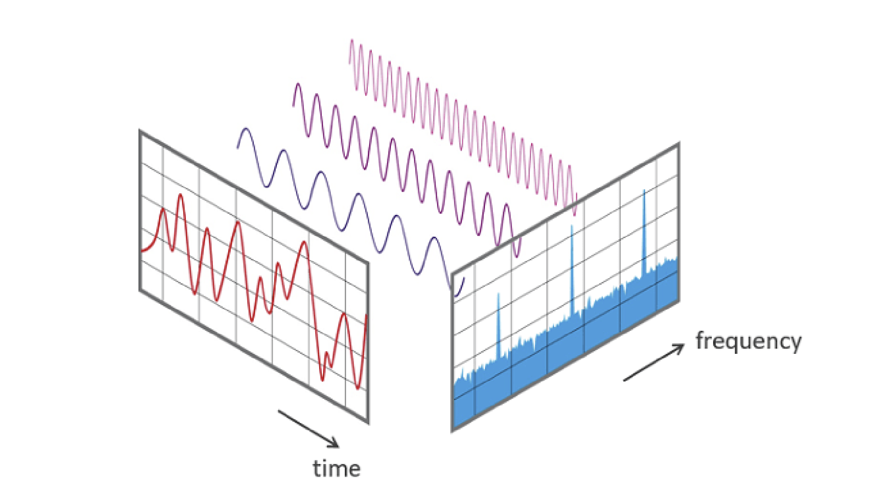
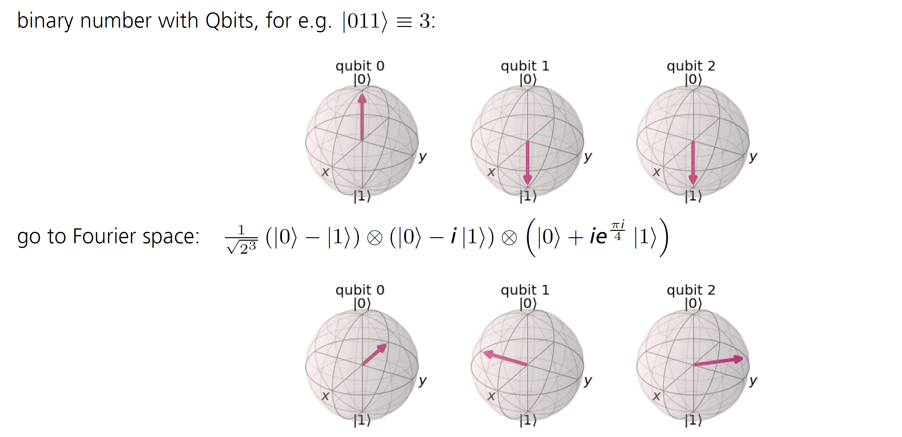

More Qrisp Programming
======================

After we got you all hot and bothered :ref:`in the last chapter <1stprogramming>` about programming with Qrisp, we are dedicating this section to
the basics of quantum algorithms. We start with the Quantum Fourier
Transformation, which is also a substep in the next algorithm, the
Quantum Phase Estimation. These routines are crucial steps in many
advanced algorithms, and therefore it’s essential to get them down.

Quantum Fourier Transformation
------------------------------

If I show you a function, can you tell me its frequency? This question
might sound easy for simple functions like sine or cosine, but can get
tricky for a superposition of many sine and cosine functions or, even
worse, for irregular functions. This problem is part of the
day-to-day-work in audio encoding and has a classical solution, which
needs exponentional time and bits. (Although today, there exist more
efficient versions on classical hardware, see Fast Fourier
Transformations.)
Perhaps, you have heard of the Fourier Transformation in a math or
physics lecture before. It is used to switch between different
domains, like position and momentum in quantum mechanics or time and
frequency in auditory processing. This can sound confusing and not
very intuitive, so let me clear it up with a visual representation
instead:

Source: Wikipedia (https://commons.wikimedia.org/wiki/File:FFT-Time-Frequency-View.png)
  
Here, you can see the different domains represented as axes and the
switch between them would be done with the Fourier transformation.
From a mathematical standpoint, mostly the formulation for continuous
functions is used:

:math:`f(x) = \frac{1}{\sqrt{2 \pi}} \int_{ - \infty}^\infty F(k) e^{ikx} dk`

Let’s make this formula a little less scary: The
:math:`\frac{1}{\sqrt{2 \pi}}` acts as a normalizing factor, so for
now, we don’t need to pay too much attention to it. Next, we use an
integral, since we look at continuous functions, as a way to add
everything up (however, computers can’t handle continuous functions,
so we are looking at a discrete version later instead).
But what are we even adding up? Let’s get away from functions and go
to circles. A circle can be described using Euler’s formula
:math:`e^{ix}= cos(x) + i*sin(x)` in a way that uses sine and cosine.
The amplitude is now translated to the radius of the circle and the
frequency to the speed at which the circle is drawn. These attributes
can be filtered out. Take for example your favorite song: You could
filter out the frequencies of the different instruments and voices.
For an earthquake, we could analyse the vibrations and build houses
that are resistant to them (we actually do that already!). We now want
to filter out everything there is to know about the circles, and we
add up the filters. Since one lousy circle doesn’t catch the
complexity of real life functions, we can now overlap different
circles until we get our desired signal. The Fourier transform finds
the amplitude, frequency and starting angle of every involved circle,
so that we can switch from the time or spatial domain to the frequency
domain, representing the signal as these attributes. The
:math:`F(k) e^{ikx}` accounts for all contributions from different
functions’ frequencies at the time point :math:`x`.

Now that we covered the classical Fourier Transformation, we can take
the next step to the quantum version.
The main secret of the Quantum Fourier Transformation (QFT) is a
change of basis. Let’s illustrate that on a one qubit example: The
computational basis of that is :math:`\{\ket0, \ket1\}`. To change it
into the Fourier basis, we need to apply a Hadamard gate to reach the
new basis :math:`\{\ket+, \ket-\}`.
So what happens if we have more qubits? For :math:`n` qubits, there
are :math:`2^n = N` possible computational basis states. These are
considered each on their own:

.. math:: \ket{\tilde j} = QFT \ket{j} = \frac{1}{\sqrt N}\sum^{N-1}_{k=0} e^{\frac{2 \pi i j k}{N}} \ket k

Similar to the change of data domain, we perform a change of basis for
the quantum system.

As promised before, we changed to a discrete formulation. Our
normalization factor changed to :math:`\frac{1}{\sqrt N}` (similar to a
Hadamard transformation on multiple qubits). :math:`j` and :math:`k`
represent indices of quantum states. :math:`\frac{2\pi}{N}` ensures an
equal distribution over the Hilbert space of size :math:`N`.

To really see the change of basis in this equation, we can also write it
as a tensor product. For that, let’s consider our input as a binary
integer :math:`j = j_n..j_3j_2j_1` (each :math:`j_n` is either 0 or 1,
all together encode a number).

.. math:: `\ket{\tilde{j}} = QFT \ket{j} =`
   
:math:`\frac{1}{\sqrt N} (\ket 0 + e^{\frac{2 \pi i j_1}{2} } \ket 1) \otimes (\ket 0 + e^{2 \pi i(\frac{j_2}{2}+ \frac{j_1}{4})}  \ket 1) \otimes (\ket 0 + e^{2 \pi i (\frac{j_3}{2}+ \frac{j_2}{4} + \frac{j_1}{8})}  \ket 1) \otimes ...`

To get an ever better notion of the basis change, we can use the
Blochsphere, which you know from the previous sections:

   alt_text

In this example, we represent the number 3 in binary: 011. The equation
is

.. math:: \ket{\tilde{3}} = QFT \ket{3} = \frac{1}{\sqrt 8} (\ket 0 + e^{\pi i } \ket 1) \otimes (\ket 0 + e^{2 \pi i(\frac{1}{2}+ \frac{1}{4})}  \ket 1) \otimes (\ket 0 + e^{2 \pi i (\frac{1}{4} + \frac{1}{8})}  \ket 1)

:math:`= \frac{1}{\sqrt 8} (\ket 0 - \ket 1) \otimes (\ket 0 - i  \ket 1) \otimes (\ket 0 + ie^{ \frac{\pi i}{4} }  \ket 1)`

Implementation
~~~~~~~~~~~~~~

Now let’s get to the implementation: We can see in the first factor
:math:`\ket 0 + e^{\frac{2 \pi i j_1}{2}}\ket 1`, that the qubit is
brought into superposition, so we need a Hadamard Gate. The phase
:math:`e^{\frac{2 \pi i j_1}{2}}` is automatically added, since the
Hadamard gate transforms
:math:`\ket 1 \rightarrow \frac{\ket 0 + \ket 1}{\sqrt 2}` when
:math:`j_1 = 0` and
:math:`\ket 0 \rightarrow \frac{\ket 0 - \ket 1}{\sqrt 2}` when
:math:`j_1 = 1` (because of Euler’s formular:
:math:`e^{\frac{2 \pi i j_1}{2}} =e^{\pi i} = -1)`. For :math:`j_1 =0`,
we get 
:math:`e^{\frac{2 \pi i j_1}{2}} =`
:math:`e^{\frac{2 \pi i 0}{2}} = e^0 = 1`, which leads to the state
:math:`\frac{\ket 0 + 1*\ket 1}{\sqrt 2}`. These transformations can be
achieved by applying a Hadamard gate to the first qubit.

The next factor also is in superposition, so we start again with a
Hadamard gate. Additionally, a phase of :math:`e^{\frac{2 \pi i}{4}}` is
added, if :math:`j_2=1` . We implement that with a controlled phase
gate, which can be simulated by a CNOT and a regular phase gate. This
process is repeated for every qubit, with different phases. These phase
gates can be summarized to the form 
:math:`U\_{Rot_k}\ket{x_j} =e^{\frac{2 \pi i x_j }{2^k}} \ket{x_j}`, where
:math:`k` is the granularity of rotation (which depends on the number of
the qubit) and :math:`x` is the value of this particular state. We can
see that with every rotation, a phase is added to the state.

Of course, the Quantum Fourier Transformation is already implemented in
Qrisp, so you only have to plug in the values in the function.

.. code:: python

   from qrisp import QuantumSession, QFT, QuantumVariable

   qv = QuantumVariable(1)
   print("QuantumVariable before QFT", qv)
   QFT(qv)
   print("QuantumVariable after QFT", qv)
   print(qv.qs.statevector())
   >>> {'0': 1.0}
   >>> {'0': 0.5, '1': 0.5}

..

   :math:`\sqrt2 * \frac{\ket0 + \ket 1}{2}`

Try naming a faster way! As we can see, for our one qubit example, the
result is as predicted: We transformed from the :math:`\{\ket0, \ket1\}`
basis where our qubit is :math:`\ket 0` to the :math:`\{\ket+, \ket-\}`
basis where we get :math:`\ket +`. You can also try this with the qubit
starting in :math:`\ket 1` by applying an X-gate beforehand.

We can also inspect the circuit without much extra work, by calling the
QuantumSession ``qs``:

.. code:: python

   from qrisp import  x, h

   qv_1 = QuantumVariable(1)
   QFT(qv_1)
   print(qv_1.qs)

::

   QuantumCircuit:
   ---------------
           ┌─────┐
   qv_0.0: ┤ QFT ├
           └─────┘
   Live QuantumVariables:
   ----------------------
   QuantumVariable qv_0

Okay, this might not be what you expected. This dense representation
will be useful in more complicated algorithms later on, when you are
already familiar with the QFT. For now, we can break it further down
using the ``transpile`` function:

.. code:: python

   qv_2 = QuantumVariable(1)
   QFT(qv_2)
   print(qv_2.qs.transpile())

::

           ┌───┐
   qv_0.0: ┤ H ├
           └───┘

As anticipated before, the QFT on one qubit only consists of the
Hadamard gate.

.. code:: python

   qv_3 = QuantumVariable(4)
   x(qv_3[2])
   print( qv_3)
   QFT(qv_3)
   print( qv_3)
   print(qv_3.qs.statevector())

That’s more like it! With 4 qubits involved, we can see the QFT in full
action:

.. code:: python

   >>> {'0010': 1.0}
   >>> {'0000': 0.0625, '1000': 0.0625, '0100': 0.0625, '1100': 0.0625, '0010': 0.0625, '1010': 0.0625, '0110': 0.0625, '1110': 0.0625, '0001': 0.0625, '1001': 0.0625, '0101': 0.0625, '1101': 0.0625, '0011': 0.0625, '1011': 0.0625, '0111': 0.0625, '1111': 0.0625}
   >>> (|0000> + |0001> + |0010> + |0011> - |0100> - |0101> - |0110> - |0111> + I*|1000> + I*|1001> + I*|1010> + I*|1011> - I*|1100> - I*|1101> - I*|1110> - I*|1111>)/4

Our 4 qubits are initialized in the state :math:`\ket {0010}` and after
applying QFT, they are in an equal superposition.

As in many cases, the quantum version offers an exponential speedup
compared to the classical Fourier Transformation. In best cases, the
Quantum Fourier Transform has a run time of :math:`O(n~ log~ n)` and use
exponentally less gates.

Now, as all unitary operations, the QFT is reversible. That property
comes in very handy: We present the **Inverse Quantum Fourier
Transformation (IQFT)**.

The IQFT is quite similar to the regular QFT, with the difference of the
exponential:

.. math:: \ket{y} = QFT \ket{\tilde x} = \frac{1}{\sqrt N}\sum^{N-1}_{y=0} e^{-\frac{2 \pi i \tilde x y}{N}} \ket{\tilde x}

With minimal effort, we can also change our programming example:

.. code:: python

   qv_4 = QuantumVariable(1)
   h(qv_4)
   print("QuantumVariable before IQFT", qv_4)
   QFT(qv_4, inv=True)       # set inv=True for IQFT
   print("QuantumVariable after IQFT", qv_4)
   print(qv_4.qs.statevector())

   >>>{'0': 0.5, '1': 0.5}
   >>>{'0': 1.0}
   >>>|0>

As you can see, this is the retransformation from Fourier basis to the
computational basis :math:`\{\ket 0, \ket 1\}`. The IQFT is also a part
of our next algorithm, the Quantum Phase Estimation.

.. _qpe:
Quantum Phase Estimation
------------------------

As the name Quantum Phase Estimation (or QPE, for short) suggests, this
algorithm deals with the phase of a :ref:`complex number <complex>`. As you of course remember, any quantum operation can be expressed
as a unitary operator and its eigenstates and eigenvalues. For the QPE,
we consider the operator:

.. math::  U \ket{u} = e^{2\pi i \phi} \ket{u}

| Where we already know the eigenvector :math:`\ket u`. As a rule of
  quantum computing, all eigenvalues of unitary operators are of the 
  form :math:`e^{i\phi}` (this is equivalent to :math:`e^{2\pi i \phi}`
  since :math:`e^{2\pi}` describes one full round on the unit circle.
  You get this by using Euler’s formula and writing
  :math:`e^{2\pi i \phi}` as
  :math:`cos(2\pi i \phi) + i~ sin(2\pi i \phi)`, then represent the
  real and imaginary part in a coordinate system). Therefore,
  :math:`\phi` has to be between 0 and 1, since this descibes a full
  turn and all other solutions are equivalent to one between 0 and 1.
| The goal of QPE is now to determine the phase :math:`\phi`, which has
  to be between 0 and 1.

But why exactly is that supposed to be so complicated that we need a
whole new algorithm? Let’s revise some math concepts: :ref:`In an earlier chapter <phases>`, we found that global phases are not detectable
by measurement. For instance, the state

.. math::  \ket{\psi} = \frac{1}{\sqrt 2} (\ket 0 + \ket 1)

has the same probabilities for measuring 0 and 1 as the state

.. math::  \ket{\psi'} = e^{ i \pi}\frac{1}{\sqrt 2} (\ket 0 + \ket 1)

and we can only measure a relative phase such as in
:math:`\ket{\phi} =\frac{1}{\sqrt 2}( \ket 0 + e^{i \pi} \ket 1)`.

However, QPE can turn that global phase into a relative phase and make
it detectable. Magic isn’t it? Not quite, but it certainly is a powerful
tool in quantum computing and we want to show you how it’s done.

.. _implementation-1:

Implementation
~~~~~~~~~~~~~~

Let’s have a look at the implementation first and then work through the
steps:

.. code:: python

   from qrisp import p, QuantumVariable, QPE, multi_measurement, h
   import numpy as np

   def U(qv):
       x = 0.5             
       y = 0.125
       # this is what we want to calculate 

       p(x*2*np.pi, qv[0]) # phase gate
       p(y*2*np.pi, qv[1])

   qv = QuantumVariable(2)

   h(qv) # qv is put into superposition before QPE 

   res = QPE(qv, U, precision = 3)
   print(multi_measurement([qv, res]))

With the output looking like:

::

   {('00', 0.0): 0.25, ('10', 0.5): 0.25, ('01', 0.125): 0.25, ('11', 0.625): 0.25}

First, we define two custom phase gates with different phases. We also
declare a QuantumVariable to apply the QPE on and apply a Hadamard gate
on it. We then apply QPE with a single line and get the estimation of
the previously defined phases (as fractions of :math:`2\pi`).

As always, we want to inspect the circuit:

::

   >>> print(qv.qs)
   QuantumCircuit:
   ---------------
              ┌───┐                                                       »
      qv_0.0: ┤ H ├─■───────────────■───────────────■───────────────■─────»
              ├───┤ │               │               │               │     »
      qv_0.1: ┤ H ├─┼──────■────────┼──────■────────┼──────■────────┼─────»
              ├───┤ │P(π)  │P(π/4)  │      │        │      │        │     »
   qpe_res.0: ┤ H ├─■──────■────────┼──────┼────────┼──────┼────────┼─────»
              ├───┤                 │P(π)  │P(π/4)  │P(π)  │P(π/4)  │     »
   qpe_res.1: ┤ H ├─────────────────■──────■────────■──────■────────┼─────»
              ├───┤                                                 │P(π) »
   qpe_res.2: ┤ H ├─────────────────────────────────────────────────■─────»
              └───┘                                                       »
   «                                                                    »
   «   qv_0.0: ──────────■───────────────■───────────────■──────────────»
   «                     │               │               │              »
   «   qv_0.1: ─■────────┼──────■────────┼──────■────────┼──────■───────»
   «            │        │      │        │      │        │      │       »
   «qpe_res.0: ─┼────────┼──────┼────────┼──────┼────────┼──────┼───────»
   «            │        │      │        │      │        │      │       »
   «qpe_res.1: ─┼────────┼──────┼────────┼──────┼────────┼──────┼───────»
   «            │P(π/4)  │P(π)  │P(π/4)  │P(π)  │P(π/4)  │P(π)  │P(π/4) »
   «qpe_res.2: ─■────────■──────■────────■──────■────────■──────■───────»
   «                                                                    »
   «                      
   «   qv_0.0: ───────────
   «                      
   «   qv_0.1: ───────────
   «           ┌─────────┐
   «qpe_res.0: ┤0        ├
   «           │         │
   «qpe_res.1: ┤1 QFT_dg ├
   «           │         │
   «qpe_res.2: ┤2        ├
   «           └─────────┘
   Live QuantumVariables:
   ----------------------
   QuantumVariable qv_0
   QuantumFloat qpe_res

Here, we have two registers, implemented as two QuantumVariables. The
first one, ``qv_0``, is initialized in :math:`\ket u`, the eigenvector.
The second one, qpe_res, starts as :math:`\ket 0^{\otimes j}` (this just
means all :math:`j` qubits of the register are initalised in
:math:`\ket 0`) and is put into superposition with Hadamard gates.

Controlled :math:`U` rotations are applied to ``qv_0`` with ``qpe_res``
as control. These won’t have an effect on ``qv_0``, because it is in the
eigenstate of :math:`U`. Finally, IQFT is applied to the second register
and it’s measured.

Wait, what? Why would we apply the :math:`U` rotation to ``qv_0``, when
it doesn’t have an impact? This is the perfect time to revise :ref:`phase kickback <kickback>`, 
which changes the control register instead of
the target qubit.

| Let’s see a different example: If we apply a T-gate to a qubit in
  state :math:`\ket 1`, we get
  :math:`T \ket 1 = e^{\frac{i \pi}{4}} \ket 1`, which results in a
  global phase that is not measureable by itself.
| However, if you apply a controlled T-gate with the control qubit in
  :math:`\ket +` and the target qubit in :math:`\ket 1`, you get
  :math:`CT \ket{1+} =\frac{1}{\sqrt 2} CT (\ket{10} +  \ket{11} ) = \frac{1}{\sqrt 2}` 
  :math:`(\ket{10} + e^{i \pi /4} \ket{11} )= \ket 1 \otimes  \frac{1}{\sqrt 2} (\ket{0} + e^{i \pi /4} \ket{1})`.
  So you can see that the control qubit is changed to aquire the extra
  phase of :math:`e^{i \pi /4}`, which is now a relative phase.
  (Remember how I said QPE can turn a global phase into a relative phase
  and make it detectable?) As you can see, we need superposition and
  controlled gates to create phase kickback, which are both ingredients
  to QPE (and to a lot of other quantum algorithms, to be fair).

Now, how can we interpret the output? In most frameworks, :math:`\phi`
is written in binary representation, so
:math:`\phi = \frac{\phi_1}{2} + \frac{\phi_2}{4} + \frac{\phi_3}{8}...`.
Lucky for you, Qrisp already takes care of that for you and displays the
result in decimal system. Our specific solution consists of 4 states:
This can be seen as a superposition, since we designed two unitaries.
The first option, (‘00’, 0.0): 0.25, states that no phase is applied.
The next two solutions cover that one of the phases is applied, and the
last option carries out both phases ((‘11’, 0.625): 0.25). All four
options are equally probable, as we can see.

As the name quantum phase estimation also suggests, the result will be
an estimate of :math:`\phi`, and the precision depends on the number of
qubits involved. In the Qrisp function, the precision is an argument. In
this example, U is applied $2^{precision} -1 = 2^3 -1= 7 $ times.
Therefore, ``res`` consists of precision = 3 qubits. For this example, 3
qubits are enough, but if your phases have values with more decimal
places, you might need more for a higher precision.

All of this sounds nice, but what would we even need that for? One
example closer to real life would be to calculate the ground state
energy of an atom or molecule. This calculation for quantum chemistry
concerns itself with finding the energy eigenstate of a Hamiltonian
:math:`H` (you can imagine this like an energy function) for a given
eigentstate :math:`\ket{\lambda_j}`, the ground state. This formulation

.. math::  e^{iH}\ket{\lambda_j} = e^{iE_j} \ket{\lambda_j}

\ can be solved by applying quantum phase estimation to the unitary
:math:`U=e^{iH}` with the ground state as the initial state. Afterwards,
the Energy for each phase can be calculated with
:math:`e^{iE_j} = e^{2 \pi i\theta_j}`, which would be the eigenvalue of
our original problem. If you are more interested in this, there is an
example with qrisp at
https://www.qrisp.eu/reference/Examples/GroundStateEnergyQPE.html .

Summary 
-------

- QFT desribes a change of basis from :math:`\ket 0/\ket 1` to :math:`\ket +/\ket -`
- :math:`QFT \ket{j} = \frac{1}{\sqrt N}\sum^{N-1}_{k=0} e^{\frac{2 \pi i j k}{N}} \ket k`
- QFT in Qrisp: ``QFT(qv)``
- Inverse QFT works in the other direction 
- QPE: determine phase :math:`\phi` in :math:`U \ket{u} = e^{2\pi i \phi} \ket{u}`
- QPE in Qrisp: ``QPE(qv, U, precision=3) # with U self defined`` 

More examples that make use of both of these routines will be in the
next chapters, when we dive into more complicated algorithms, like

Shor’s algorithm for factoring. Until then, stay qrispy!
