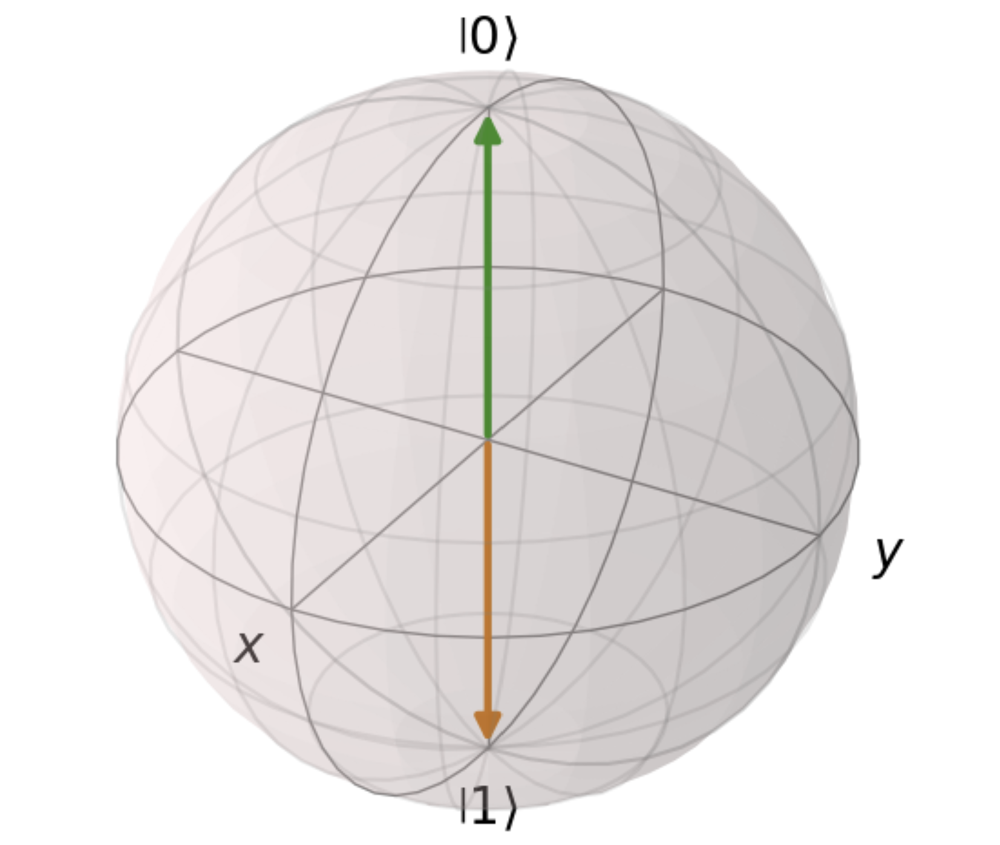
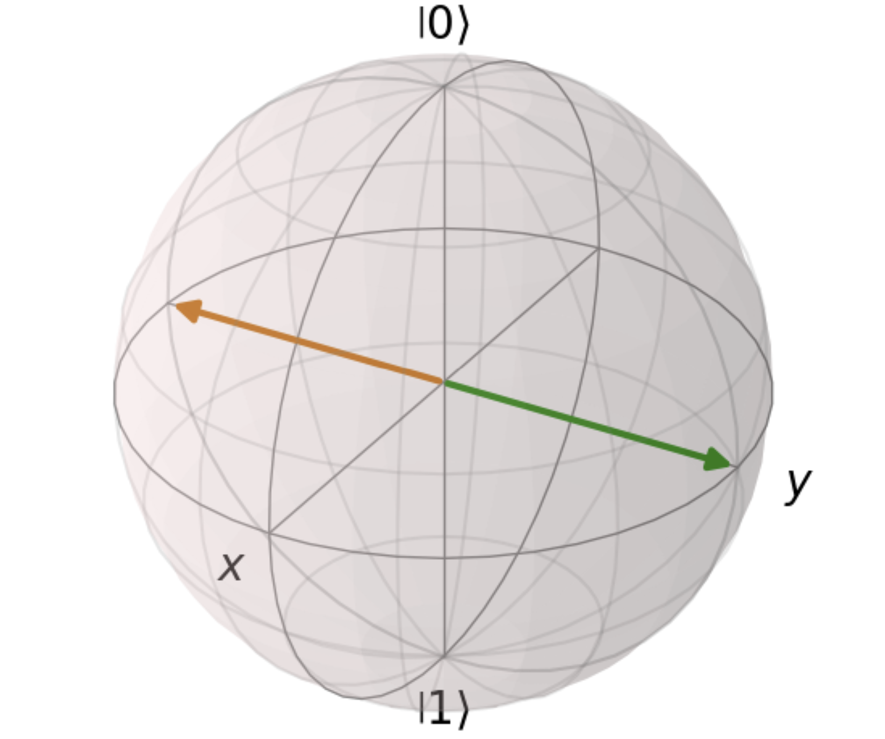

Baby’s first Quantum Computing
==============================

With a solid foundation in mathematics and physics, we are now ready to
embark on our journey into the world of quantum computing. We will start
with some theoretical considerations, as well as study and use the
fundamental quantum operations. In the last section we will discuss
today’s challenges to reliable quantum computers. To make it more
interactive and practical, we sprinkled some qrisp code into the
sections to help you get familiar with the coding style.

DiVincenzos Criteria for Quantum Computers
------------------------------------------

But as always, we need to start with some theory. In 1996, the
theoretical physicist David P. DiVincenzo proposed five requirements
for the realization of quantum computing hardware that still hold
today: 
  
1. **Scalability**
Microscopic quantum objects, which can be precisely controlled, form
the building block of quantum computers. The discrete energy levels in
atoms ( :ref:`think of the Bohr model introduced before <atommodel>`) or
polarization states of photons are used to physically implement the
basis states. A quantum computer needs the ability to scale the qubit
count reliably without decoherence. 
  
2. **Initialization**
The qubits need to be initialized accurately to perform computations.
The basis states :math:`\ket{0}` and :math:`\ket{1}` are frequently
used, but other linear independent states are possible.
  
3. **Coherence**
Coherence describes the time a qubit maintains its quantum properties
before it follows the rules of classical mechanics and is useless for
quantum computations (decoherence). To avoid decoherence, isolation
from outer influences is necessary, but still maintaining accessible
to implement the gate operation and measurements. This poses as one of
the biggest challenges today. For effective computations, a long
coherence time is necessary. 
  
4. **Universality**
Quantum gates are the core elements of quantum computing, similar to
the logic gates of classical computing. To build a universal quantum
computer, you need a universal gate set. These gates, when combined in
various ways, are able to approximate or simulate any other quantum
gate; which means you can construct any quantum operation or gate you
might need using this set of gates. We will study a basic universal
quantum gate set down below. 
  
5. **Measurement**
Quantum states need to be observed (measured) at the end of the
algorithm to obtain classical information that we can interpret. For
this purpose, every qubit needs to be accurately measured, which leads
to decoherence. Therefore, a qubit can only be observed once, else the
computation has to be repeated.

Introduction to Qrisp
---------------------

Qrisp is a high-level language to write programs for quantum computers.
Much like in classical high-level languages like Python or C++, the main
objects we’re working with in Qrisp are variables and functions instead
of single qubits and gate operations. This means that you don’t have to
study quantum mechanics for several years to program a quantum computer.
In fact, the tutorial sections you have read so far are a very good
starting point to dive into programming quantum computers with Qrisp.
Let’s look at the structures you already know from classical computing.

The main object we’re working with in Qrisp is the **QuantumVariable**,
which acts like any other variable. It is assigned with a number
corresponding to the amount of qubits used.

.. code:: python

    from qrisp import QuantumVariable
    qv = QuantumVariable(5) # 5 qubits are initialized with this variable. To access one specific qubit i, use qv[i]

You can now perform any gate operation onto the QuantumVariable,
harnessing the power of quantum computing without having to worry about
any underlying qubit structures.

If you’re familiar with programming, you might wonder what the type of
this variable is. The simple answer is: none so far. But Qrisp has the
common types already implemented. Those are QuantumBool, QuantumFloat,
QuantumChar and QuantumString (which is an array of QuantumChars). All
these types inherit from the QuantumVariable class, as in most
programming languages. By this logic, you can also create your very own
QuantumType.

But let’s head back first to the already implemented QuantumTypes: The
QuantumFloat for example is initialized like any floating point number.
In the code example below the 3 indicates the mantissa qubits and -1 the
exponent for the usual basis 2.

.. code:: python

    from qrisp import QuantumFloat
    a = QuantumFloat(3, -1, signed = False)

All known operations like addition and division can be performed as
usual. Keep in mind that division and inversion are approximated
results.

So far, the QuantumTypes very much acted like the classical types you’re
used to, but since we have quantum computers, we can of course do more
than that. For example the QuantumBool, like all QuantumTypes, can be
put into a superposition. This also affects regular operations like
numerical comparison or logical functions:

.. code:: python

   >>> from qrisp import QuantumBool, h
   >>> q_bool_0 = QuantumBool()
   >>> h(q_bool_0)     # superposition
   >>> print(q_bool_0)
   {False: 0.5, True: 0.5}
   >>> q_bool_1 = QuantumBool()    # initialized as false per default 
   >>> print(q_bool_1 | q_bool_0)      # q_bool_0 ist still in superposition, therefore there's a 0.5 chance it's true and the disjunction is true 
   {False: 0.5, True: 0.5}
   >>> print(q_bool_1 & q_bool_0)      # q_bool_1 is initialized as false, so the conjunction is always false
   {False: 1.0}

We have only looked at single QuantumVariables until now, but as in
classical computing, we can also have an array of QuantumVariables. For
example the QuantumString, briefly mentioned before, is such an array of
QuantumChars. With this type, or more like array of variables, we can
now recreate the world’s most popular computer program on a quantum
computer:

.. code:: python

   >>> from qrisp import QuantumString
   >>> q_str = QuantumString(size = len("hello world"))        #initialize string with desired length
   >>> q_str[:] = "hello world"        #initialize String 
   >>> print(q_str)
   {'hello world': 1.0}

As expected, we get ‘hello world’ with 100% certainty (since we so far
only executed our programs on a simulator, more to that later). Because
we want to use the quantum effects to spice up our hello world program,
we implement another small program, but now split ‘hello world’ into
three parts:

.. code:: python

   >>> q_str_0 = QuantumString()
   >>> q_str_1 = QuantumString()
   >>> q_str_2 = QuantumString()
   >>> q_str_0[:] = "hello"
   >>> q_str_1 += " "
   >>> q_str_2[:] = "world"
   >>> q_str_3 = q_str_1 + q_str_2     # concatenation
   >>> q_str_0 += q_str_3      # concatenation
   >>> print(q_str_0)
   {'hello world': 1.0}

So far nothing really changed, besides that we split ‘hello world’ in
three parts and glued them together. But now we want to add some
superposition and apply a Hadamard gate to the first qubit of the second
string:

.. code:: python

   >>> from qrisp import h
   >>> h(q_str_2[0][0])        # Hadamard gate. introduces supersposition 
   >>> print(q_str_0)
   {'hello world': 0.5, 'hello xorld': 0.5}

As you can see, we now have a superposition of ``hello world`` and
``hello xorld``. The string is in both states simultaneously, which
shows the power of Qrisp. We don’t just have some superposition of
states, but really a superposition of string values. The Hadamard gate,
which creates the superposition, is formally introduced down below.

Circuits
--------

To visualize quantum algorithms, the circuit representation is very
commonly used, so we also want to introduce it here briefly. In a
quantum circuit each (logical) qubit is represented by a wire, starting
in the initialized state. Little boxes with the corresponding letter
show the applied gate. We visualize a circuit with ``print()``. Here is
a simple example:

.. code:: python

   from qrisp import QuantumVariable
   qv = QuantumVariable(1)
   from qrisp import h
   h(qv[0])
   print(qv.qs) 

::

   QuantumCircuit:
   ---------------
         ┌───┐
   qv.0: ┤ H ├
         └───┘
   Live QuantumVariables:
   ----------------------
   QuantumVariable qv

The ``print()`` function should be used with a QuantumSession of the
corresponding QuantumVariable (``qv.qs``). You can imagine the
QuantumSession like the bigger picture that contains all
QuantumVariables and constructs the circuit.

Multi-qubit gates that contain target and control qubits are visualized
with a crosshair or a labelled box on the target. The control is
stylized into a little dot. We will find out more about multi-qubit
gates a few sentences below in the next section.

In Qrisp, commonly used sub-routines are not broken down to their core
gates, but instead represented by a box with a label of the algorithm.
This helps you construct complex circuits without having to worry about
the foundational gates, but you can break them down to a gate level, if
you wish, using the ``transpile()`` function.

For example, this popular sub-routine (that we will explore in a later
section)

.. code:: python

   from qrisp import QuantumVariable, h, QFT
   qv1 = QuantumVariable(2)
   QFT(qv1)
   print(qv1.qs)

::

   QuantumCircuit:
   ---------------
           ┌──────┐
   qv_0.0: ┤0     ├
           │  QFT │
   qv_0.1: ┤1     ├
           └──────┘
   Live QuantumVariables:
   ----------------------
   QuantumVariable qv_0

can be broken down to:

::

   >>> print(qv1.qs.transpile())
           ┌────────┐          ┌───┐┌─────────┐┌───┐┌───┐┌───┐     ┌───┐
   qv_0.0: ┤ P(π/4) ├──────────┤ X ├┤ P(-π/4) ├┤ X ├┤ H ├┤ X ├──■──┤ X ├
           └─┬───┬──┘┌────────┐└─┬─┘└─────────┘└─┬─┘└───┘└─┬─┘┌─┴─┐└─┬─┘
   qv_0.1: ──┤ H ├───┤ P(π/4) ├──■───────────────■─────────■──┤ X ├──■──
             └───┘   └────────┘                               └───┘   

If you’re all hot for Qrisp programming now, there’s good news: The next
chapter is completely focused on implementing simple programs and diving
deeper into the Qrisp language. For now, we will introduce the most
common quantum gates with their effect on the qubits.

Quantum Gates
-------------

In the above section, we have already seen some quantum gates. We now
briefly want to review them and see how they look in a circuit
representation and learn more about their effect on the qubits. And of
course we will also get to know more common quantum gates, which will be
useful later, when we are going to implement the first quantum
algorithms.

All quantum gates are represented by a matrix. This makes more sense
than a traditional truth table, since we don’t have distinct values like
1 and 0. Furthermore, as we already learned, they are reversible. That
means, if you show me your final state and the gates you used, I can
tell you which state you started in. In classical computing, this would
be like trying to unmix a bunch of colored paints – it’s just not
possible.

We already encountered the **Pauli-X gate** or simply **X gate** ,
operating as a bit-flip. The corresponding matrix looks like an
anti-identity matrix, as it switches the values:

.. math::

   X =\left (\begin{array}{rrr}
       0 & 1\\
       1 & 0\\
   \end{array} \right)

.. code:: python

   from qrisp import QuantumVariable, x
   qv = QuantumVariable(1)
   x(qv)

On the Blochsphere, the state vector is rotated by angle :math:`\pi` (or
180°) around the x-axis, hence the name “X gate”:

Notice that if we start in a state where both outcomes are equally
probable (in superposition), the X gate has no effect. The Pauli-X gate
exchanges the probabilities for :math:`\ket{0}` with :math:`\ket{1}`,
but since both states have the same probability, it stays the same. Here
is a visualization for the state
:math:`\frac{1}{\sqrt{2}} \ket{0} + \frac{1}{\sqrt{2}} \ket{1}`:

Since this vector stays unaffected by the linear transformation of the
X-gate, it is its eigenvector.

Other Pauli gates are Y and Z. The **Pauli-Y** gate is comparable with
the X gate, but instead of a bit-flip, a phase-flip is applied. As the
name reveals, it performs a :math:`\pi` angle (180°) rotation around the
y-axis:

.. math::

    Y=\left (\begin{array}{rrr}
       0 & -i\\
       i & 0\\
   \end{array} \right)

.. code:: python

   from qrisp import QuantumVariable, y, QuantumSession
   qv = QuantumVariable(1)
   y(qv)
   print(qv.qs)

::

   QuantumCircuit:
   ---------------
         ┌───┐
   qv.0: ┤ Y ├
         └───┘
   Live QuantumVariables:
   ----------------------
   QuantumVariable qv

The **Pauli Z-gate** (you guessed it!) rotates around the z-axis by the
angle :math:`\pi`. It leaves the qubit :math:`\ket{0}` unchanged, but
changes the sign of :math:`\ket{1}`, so it maps
:math:`\ket{1} \rightarrow -\ket{1}`.

.. math::

   Z=\left (\begin{array}{rrr}
       1 & 0\\
       0 & -1\\
   \end{array} \right)

.. code:: python

   from qrisp import QuantumVariable, z
   qv = QuantumVariable(1)
   z(qv)

(The circuits for the X and Z-gate look exactly like the Y-gate, with
their respective letter instead. You can also print them for yourself.)

The general **phase shift gate** is represented by the matrix: 

.. math::

   \left (\begin{array}{rrr}
   1 & 0\\ 
   0 & e^{i\theta}\\ 
   \end{array} \right), 

where :math:`\theta` denotes the phase. The
:math:`\ket{0}` state stays unchanged, and :math:`\ket{1}` is mapped to
:math:`e^{i\theta} \ket{1}`, changing the relative phase of
:math:`\ket{1}`. Specific phase gates are: 
* Pauli Z-gate with
:math:`\theta = \pi` 
* S-gate with the matrix

.. math::

   \left (\begin{array}{rrr}
   1 & 0\\
   0 & i\\
   \end{array} \right) 

with :math:`\theta = \frac{\pi}{2}` + T-gate with
:math:`\theta = \frac{\pi}{4}`

Next, we are having a look at **rotation gates**. They can be seen as a
generalized approach to the Pauli matrices, since they are not limiting
the degree of rotation.

.. math:: 
   R_x (\theta)= \left (\begin{array}{rrr}
    cos(\frac{\theta}{2}) &-i*sin(\frac{\theta}{2})\\
    -i*sin(\frac{\theta}{2})& cos(\frac{\theta}{2})\\
    \end{array} \right)

.. math::
   R_y (\theta)= \left (\begin{array}{rrr}
    cos(\frac{\theta}{2}) &-sin(\frac{\theta}{2})\\
    sin(\frac{\theta}{2})& cos(\frac{\theta}{2})\\
   \end{array} \right)

.. math::
   R_z(\lambda)= \left (\begin{array}{rrr}
    e^{-i\frac{\lambda}{2}} &0\\
    0& e^{i\frac{\lambda}{2}}\\
   \end{array} \right)

As stated previously, the Pauli matrices perform a rotation around their
respective axis for :math:`\pi`. Let’s test that:

.. code:: python

   from qrisp import QuantumVariable, measure, x, rx
   import numpy as np
   qv3 = QuantumVariable(1)
   qv4 = QuantumVariable(1)
   x(qv3)              # pauli x gate 
   rx(np.pi, qv4)      # rotation gate around the x axis for angle pi
   print(qv3)
   print(qv4)

::

   {'1': 1.0}                                                  
   {'1': 1.0} 

As you can see, both are equivalent for :math:`\theta= \pi`. Notice that
we might have caught some global phase in the process, but that
shouldn’t bother us.

Last, but certainly not least, we have the **Hadamard** gate: When
starting in state :math:`\ket{0}` it creates an equal superposition. To
harness the power of quantum computing, the Hadamard gate is often used
in the beginning of circuits to put all qubits in superposition.

.. math::

    H= \frac{1}{\sqrt{2}}\left (\begin{array}{rrr}
       1 & 1\\
       1 & -1\\
   \end{array} \right)

.. code:: python

   >>> from qrisp import QuantumVariable, QuantumSession,h
   >>> qv = QuantumVariable(1)
   >>> h(qv)
   >>> print(qv.qs.statevector()) # another useful function to get the vector in the Bloch sphere 
   sqrt(2)*(|0> + |1>)/2

Have you noticed the factor of :math:`\frac{1}{\sqrt{2}}` before the
matrix? Since we are always working with :ref:`normalised quantum states <matrix>`, this factor makes sure that also after applying the
Hadamard gate, the qubit states are still normalised.

After studying all these gates individually, let’s see an example where
some gates are applied successively: We initialize a qubit in the
fiducial state :math:`\ket{0}`, apply a Hadamard gate for equal
superposition, oppose a bit-flip with Pauli-X and a phase shift with S:

.. math::

   SXH\ket{0} = \frac{1}{\sqrt{2}} \left (\begin{array}{rrr}
   1 & 0\\
   0 & i\\
   \end{array} \right)\left (\begin{array}{rrr}
   0 & 1\\
   1 & 0\\
   \end{array} \right)\left (\begin{array}{rrr}
   1 & 1\\
   1 & -1\\
   \end{array} \right)\left (\begin{array}{c}
   1 \\ 0\\
   \end{array} \right) \\ =  \frac{1}{\sqrt{2}} \left (\begin{array}{rrr}
   1 & 0\\
   0 & i\\
   \end{array} \right)\left (\begin{array}{rrr}
   0 & 1\\
   1 & 0\\
   \end{array} \right)\left(\begin{array}{c}
   1 \\ 1\\
   \end{array} \right) \\ =\frac{1}{\sqrt{2}} \left (\begin{array}{rrr}
   1 & 0\\
   0 & i\\
   \end{array} \right)\left(\begin{array}{c}
   1 \\ 1\\
   \end{array} \right) \\ =\frac{1}{\sqrt{2}}\left(\begin{array}{c}
   1 \\ i\\
   \end{array} \right)

It is important to reverse the order of the gates, so that the gates
closest to the qubit are applied first, since matrix multiplication does
not commute and we start at the end. The normalization factor
:math:`\frac{1}{\sqrt{2}}` from the Hadamard gate however can be written
in front of the calculation.

Let’s have a look at how to implement this calculation:

.. code:: python

   from qrisp import x, s,QuantumSession
   qv = QuantumVariable(1) 
   h(qv)
   x(qv)
   s(qv)
   print(qv)
   print(qv.qs)
   print(qv.qs.statevector())

.. code:: python

   {'0': 0.5, '1': 0.5}                                                
   QuantumCircuit:
   --------------
         ┌───┐┌───┐┌───┐
   qv.0: ┤ H ├┤ X ├┤ S ├
         └───┘└───┘└───┘
   Live QuantumVariables:
   --------------------
   QuantumVariable qv
   sqrt(2)*(|0> + I*|1>)/2

The measurements {‘0’: 0.5, ‘1’: 0.5} are the probabilities, the
statevector function :math:`\frac{\sqrt{2} (\ket 0 + i \ket 1)}{2}` is
providing us our initial solution.

| As mentioned in the 4th DiVincenzo criterium, a set of universal
  quantum gates is required to perform arbitrary computations. One
  commonly used universal set consists of the rotation, phase shift and
  CNOT gate. By using combinations of these gates, you can effectively
  simulate or approximate any other unitary quantum gate. The key word
  here is approximate, since some gates connot be recreated 100%
  accurately. The Solovay-Kitaev theorem is giving us more information
  about that: Any quantum circuit containing :math:`m` CNOTs and single
  qubit gates can be approximated to an accuracy :math:`\epsilon` using
  only :math:`\mathcal(O)(m* log^c (\frac{m}{\epsilon}))` gates from a
  certain set.
| Why is this useful? When implementing quantum algorithms on real
  quantum computers, you often have to work with specific gates provided
  by the hardware. The Solovay-Kitaev theorem helps compile your quantum
  programs into sequences of these available gates, ensuring that your
  computation is performed accurately and efficiently. Furthermore, it
  can be used in high-level programming languages like Qrisp, that have
  to break down your written code into gates to apply them.

.. _conditional: 

Multi-qubit gates
~~~~~~~~~~~~~~~~~

| To really harness the power of entanglement, we need multi-qubit
  gates. The most famous one is the **CNOT** (controlled-not) gate: As
  the name suggests, it works conditional. It is applied to two qubits,
  one acts as the control qubit and the other as target qubit. Is the
  control qubit in state :math:`\ket{0}`, nothing changes. However, is
  the control qubit in state :math:`\ket{1}`, a bit-flip is applied to
  the target qubit. The values of the qubits depend on each other,
  therefore they can be entangled. Since a bitflip is applied, the gate
  is also called CX (controlled X gate).
| If we apply this gate to two qubits in the initial state
  :math:`\ket{00}`, we get the underwhelming result of… still
  :math:`\ket{00}`. The control qubit needs to be in the state
  :math:`\ket{1}` for the gate to show its effect. But even when
  starting in :math:`\ket{01}`, our result would be :math:`\ket{11}`,
  however we haven’t seen any entanglement yet. To achieve that, we need
  the control qubit to start in superposition
  :math:`\frac{1}{\sqrt{2}}\ket{00} +\frac{1}{\sqrt{2}}\ket{01}`. The
  first number represents the target qubit, the second the control. As
  you can see, the control qubit is in a superposition, we only wrote
  the target qubit into the ket as well to simplify. Of course we could
  also choose any other superposition state. When we apply the CX gate
  now, we get the Bell state
  :math:`\frac{1}{\sqrt{2}}\ket{00} +\frac{1}{\sqrt{2}}\ket{11}`, which
  is in fact entangled.

.. code:: python

   from qrisp import QuantumVariable, h, cx, QuantumSession
   qv5 = QuantumVariable(1)
   qv6 = QuantumVariable(1)
   h(qv5)
   cx(qv5, qv6)
   print(qv5)
   print(qv5.qs)
   print(qv5.qs.statevector())

::

   {'0': 0.5, '1': 0.5}                                                     
   QuantumCircuit:
   ---------------
          ┌───┐     
   qv5.0: ┤ H ├──■──
          └───┘┌─┴─┐
   qv6.0: ─────┤ X ├
               └───┘
   Live QuantumVariables:
   ----------------------
   QuantumVariable qv5
   QuantumVariable qv6
   sqrt(2)*(|0>**2 + |1>**2)/2

| This state is per definition entangled, and you can not find any
  product state of two independent qubits that add up to this state.
| The Bell state is the easiest way to reach maximum entanglement for
  two qubits and is essential, for example in superdense coding. This
  quantum communication protocol relies on two entangled qubits that are
  shared between two parties, usually Alice and Bob; by sending only one
  qubit Alice can convey the same information as with two classical
  bits.

Certain combinations of starting states for target and control qubits
can lead to them switching the values. This is known as a **phase
kickback**. See this example:
 :math:`\frac{1}{2}\ket{00} -\frac{1}{2}\ket{01} +\frac{1}{2}\ket{10}-\frac{1}{2}\ket{11} \xrightarrow{CNOT}\frac{1}{2}\ket{00} -\frac{1}{2}\ket{01} -\frac{1}{2}\ket{10}+\frac{1}{2}\ket{11}`
This will be an essential step in the Quantum Phase Estimation
Algorithm (TODO: add link). To further understand these propteries, let’s have a look at the
matrix:

.. math:: 

   CNOT=\left (\begin{array}{rrr} 1 & 0 & 0 & 0\\0 & 1 & 0 & 0\\0 & 0 & 0 & 1\\0 & 0 & 1 & 0\\ \end{array} \right)

Note that the upper part resembles an identity matrix, since the control
qubit is left unchanged. The lower part looks like the X gate, flipping
the values. With this structure, we can construct new controlled
versions of abitrary matrices in the bottom right part. Other well-known
examples are the CY or CZ gates, including the respective Pauli matrix
in the target part.

The CNOT gate can also be expanded to include more control qubits,
leading to our next operation:
The **Toffoli**- or CCNOT-gate is a quantum equivalent of a classical
gate. It extends the CNOT gate to include two control qubits, meaning
the upper part is repeated: 

.. math::

   TOFFOLI=\left (\begin{array}{rrr}
   1 & 0 & 0 & 0 & 0 & 0 & 0 & 0\\
   0 & 1 & 0 & 0& 0 & 0 & 0 & 0\\
   0 & 0 & 1 & 0& 0 & 0 & 0 & 0\\
   0 & 0 & 0 & 1& 0 & 0 & 0 & 0\\
   0 & 0 & 0 & 0& 1 & 0 & 0 & 0\\
   0 & 0 & 0 & 0& 0 & 1 & 0 & 0\\
   0 & 0 & 0 & 0& 0 & 0 & 0 & 1\\
   0 & 0 & 0 & 0& 0 & 0 & 1 & 0\\
   \end{array} \right)

Due to the exponential growth of qubits, the three qubit gate needs
:math:`2^3 = 8` rows and columns.

The **swap** gate changes the values of two qubits. In contrast to the
CNOT, it is not conditional, and works on two whole qubits instead of
the two states of one qubits (that would be a X gate).

.. math::

   SWAP =\left (\begin{array}{rrr}
       1 & 0 & 0 & 0\\
       0 & 0 & 1 & 0\\
       0 & 1 & 0 & 0\\
       0 & 0 & 0 & 1\\
   \end{array} \right)

.. code:: python

   from qrisp import QuantumVariable, QuantumSession,swap, multi_measurement
   qv0 = QuantumVariable(1)
   qv1 = QuantumVariable(1)
   x(qv0)      #0 -> 1
   swap(qv0, qv1)
   print(qv0.qs)
   print(qv0)
   print(qv1)

::

   QuantumCircuit:
   ---------------
          ┌───┐   
   qv0.0: ┤ X ├─X─
          └───┘ │ 
   qv1.0: ──────X─
                  
   Live QuantumVariables:
   ----------------------
   QuantumVariable qv0
   QuantumVariable qv1
   {'0': 1.0} 2 qubits                                                    
   {'1': 1.0} 2 qubits

Challenges
----------

| The reason we put so much effort into developing a new programming
  paradigm is the promised quatum advantage. This describes the hope
  that a quantum computer can solve problems that no classical computer
  can solve in feasible time. This advantage has not been proven so far,
  but we have evidence to believe in it, such as clever engineered
  algorithms that make use of quantum phenomena and can already solve
  specific problems faster (that we will look at in the next sections).
| However, there are still challenges we face before quantum advantage
  is reached. In this section we will go through some major challenges
  physicists and engineers are facing when building quantum computers.

For example the **connectivity** between qubits plays a vital role. When
two qubits need to be adressed together, e.g. with a CNOT gate, but are
not connected to each other, the qubits need to be permuted via SWAP
operations which costs valuable computation time and thus increases the
probability of quantum noise effects (errors). However, a well-connected
qubit system can lead to unwanted qubit interactions, termed as
cross-talk between qubits, which induce decoherence.

Quantum systems are extremly fragile and prone to **decoherence**. The
slightest change in temperature, humidity, electromagnetic influences
(even in another room) or even the qubits themselves as just established
can lead to information loss. Of course, these challenges are kept in
mind when designing the hardware, but it is still hard to completely
isolate the qubits from the evironment, especially since we need to
manipulate them via gate functions.

Similar, decoherence limits the **scalability**, as bigger quantum
circuits offer more chances to induce noise. A higher qubit count
however is needed to tackle interesting problems that are
computationally too expensive on classical computers.

These effects often prohibit as many qubit connections as mathematically
or physically possible, or require additional qubits for error
correction. This leads to the logical qubit to physical qubit trade-off.
You can therefore often only implement algorithms using fewer logical
qubits than available physical qubits. This relationship is estimated to
be 10:1 to 1.000:1, depending on the algorithm, the error correction
method and the fault-tolerance of the computation.

To actually be able to build elaborate quantum computers and hopefully
achieve quantum advantage, error handling techniques arised, so we can
reduce these effects. In the section error handling (TODO add link), we
have a closer look at different techniques. You can now decide if yo
want to read up more on that, or get practical with your first Qrisp
programming.

Summary
-------

-  The five basic requirements for quantum computers are scalability,
   coherence, universal gates, precise measurement and reliable
   initialization
-  The most important single qubit gates are the Pauli X, Y, Z gates,
   the phase shift gates, the rotation operations and the Hadamard gate
-  The most important mulit qubits gates are the SWAP, the CNOT-gate and
   its extension, the Toffoli gate.
-  In Qrisp, QuantumTypes, the quantum counterparts to classical
   programming types, can be used without explicitly initializing the
   qubit structure
-  Quantum circuits visualize an algorithm. With ``print(qv.qs)``, they
   can be drawn with Qrisp.
-  Current problems in the development of quantum computers include
   connectivity, scalability and noise due to decoherence.
