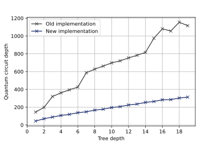

.. _v0.3:

Qrisp 0.3
=========

We’re excited to present our latest update, packed with a variety of innovative features that will optimize you programming tasks and take them to new heights. Proceed further to explore the innovative enhancements in the latest update of our Qrisp framework!

Quantum Approximate Optimization Algorithm (QAOA) module
--------------------------------------------------------

QAOA is the predominant quantum algorithm for combinatoric optimization. Within the past months, we developed a module that smoothly integrates many aspects of this algorithm into Qrisp. Together with the established infrastructure, this module enables you to formulate problems independent of the information encoding. As established for Qrisp, algorithmic elements of QAOA can be supplied as Python functions instead of QuantumCircuits, enabling a high degree of code modularity and maintanbility.

The following is new in Qrisp 0.3 with regard to QAOA

* The :ref:`QAOAProblem` class, which facilitates convenient problem formulation and evaluation.
* The :ref:`QAOABenchmark` class, which allows you to investigate the performance of your implementations.
* :ref:`Various tutorials <QAOA101>` that cover a lot of content. From :ref:`the very basics <TheoryQAOA>` to :ref:`scientific novelties <ConstrainedMixers>`.
* 7 different presolved problems from combinatorial optimization.
* `Qiskit runtime services <https://qiskit.org/ecosystem/ibm-runtime/>`_ can now be used as a :ref:`Qrisp backend <QiskitRuntimeBackend>`.

With the release of Qrisp 0.3 we also introduce a novel mixer architecture that can keep arbitrary constraints intact and has polynomial complexity! Read more about this exciting idea :ref:`here <ConstrainedMixers>`.

Upgraded Backtracking 
----------------------

Due to a new encoding we could improve the performance of the backtracking module by 300%! The plot below shows the circuit depth for trivial ``reject`` and ``accept`` functions.

| 

Furthermore the backtracking implementation now has to call the ``reject`` function only once per quantum step (previously twice).

Documentation
-------------

Powered by the `Thebe framework <https://thebe.readthedocs.io/en/stable/>`_, the Qrisp documentation is now fully interactive. Furthermore we made some stylistic improvements.

Framework interfacing
---------------------

Qrisp :ref:`QuantumCircuits <QuantumCircuit>` can now be export to :meth:`Pennylane <qrisp.QuantumCircuit.to_pennylane>` and :meth:`PyTket <qrisp.QuantumCircuit.to_pytket>`.

Minor Features
--------------

* Arithmetic module uses the :ref:`ConjugationEnvironment`.
* Improved the simulator speed for circuits with many measurements. For many QAOA related tasks, we achieved a x2 speed-up.
* Implemented ``precompiled_qc`` keyword argument for ``get_measurement`` methods of QuantumVariable and QuantumArray.
* Implemented not equal method for general QuantumVariables and increased performance for both: ``eq`` and ``neq``.
* Implemented :meth:`custom_control <qrisp.custom_control>` decorator.
* Implemented the `Saeedi shifting method <https://arxiv.org/abs/1304.7516>`_ for the :meth:`cyclic_shift <qrisp.cyclic_shift>` function.
* Improved the substitution speed of large expressions of abstract parameters.

Bug fixes
---------

* Fixed abstract parameters not being treated properly in session merging.
* Fixed an error in the decoder of QuantumArray that prevented proper display of bitstring quantum types.
* Fixed an issue that prevented the progressbar of the statevector simulator from being properly removed if the simulation is trivial.
* Fixed an error that in some cases caused faulty results for symbolic statevector simulation.
* Fixed proper error message display for exceptions in :ref:`IterationEnvironment`.
* Fixed a bug that caused wrong results for the backtracking algorithm if the reject function did not return equivalent results on non-algorithmic states.
* Fixed permeability specification for logic synthesis functions.
* Fixed QuantumDictionary loading for pprm synthesis.

