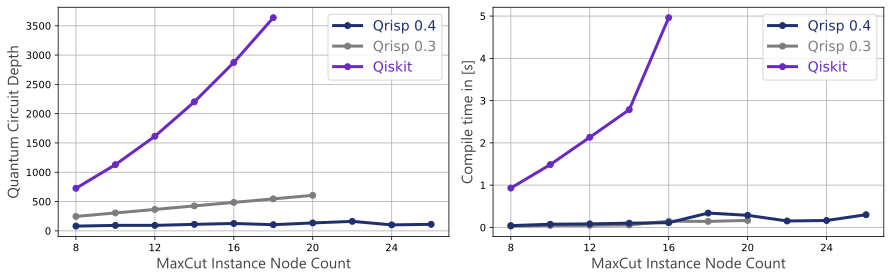

.. _v0.4:

Qrisp 0.4
=========

The latest update of Qrisp is (once again) the biggest (so far)! We integrated a large variety of features, but also worked a lot on the classical performance, making Qrisp algorithms more scalable than ever.

Shor's Algorithm and modular arithmetic
---------------------------------------

With 0.4 we integrated the infrastructure to facility the implementation and compilation of Shor's algorithm. Most notably:

* The :ref:`QuantumModulus` quantum type, which allows you to utilize modular arithmetic in your algorithms with a minimal amount of knowledge of the `underlying circuits <https://arxiv.org/abs/1801.01081>`_. 
* Furthermore, we implemented the :meth:`qcla <qrisp.qcla>` introduced by `Wang et al <https://arxiv.org/abs/2304.02921>`_. The previously mentioned arithmetic can be adapted to use this adder (or any other adder for that matter!).
* We wrote a :ref:`tutorial for Shor's algorithm in Qrisp <shor_tutorial>` and created a dead simple :ref:`interface for factoring numbers <Shor>`.
* :ref:`Decrypt <crypto_tools>` your neighbors pizza delivery order to make them eat pineapples! 😈

As we found out, implementations of Shor's algorithm that are able to return a QuantumCircuit in a finite amount of time are an extremely rare sight. After some searching, we could find `some <https://github.com/RevanthK/ShorsAlgorithmIBMQiskit>`_ `competitors <https://qiskit.org/documentation/stable/0.28/tutorials/algorithms/08_factorizers.html#:~:text=Shor's%20Factoring%20algorithm%20is%20one,N%20%3D%2015%20backend%20%3D%20Aer.>`_ for a benchmark:

.. _shor_benchmark_plot:
|

.. image:: 04_shor_plot.svg
    
This demonstrates how powerful the Qrisp version is compared to other compilers/implementations. The presented values for the are averaged over several choices of $a$ per $N$. T-depth and T-count are computed under the (extremely optimistic) assumption that parametrized phase gates can be executed in unit time and unit cost. Without this assumption the Qrisp implementation brings a speed-up of almost 3 orders of magnitude!

Compiler upgrades
-----------------

The :meth:`compile <qrisp.QuantumSession.compile>` function received two important upgrades:

* Due to another topological ordering step, this function can now reduce the depth in many cases by a significant portion with minimal classical performance overhead.
* It is now possible to specify the time each gate takes to optimize the overall run time in a physical execution of the quantum circuit. Read more about this feature :ref:`here <gate_speed_aware_comp>`. This especially enables compilation for fault tolerant backends, as they are expected to be bottlenecked by T-gates.

This plot highlights how the Qrisp compiler evolved compared to the last version (and it's competitors). It shows the circuit depth (as acquired with :meth:`depth <qrisp.QuantumCircuit.depth>`) for the QAOA algorithm applied to a MaxCut problem. We benchmarked the code that is available as tutorial.

|

Algorithmic primitives
----------------------

We added the following algorithmic primitives to the Qrisp repertoire:

* :meth:`amplitude_amplification <qrisp.amplitude_amplification>` is an algorithm, which allows you to boost the probability of measuring your desired solution.
* :meth:`QAE <qrisp.QAE>` gives you an estimate of the amplitude of a certain sub-space without having to perform a possibly exponential amount of measurements.
* The ``gidney`` and ``jones`` methods for compiling :meth:`mcx <qrisp.mcx>` gates with optimal T-depth in a fault-tolerant setting.
* The :meth:`gidney_adder <qrisp.gidney_adder>` as documented `here <https://arxiv.org/abs/1709.06648>`_.

QUBO optimization
-----------------

QUBO is short for Quadratic Uncostrained Binary Optimization and a problem type, which captures a `large class of optimization problems <https://arxiv.org/abs/1302.5843>`_. QUBO instances can now be :ref:`solved within the QAOA module <QUBOQAOA>`.

Simulator
---------

The Qrisp simulator received multiple powerfull performance upgrades such as a much faster sparse matrix multiplication algorithm and better statevector factoring. These upgrades facility the simulation of extremely large circuits (in some cases, we observed >200 qubits)!

Network interface
-----------------

For remote backend queries, Qrisp now uses the network inteface developed in the `SequenC project <https://sequenc.de/>`_. This project aims to build a uniform, open-source quantum cloud infrastructure. Note that specific backend vendors like IBMQuantum can still be called via :ref:`VirtualBackends <VirtualBackend>`.

Minor features
--------------

* Implemented ``&``, ``|``, and ``^`` operators for general :ref:`QuantumVariables <QuantumVariable>`.
* Classical performance upgrade for Qrisp's internal logic synthesis function, facilitating faster execution of many algorithms.
* CNOT and T-depth can now be inferred from :ref:`QuantumCircuits <QuantumCircuit>` via :meth:`cnot_depth <qrisp.QuantumCircuit.cnot_depth>` and :meth:`t_depth <qrisp.QuantumCircuit.t_depth>`
* Implemented the :meth:`train_function <qrisp.qaoa.QAOAProblem.train_function>` method to reuse QAOA circuits in higher order algorithms.
* Implemented the :meth:`compile_circuit <qrisp.qaoa.QAOAProblem.compile_circuit>` method to give direct access to the circuit executed by :meth:`run <qrisp.qaoa.QAOAProblem.run>`.
* ``==`` and ``!=`` for :ref:`QuantumVariable` are now compiled using the :ref:`ConjugationEnvironment` enabling a more efficient :meth:`custom_control <qrisp.custom_control>`.
* Wrote the :meth:`inpl_adder_test <qrisp.inpl_adder_test>` function to verify a user specified function is a valid adder.

Bug-fixes
---------

* Fixed a bug that caused false results in some simulations containing a Y-gate.
* Fixed a bug that prevented proper QFT cancelation within the :meth:`compile <qrisp.QuantumSession.compile>` method in some cases.
* Fixed a bug that prevented proper verification of correct automatic uncomputation in some cases.
* Fixed a bug that caused false determination of the unitary of controlled gates with a non-trivial control state.
* Fixed a bug that caused problems during circuit visualisation on some platforms.
* Fixed a bug that caused the simulation progressbar to not vanish after the simulation concluded.
* Fixed a bug that introduced an extra phase in the compilation of dirty-ancillae supported ``balauca`` MCX gates.
