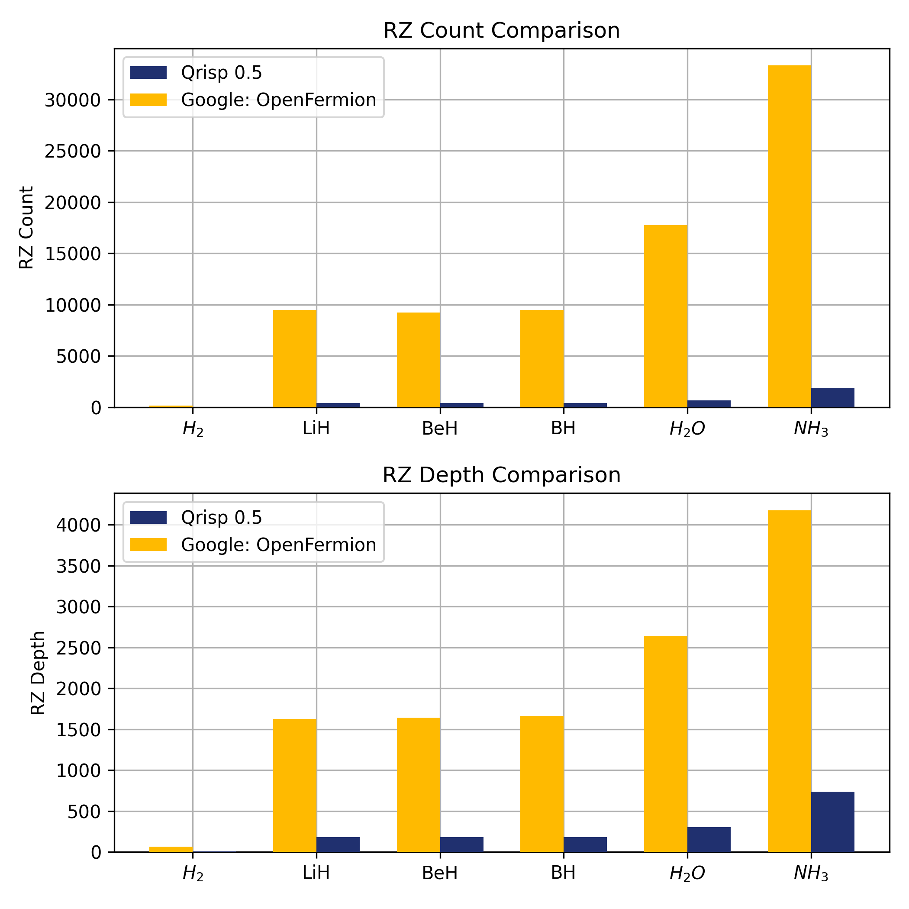

.. _v0.5:

Qrisp 0.5
=========

Welcome to the latest update of Qrisp, our quantum computing programming language! This release introduces powerful new features designed to enhance your quantum programming experience. We are excited to announce the addition of Hamiltonian simulations, enabling users to tackle complex chemistry problems with greater efficiency and precision. Additionally, a cutting-edge algorithm for combinatorial optimization has been integrated, offering significant improvements in solving challenging optimization tasks. Alongside these advancements, we've also introduced several new algorithmic primitives, further expanding the capabilities of Qrisp.

The Operators module
--------------------

This module allows you to describe operators that are not necessarily unitary or even hermitian. With these tools at hand you can effectively set up two of quantum's most important algorithms: :meth:`Hamiltonian simulation <qrisp.operators.qubit.QubitOperator.trotterization>` and the :ref:`VQE`.

For this purpose, Qrisp provides the following classes:

* :ref:`QubitOperator` is a class that enables the representation and processing of operators acting on a qubit space: $(\mathbb{C}^2)^{\otimes n}$. QubitOperators can be constructed based on a variety of tensor factors including the Pauli-matrices but also projector, creators and annihilators. For the latter Qrisp features a highly performant algorithm for Hamiltonian simulation proposed by `Kornell and Selinger <https://arxiv.org/abs/2310.12256>`_.
* :ref:`FermionicOperator` provides you with the tools to describe and manipulate fermionic systems. This type of system is of particular importance for applications in chemistry because many computations for molecular dynamics involve the simulation of electrons, which are fermions. FermionicOperators can be :ref:`constructed effortlessly <pscf_loading>` from `PySCF <https://pyscf.org/>`_ data. PySCF is one of the most popular quantum chemistry Python packages.
* :ref:`VQEProblem` which allows you to quickly formulate and run the VQE algorithm using Hamiltonians expressed through the two operator classes.

Explore these features in the following a `tutorial on simulating the dynamics of the $H_2$ molecule <https://www.qrisp.eu/general/tutorial/H2.html>`_, and examples :ref:`computing the ground state energy of the Hydrogen molecule <GroundStateEnergyQPE>`, :ref:`determine the molecular potential energy curve of the Hydrogen molecule <MolecularPotentialEnergyCurve>`, :ref:`simulate the Ising-modell with a disturbance <IsingModel>`.

Hamiltonian simulation in Qrisp is very performant. In a benchmark against Google's `OpenFermion <https://quantumai.google/openfermion/tutorials/intro_workshop_exercises#hamiltonian_simulation_with_trotter_formulas>`_, Qrisp requires 20 times less RZ gates.

The amount of RZ gates is proportional to the required computation effort because Hamiltonian simulation is an algorithm, which requires fault tolerant devices. In this device model, arbitrary angle gates (like RZ, P or RX) need to be synthesized by a sequence of Clifford+T gates. More details `here <https://arxiv.org/abs/1403.2975>`__.

QIRO
----

The :ref:`QIRO algorithm <QIRO>` introduced by J. Finzgar et. al. in `Quantum-Informed Recursive Optimization Algorithms (2023) <https://arxiv.org/abs/2308.13607>`_ has been implemented.
The algorithm is based on updating the problem instance based on correlations, that are in turn established with a QAOA protocol. For further info have a look at our `tutorial on QIRO! <https://www.qrisp.eu/general/tutorial/QIROtutorial.html>`
The central data structure of the QIRO module is the :ref:`QIROProblem` class.

Compiler upgrades
-----------------

* A significantly faster algorithm for memory management has been implemented. With this feature, managing circuits with thousands of qubits is no problem.
* The compiler can now also leverage X-Permeability type commutativity relations. More info `here <https://quantum-compilers.github.io/iwqc2024/papers/IWQC2024_paper_16.pdf>`__.

Algorithmic primitives
----------------------

* :ref:`A module <phase_polynomials>` for the efficient treatment of phase polynomials has been implemented.
* :ref:`Quantum switch-case <qswitch>` can be used to execute a `switch statement <https://en.wikipedia.org/wiki/Switch_statement>`_ in superposition.
* Implemented a :ref:`Dicke state preparation algorithm <DickeStates>`.

Minor features
--------------

* It is now possible for backends to specify their own default shot count.
* Deprecated the QuantumNetworks module.
* :ref:`Operations <Operation>` can now receive complex numbers as parameters.
* :ref:`QuantumModulus` will now use the user-specified adder for all arithmetic evaluations (previously only in-place multiplication).
* A `tutorial for utilizing the Quantum-Backtracking algorithm for solving Sudokus <https://www.qrisp.eu/general/tutorial/Sudoku.html>`_ is now available.