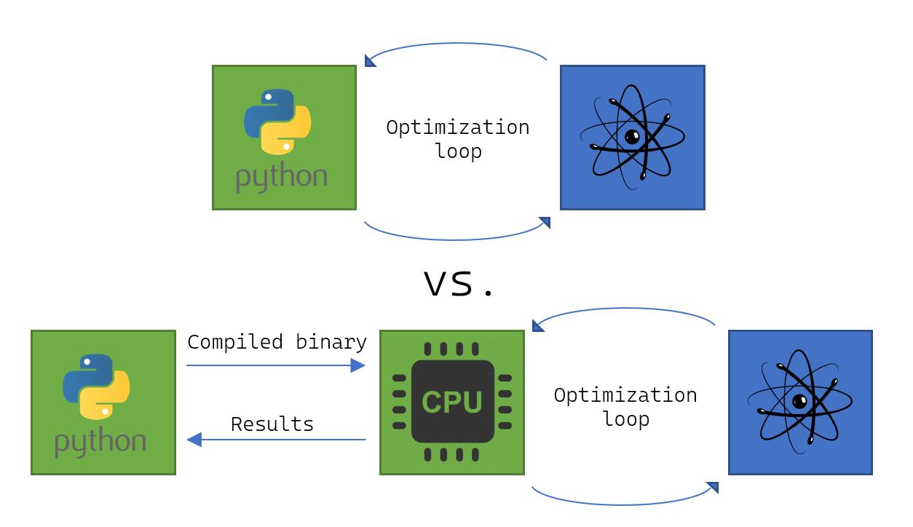

.. _v0.7:

Qrisp 0.7
=========

Qrisp 0.7 is here, marking another significant milestone in the evolution of our high-level quantum programming framework. This release continues Qrisp’s mission to make quantum algorithm development more intuitive, efficient, and accessible for researchers and developers alike. While previous updates often focused on a unified theme, Qrisp 0.7 brings a diverse collection of features and improvements, reflecting the rapidly expanding landscape of quantum computing.

With this version, users will find not only innovative new primitives and protocols, but also substantial enhancements to existing workflows and resource management. The integration of advanced compilation techniques, dynamic algorithmic components, and expanded compatibility with the Jasp submodule further solidifies Qrisp’s position as a leading platform for scalable quantum software development. Whether you are exploring cutting-edge quantum algorithms or optimizing large-scale simulations, Qrisp 0.7 delivers the tools and performance to push your projects forward.

Linear Combination Of Unitaries
-------------------------------

`LCU <https://arxiv.org/abs/1202.5822>`_ was initially conceived for improving the precision of Hamiltonian simulations but since then has become a core tool for a diverse field of quantum algorithms including `QSP <https://journals.aps.org/prxquantum/abstract/10.1103/PRXQuantum.5.020368>`_, `QSVT <https://dl.acm.org/doi/abs/10.1145/3313276.3316366>`_, `LCHS <https://journals.aps.org/prl/pdf/10.1103/PhysRevLett.131.150603>`_, and `optimization via dynamical simulation <https://arxiv.org/abs/2502.04285>`_. Qrisp 0.7 makes all of the above possible: i.e. LCHS (Linear Combination of Hamiltonian Simulation) utilizing the :ref:`operators module <Operators>` and our :ref:`Trotterization method <Trotterization>` for passing the Hamiltonian simulation unitary through the LCU protocol. 

The Linear Combination of Unitaries technique relies on a :ref:`non-unitary feedback loop <RUS>` to add up the unitaries of several user-specified quantum functions. Within the quantum software landscape the importance of LCU has been recognized within some artifacts implementing the `"loop body" <https://github.com/Classiq/classiq-library/blob/main/tutorials/classiq_101/quantum_primitives/linear_combination_of_unitaries/linear_combination_of_unitaries.ipynb>`_ but to the best of our knowledge no framework implements the means for compiling the whole workflow down to a low-level representation. This changes with Qrisp 0.7.

Using our new :ref:`LCU` primitive it is possible to perform a streamlined and efficient implementation of the workflow using an arbitrary set of user-specified functions.

Dynamic Quantum Switch
----------------------

The :ref:`quantum switch <qswitch>` is a core component of the LCU protocol and as such is now compatible with Jasp. It is furthermore now possible to specify case functions dynamically, ensuring the scalability of every component involved. Finally an additional `compilation technique based on a binary tree <https://arxiv.org/pdf/2407.17966v1>`_ has been implemented to ensure state of the art compilation performance.

Dynamic QAOA/VQE and gradient free dynamic optimization
-------------------------------------------------------

QAOA and VQE are among the most popular hybrid algorithms. The established way of running these is to set up a feedback loop that alternates between a quantum computer and a Python instance performing the classical optimization. While suitable for prototypical implementations, this architecture brings a considerable overhead because (a) entering and running the Python interpreter is slow and (b) using IP networks for connectivity introduces extra latency. For this reason we made the algorithms compatible with Jasp, implying the whole workflow is now compiled into one big QIR expression. Read more about this :ref:`here <JaspQAOA>`.

Iterative Quantum Phase Estimation
----------------------------------

:ref:`IQPE` is a technique that extends the idea of :ref:`regular QPE <QPE>` to the dynamic context. By introducing real-time features the eigenvalues of a unitary $U$ can be estimated to $n$ digits of precision using only a single extra ancilla qubit (instead of $n$).

Resource estimation
-------------------

Estimating the resources of large scale quantum algorithms has become an `important field of research <https://qre2024.quantumresource.org/>`_, as it provides concrete indicators, which purposes future quantum computers might be suitable for. A variety of frameworks exists for tackling this problem - in many cases however the framework can either (a) not compile/simulate the full algorithm, which makes it hard to verify correctness or (b) can only estimate the resources at limited scale. With Jasp we can now do both! The :ref:`count_ops <count_ops>` decorator uses the tight embedding into classically established compilation infrastructure to compile a binary program that computes the required resources. This allows us to probe algorithms with billions of gates within only a few seconds! By switching out the decorator to :ref:`jaspify`, we can simulate the exact same code without any changes on a smaller scale.

Other Jaspified features
------------------------

The following features are now compatible with Jasp:

* :ref:`QuantumArray`.
* :ref:`QubitOperator` and :ref:`FermionicOperator` expectation value evaluation.
* :ref:`QITE`.
* :ref:`IQAE`.
* :ref:`MCX <mcx>` implementation by `Khattar et. al <https://arxiv.org/pdf/2407.17966v1>`_ based on conditionally free ancillae.

New Tutorials
-------------

Next to a major visual revamp of the :ref:`tutorial` page, the following tutorials have been added.

* :ref:`HHL_tutorial`, explaining how to implement the HHL algorithm using Jasp.
* :ref:`JaspQAOAtutorial`, explaining how to create your own Jasp implementation of QAOA from scratch.

UI Changes
----------

* ``QubitOperator.get_measurement`` is replaced by ``QubitOperator.expectation_value`` and will be removed in a future release of Qrisp.