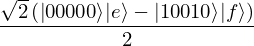

.. _tutorial:

Tutorial
========
Welcome to the tutorial of Qrisp! This page is designed to help you get started by providing step-by-step instructions and examples. Whether you're a beginner or an experienced quantum programmer, this tutorial will guide you through the fundamentals of the framework and help you become familiar with its syntax and features.

We've structured the tutorial in a way that is easy to follow, starting with the basics and gradually building up to more advanced language features like automatic :ref:`recomputation <recomputation>`. Along the way, we'll introduce you to important concepts and techniques that you'll need to know in order to write highly efficient algorithms in Qrisp.

We encourage you to follow along with the examples and try out the code for yourself. Don't worry if you make mistakes or don't understand something right away - programming is a process of learning and experimentation, and it takes time to become proficient.

By the end of this tutorial, you'll have a solid foundation of Qrisp and be ready to tackle more complex projects. So let's get **started**!

Creating a QuantumVariable
--------------------------
The central building block of Qrisp algorithms is the :doc:`/./reference/Core/QuantumVariable`. A QuantumVariable hides the qubit management from the user, enables human readable in- and outputs, strong typing via class inheritance, infix arithmetic syntax and much more. Creating a QuantumVariable is simple:

>>> from qrisp import QuantumVariable
>>> qv = QuantumVariable(5)

Here, 5 refers to the number of qubits the QuantumVariable represents.
QuantumVariables allow for convenient quantum function construction and evaluation, since a QuantumVariable carries all the information that is relevant for performing quantum operations on it.

QuantumVariables can be low-level manipulated by calling :ref:`gate application functions <gate_application_functions>` on them:
  
>>> from qrisp import h, z, cx
>>> h(qv[0])
>>> z(qv)
>>> cx(qv[0], qv[3])

Note that the Z gate is applied to all qubits of ``qv`` since there is no qubit specified.

In order to take a look at the generated circuit, we call ``print`` on the :ref:`QuantumSession` in which ``qv`` is registered:

>>> print(qv.qs)
QuantumCircuit:
---------------
      ┌───┐┌───┐     
qv.0: ┤ H ├┤ Z ├──■──
      ├───┤└───┘  │  
qv.1: ┤ Z ├───────┼──
      ├───┤       │  
qv.2: ┤ Z ├───────┼──
      ├───┤     ┌─┴─┐
qv.3: ┤ Z ├─────┤ X ├
      ├───┤     └───┘
qv.4: ┤ Z ├──────────
      └───┘          
Live QuantumVariables:
----------------------
QuantumVariable qv

Once the QuantumVariable is not needed anymore, we can call the :meth:`delete<qrisp.QuantumVariable.delete>` method, to tell the qubit manager, to free up the corresponding qubits. Calling :meth:`delete<qrisp.QuantumVariable.delete>` enables the qubits of ``qv`` to be reused at a later point for other purposes.

>>> qv.delete(verify = True)
Exception: Tried to delete QuantumVariable which is not in |0> state.

If given the keyword argument ``verify`` , Qrisp will check if the deleted qubits are properly disentangled by querying a simulator. Note that ``verify`` is set to ``False`` by default as the simulation can be resource costly for algorithms, which are creating and destroying alot of QuantumVariables.

In this case, the qubits are not ready to use for other purposes as they still are in a non-trivial state. If ``qv`` is entangled to other qubits, a simple reset would result in a non-unitary collapse of superposition. We would need to perform a procedure which is commonly called :ref:`uncomputation`.

QuantumVariables can be thought of as the abstract parent class of more special types. One example is the :doc:`/./reference/Quantum Types/QuantumChar`:

>>> from qrisp import QuantumChar
>>> qch = QuantumChar()

In order to initialize ``qch``, we use the slicing operator (which invokes the :doc:`encode</./reference/Core/generated/qrisp.QuantumVariable.encode>` method):

>>> qch[:] = "e"

We can check the content using a simple ``print`` call:

>>> print(qch)
{"e": 1.0}

This command queries a simulator which evaluates the compiled quantum circuit. The measurement results are returned as bitstrings, which are then converted to the corresponding outcome value. Here, the 1.0 corresponds to the probability of the outcome ``"e"``.
In order to bring some quantumness into the script, we can entangle it to our previously created QuantumVariable

>>> cx(qv[0], qch[0])
>>> print(qch)
{'e': 0.5, 'f': 0.5}

This brings the 0-th qubit of ``qch`` into a superposition and therefore ``"f"`` now appears with 50% probability.

If we want to apply further processing to the measurement results, we can retrieve them as a dictionary using the :meth:`get_measurement<qrisp.QuantumVariable.get_measurement>` method:
  
>>> results = qch.get_measurement()

To investigate the statevector, we call the :meth:`statevector <qrisp.QuantumSession.statevector>` method of the :ref:`QuantumSession`:

>>> qch.qs.statevector()
sqrt(2)*(|00000>*|e> - |10010>*|f>)/2

If you have Sympy's `pretty printing <https://docs.sympy.org/latest/tutorials/intro-tutorial/printing.html>`_ enabled in your console, you will even receive a nice LaTeX rendering:

|

Qrisp has full compatibility to Qiskit featuring convenient :meth:`importing <qrisp.QuantumCircuit.from_qiskit>` and :meth:`exporting <qrisp.QuantumCircuit.to_qiskit>` of Qiskit circuits:

>>> qiskit_qc = qch.qs.compile().to_qiskit()

It is also possible to run Qrisp code directly on IBM Q hardware using a :ref:`VirtualQiskitBackend`.

>>> from qiskit_ibm_provider import IBMProvider
>>> provider = IBMProvider(YOUR_APITOKEN)
>>> kolkata_qiskit = provider.get_backend("ibm_lagos")
>>> from qrisp import VirtualQiskitBackend
>>> kolkata_qrisp = VirtualQiskitBackend(kolkata_qiskit)
>>> results = qch.get_measurement(backend = kolkata_qrisp)
>>> print(results)
{'e': 0.4544, 'f': 0.4492, 'g': 0.0269, 'h': 0.0261, 'm': 0.0173, 'n': 0.0142, 'a': 0.0037, 'b': 0.0035, 'u': 0.0012, 'v': 0.0012, 'p': 0.0008, 'o': 0.0006, 'd': 0.0002, 'j': 0.0002, 'x': 0.0002, 'c': 0.0001, 'i': 0.0001, '?': 0.0001}

And that's it - you're set with the basics and ready to build some algorithms!

Solving a quadratic equation using Grover's algorithm
=====================================================

As a first example, we showcase how to solve the quadratic equation

.. math::

   x^2 = 0.25

using Grover's algorithm. The idea here is to prepare an oracle, that multiplies a :doc:`/./reference/Quantum Types/QuantumFloat` with itself and tags the desired value $c_{tag} = 0.25$. This oracle is then embedded into several Grover iterations to amplify the amplitude of the solution.

Oracle Construction
-------------------

We start with elaborating the oracle construction: ::

    from qrisp import auto_uncompute, z, h, QuantumFloat

    @auto_uncompute
    def sqrt_oracle(qf):
        temp_qbool = (qf*qf == 0.25)
        z(temp_qbool)
       

This oracle recieves a :ref:`QuantumFloat` ``qf`` and evaluates the square. Subsequently it determines wether the result is equal to 0.25, which returns the :ref:`QuantumBool` ``temp_qbool``. Finally, we perform a Z gate on ``temp_qbool``. Note the ``auto_uncompute`` decorator, which automatically uncomputes all temporary values of this function (ie. the result of the multiplication and ``temp_qbool``). You can find more information about Qrisps automatic uncomputation in  :ref:`uncomputation`.

To inspect the circuit, we create a :ref:`QuantumFloat`, evaluate the oracle and call ``print`` on the ``.qs`` attribute

>>> qf = QuantumFloat(3, -1, signed = True)
>>> sqrt_oracle(qf)
>>> print(qf.qs)
QuantumCircuit:
---------------
             ┌───────────┐               ┌──────────────┐
     qf_0.0: ┤0          ├───────────────┤0             ├
             │           │               │              │
     qf_0.1: ┤1          ├───────────────┤1             ├
             │           │               │              │
     qf_0.2: ┤2          ├───────────────┤2             ├
             │           │               │              │
     qf_0.3: ┤3          ├───────────────┤3             ├
             │           │               │              │
mul_res_0.0: ┤4          ├──■─────────■──┤4             ├
             │           │  │         │  │              │
mul_res_0.1: ┤5          ├──o─────────o──┤5             ├
             │           │  │         │  │              │
mul_res_0.2: ┤6          ├──o─────────o──┤6             ├
             │           │  │         │  │              │
mul_res_0.3: ┤7          ├──o─────────o──┤7             ├
             │           │  │         │  │              │
mul_res_0.4: ┤8  __mul__ ├──o─────────o──┤8  __mul___dg ├
             │           │  │         │  │              │
mul_res_0.5: ┤9          ├──o─────────o──┤9             ├
             │           │  │         │  │              │
mul_res_0.6: ┤10         ├──o─────────o──┤10            ├
             │           │  │         │  │              │
sbp_anc_0.0: ┤11         ├──┼─────────┼──┤11            ├
             │           │  │         │  │              │
sbp_anc_1.0: ┤12         ├──┼─────────┼──┤12            ├
             │           │  │         │  │              │
sbp_anc_2.0: ┤13         ├──┼─────────┼──┤13            ├
             │           │  │         │  │              │
sbp_anc_3.0: ┤14         ├──┼─────────┼──┤14            ├
             │           │  │         │  │              │
sbp_anc_4.0: ┤15         ├──┼─────────┼──┤15            ├
             │           │  │         │  │              │
sbp_anc_5.0: ┤16         ├──┼─────────┼──┤16            ├
             └───────────┘┌─┴─┐┌───┐┌─┴─┐└──────────────┘
eq_cond_0.0: ─────────────┤ X ├┤ Z ├┤ X ├────────────────
                          └───┘└───┘└───┘                
Live QuantumVariables:
----------------------
QuantumFloat qf_0

We can see how the multiplication is evaluated into a new QuantumFloat called ``mul_res_0`` using some ancilla qubits. Subsequently, a multi-controlled X-gate evaluates the condition of it to be equal to 0.25 into a qubit called ``eq_cond_0``. The ancilla qubits and ``eq_cond`` will be recycled for each other during :meth:`compilation <qrisp.QuantumSession.compile>`, implying there is 0 qubit overhead for the ancillae:

>>> qf.qs.compile().num_qubits()
12

We perform the Z-gate and :ref:`uncompute <uncomputation>`. The uncomputation is necessary here because the state the :meth:`Grover diffuser <qrisp.grover.diffuser>` acts on needs to be disentangled.

.. note::
   QuantumVariables can be named independently of their name as a Python variable. If no name is provided, Qrisp tries to infer the name of the Python variable but in many cases there is ambiguity, meaning there is no guaranteed relation between the naming of the qubits and the name of the Python variable.

Grover's algorithm
------------------

The code for embedding the constructed oracle into Grover's algorithm is: ::

    from qrisp.grover import diffuser

    qf = QuantumFloat(3, -1, signed = True)

    n = qf.size
    iterations = int((2**n/2)**0.5)

    h(qf)

    for i in range(iterations):
        sqrt_oracle(qf)
        diffuser(qf)

>>> print(qf)
{0.5: 0.4727, -0.5: 0.4727, 0.0: 0.0039, 1.0: 0.0039, 1.5: 0.0039, 2.0: 0.0039, 2.5: 0.0039, 3.0: 0.0039, 3.5: 0.0039, -4.0: 0.0039, -3.5: 0.0039, -3.0: 0.0039, -2.5: 0.0039, -2.0: 0.0039, -1.5: 0.0039, -1.0: 0.0039}
   

First we create the :doc:`/./reference/Quantum Types/QuantumFloat` which will contain the solution. Note that the QuantumFloat constructor creates unsigned floats by default. We determine the number of iterations according to the formula given `here <https://arxiv.org/abs/quant-ph/9909040>`_, taking into consideration that we expect two solutions ($S = \{0.5, -0.5\}$). The next step is then to bring ``qf`` into uniform superposition, followed by the Grover iterations and finalized by a :meth:`measurement<qrisp.QuantumVariable.get_measurement>` (which is called by ``print``).

Quantum Phase Estimation
========================

`Quantum phase estimation <https://en.wikipedia.org/wiki/Quantum_phase_estimation_algorithm>`_ is an important subroutine in many quantum algorithms. If you are not familiar with this algorithm, we recommend that you first read about it `elsewhere <https://qiskit.org/textbook/ch-algorithms/quantum-phase-estimation.html>`_ and then come back here. We shortly summarize the problem this algorithm solves:
Given is a unitary $U$ and quantum state $\ket{\psi}$ which is an eigenvector of $U$:

.. math::

   U \ket{\psi} = \text{exp}(i 2 \pi \phi)\ket{\psi}

Applying quantum phase estimation to $U$ and $\ket{\psi}$ returns a quantum register containing an estimate for the value of $\phi$.

.. math::

   \text{QPE}_{U} \ket{\psi} \ket{0} = \ket{\psi} \ket{\phi}

It can be implemented within a few lines of code in Qrisp:

::

    from qrisp import QuantumFloat, control, QFT, h    

    def QPE(psi, U, precision):
       
        res = QuantumFloat(precision, -precision)

        h(res)

        for i in range(precision):
            with control(res[i]):
                for j in range(2**i):
                    U(psi)
       
        return QFT(res, inv = True)

The first step here is to create the :meth:`QuantumFloat <qrisp.QuantumFloat>` ``res`` which will contain the result. The first argument specifies the amount of mantissa qubits, the QuantumFloat should contain and the second argument specifies the exponent. Having $n$ mantissa qubits and and exponent of $-n$ means that this QuantumFloat can represent the values between 0 and 1 with a granularity of $2^{-n}$. Subsequently we apply an Hadamard gate to all qubits of ``res`` and continue by performing controlled evaluations of $U$. This is achieved by using the ``with control(res[i]):`` statement. This statement enters a :ref:`ControlEnvironment` such that every quantum operation inside the indented code block will be controlled on the i-th qubit of ``res``. We conclude the algorithm by performing an inverse quantum fourier transformation of ``res``.

Note that compared to the `Qiskit implementation <https://qiskit.org/documentation/stubs/qiskit.circuit.library.PhaseEstimation.html>`_ the Qrisp version comes with the convenience that $U$ can be given as a Python function (instead of a Circuit object) allowing for slim and elegant evaluations. Furthermore, the line ``with control(res[i]):`` invokes a :meth:`ControlEnvironment <qrisp.ControlEnvironment>`, which can yield significant gains in performance if ``qpe`` is called within another ``ControlEnvironments`` (compared to the Qiskit approach of simply synthesizing the double controlled version for every participating gate).

We test our code with a simple example:

::

    from qrisp import p, QuantumVariable, multi_measurement
    import numpy as np

    def U(psi):
        phi_1 = 0.5
        phi_2 = 0.125

        p(phi_1*2*np.pi, psi[0])
        p(phi_2*2*np.pi, psi[1])
       
    psi = QuantumVariable(2)

    h(psi)

    res = QPE(psi, U, 3)

In this code snippet, we define a function ``U`` which applies a phase gate onto the first two qubits of its input. We then create the :ref:`QuantumVariable` ``psi`` and bring it into uniform superposition by applying Hadamard gates onto each qubit. Subsequently, we evaluate ``qpe`` on ``U`` and ``psi`` with the precision 3.

The quantum state is now:

.. math::
   
   \frac{1}{2} \text{QPE}_{U}(\ket{00} + \ket{01} + \ket{10} + \ket{11})\ket{0} = \frac{1}{2} (\ket{00}\ket{0} + \ket{10}\ket{\phi_1} + \ket{01}\ket{\phi_2} +\ket{11}\ket{\phi_1 + \phi_2})

We verify by measuring ``psi`` :meth:`together<qrisp.multi_measurement>` with ``res``:

>>> print(multi_measurement([psi, res]))
{('00', 0.0): 0.25,
 ('10', 0.5): 0.25,
 ('01', 0.125): 0.25,
 ('11', 0.625): 0.25}

Solving the traveling salesman problem (TSP)
============================================
.. _tsp:

While the previous examples contained a complexity, that could in principle still be managed with a low level QuantumCircuit creation framework, our next problem contains much more conceptual complexity. We believe that this example clearly displays the neccessity of a higher-level language like Qrisp in order to tackle problems of similar or even higher complexity.

The `traveling salesman problem <https://en.wikipedia.org/wiki/Travelling_salesman_problem>`_ is a common example of an NP-hard problem. The task is to find the shortest round trip through a set of cities, which are described by a weighted graph. As shown in `this tutorial <https://qiskit.org/documentation/optimization/tutorials/06_examples_max_cut_and_tsp.html>`_ the traveling salesman problem can be reformulated in terms of a `QUBO problem <https://en.wikipedia.org/wiki/Quadratic_unconstrained_binary_optimization>`_ instance and then solved using either VQE or QAOA. A certain disadvantage of this approach is that the amount of binary variables grows as $\mathcal{O}(n^2)$ where $n$ is the amount of cities.
Another approach has been demonstrated `in this paper <https://arxiv.org/pdf/1805.10928.pdf>`_ (which has also been implemented in a `Qiskit tutorial <https://qiskit.org/textbook/ch-paper-implementations/tsp.html>`_). The idea is to use quantum phase estimation on successive diagonal operators to retrieve the route distance. The amount of qubits here grows as $\mathcal{O}(n log(n))$. Unfortunately the paper provides no details on how to perform the actual quantum search.

We will now introduce a solution that resembles the second method including the quantum search. This involves creating a superposition of all possible routes (excluding those that repeat cities), assessing the distance of the routes, and determining whether the distance is below a certain threshold. The use of Qrisp's high-level language features simplifies many of these steps. Moreover, employing Qrisp not only streamlines the process, but also greatly improves resource efficiency: The presented code includes more than 10 distinct QuantumVariables distributed across 41 qubits which compiles into a QuantumCircuit that uses only 23 qubits.

The first step is to create a problem instance. We do this by specifying the amount of cities and an adjancecy matrix. ::

    import numpy as np
    from qrisp import *

    city_amount = 4

    distance_matrix = np.array([[0,     0.25,   0.125,  0.5],
                                [0.25,  0,      0.625,  0.375],
                                [0.125, 0.625,  0,      0.75],
                                [0.5,   0.375,  0.75,   0]])/city_amount

Setting up a superposition of all routes
----------------------------------------

Unlike Qiskit's solution, we will not search the space of **every** combination of cities but only the permutations (ie. the combinations, which contain each city only once). To do this we need to set up a superposition, where only the permutations are present. We achieve this by bringing a set of QuantumVariables $s_0, s_1, .. s_k$, which we call ``perm_specifiers`` into uniform superposition. Each computational basis-state of these variables specifies a permutation. We then call a function ``eval_perm``, which creates a :ref:`QuantumArray` containing that permutation.

.. math::

   U_{\text{eval_perm}} \sum_{s_0 = 0}^n \sum_{s_1 = 0}^n .. \sum_{s_k = 0}^n \left( \bigotimes_{i = 0}^k \ket{s_i} \right) \ket{0}\\
   = \sum_{s_0 = 0}^n \sum_{s_1 = 0}^n .. \sum_{s_k = 0}^n \left( \bigotimes_{i = 0}^k \ket{s_i} \right) \ket{\text{eval_perm}(s_0, s_1, .. s_n)}
   
The first task in creating the oracle is therefore to code the function ``eval_perm``. The idea here is to use "reverse" `selection sort <https://en.wikipedia.org/wiki/Selection_sort>`_. What does that mean? A sorting algorithm is basically a procedure that reverts every permutation to its ordered state. The reversal of this procedure therefore transforms the ordered state (ie. (1,2,3..)) to a permutation, based on a set of variables. For selection sort this set of variables is the index of the minimum element of each iteration. This index specifies, which element is swapped to the first position. Swapping a :ref:`QuantumArray` entry specified by a :ref:`QuantumFloat` to the first position can be achieved by inverting the :meth:`demux<qrisp.demux>` function : ::
   
    #Receives a QuantumArray qa and a QuantumFloat index and 
    #then swaps the entry specified by index to the first position of the QuantumArray
    def swap_to_front(qa, index):
        with invert():
            demux(qa[0], index, qa, permit_mismatching_size = True)

We can now define ``eval_perm``: ::

    #Receives a list of QuantumFloats, which specify a permuation 
    #and then returns QuantumArray holding that permutation
    def eval_perm(perm_specifiers):

        #Specify the size of the QuantumFloats, which will represent the cities
        city_specifier_size = int(np.ceil(np.log2(city_amount)))

        #Create the QuantumArray, which will hold the permutations
        qa = QuantumArray(QuantumFloat(city_specifier_size), city_amount)

        #Initiate the QuantumArray with the identity permutation, ie. (0,1,2..)
        qa[:] = np.arange(city_amount)

        #Iteratively swap 
        for i in range(city_amount - 1):
            swap_to_front(qa[i:], perm_specifiers[i])

        return qa

In this function we first determine, how big the QuantumFloat needs to be in order to represent every city. If we had $8 = 2^3$ cities, we would need 3 qubits. We then create a :ref:`QuantumArray` with qtype :ref:`QuantumFloat` and size ``city_amount``. This array will hold the resulting permutation, which is why we :meth:`initiate <qrisp.QuantumArray.encode>` the identity permutation. The final part of the function is to iterate through the array and swap the entry specified by ``perm_specifiers`` to the i-th entry.

Before we test this function, we create another helper function, which creates the ``perm_specifiers``. ::

    #Function that returns a list of QuantumFloats, 
    #specifying the permutations (these will be in uniform superposition)
    def create_perm_specifiers(city_amount):

        perm_specifiers = []

        for i in range(city_amount - 1):

            qf_size = int(np.ceil(np.log2(city_amount-i)))

            temp_qf = QuantumFloat(qf_size)

            perm_specifiers.append(temp_qf)

        return perm_specifiers

Note that we dynamically redetermine the size of the :ref:`QuantumFloat` before each iteration. To understand why we can do this, consider the last iteration of ``eval_perm``. Here we treat a :ref:`QuantumArray` with only 2 entries. Therefore the last specifier only needs the size of a single qubit.

We can now test our results so far:

>>> perm_specifiers = create_perm_specifiers(city_amount)
>>> for qv in perm_specifiers: h(qv)
>>> perm = eval_perm(perm_specifiers)
>>> multi_measurement(perm_specifiers + [perm])
{(0, 0, 0, OutcomeArray([0, 1, 2, 3])): 0.0312,
 (0, 0, 1, OutcomeArray([0, 1, 3, 2])): 0.0312,
 (0, 1, 0, OutcomeArray([0, 2, 1, 3])): 0.0312,
 (0, 1, 1, OutcomeArray([0, 2, 3, 1])): 0.0312,
 (0, 2, 0, OutcomeArray([0, 3, 2, 1])): 0.0312,
 (0, 2, 1, OutcomeArray([0, 3, 1, 2])): 0.0312,
 (0, 3, 0, OutcomeArray([0, 3, 1, 2])): 0.0312,
 (0, 3, 1, OutcomeArray([0, 3, 2, 1])): 0.0312,
 (1, 0, 0, OutcomeArray([1, 0, 3, 2])): 0.0312,
 (1, 0, 1, OutcomeArray([1, 0, 2, 3])): 0.0312,
 (1, 1, 0, OutcomeArray([1, 3, 0, 2])): 0.0312,
 (1, 1, 1, OutcomeArray([1, 3, 2, 0])): 0.0312,
 (1, 2, 0, OutcomeArray([1, 2, 3, 0])): 0.0312,
 (1, 2, 1, OutcomeArray([1, 2, 0, 3])): 0.0312,
 (1, 3, 0, OutcomeArray([1, 2, 0, 3])): 0.0312,
 (1, 3, 1, OutcomeArray([1, 2, 3, 0])): 0.0312,
 (2, 0, 0, OutcomeArray([2, 1, 0, 3])): 0.0312,
 (2, 0, 1, OutcomeArray([2, 1, 3, 0])): 0.0312,
 (2, 1, 0, OutcomeArray([2, 0, 1, 3])): 0.0312,
 (2, 1, 1, OutcomeArray([2, 0, 3, 1])): 0.0312,
 (2, 2, 0, OutcomeArray([2, 3, 0, 1])): 0.0312,
 (2, 2, 1, OutcomeArray([2, 3, 1, 0])): 0.0312,
 (2, 3, 0, OutcomeArray([2, 3, 1, 0])): 0.0312,
 (2, 3, 1, OutcomeArray([2, 3, 0, 1])): 0.0312,
 (3, 0, 0, OutcomeArray([3, 0, 1, 2])): 0.0312,
 (3, 0, 1, OutcomeArray([3, 0, 2, 1])): 0.0312,
 (3, 1, 0, OutcomeArray([3, 1, 0, 2])): 0.0312,
 (3, 1, 1, OutcomeArray([3, 1, 2, 0])): 0.0312,
 (3, 2, 0, OutcomeArray([3, 2, 1, 0])): 0.0312,
 (3, 2, 1, OutcomeArray([3, 2, 0, 1])): 0.0312,
 (3, 3, 0, OutcomeArray([3, 2, 0, 1])): 0.0312,
 (3, 3, 1, OutcomeArray([3, 2, 1, 0])): 0.0312}

In this code snipped, we first create the ``perm_specifiers`` and set them to uniform superposition by applying an H gate onto every participating qubit. We then call the ``eval_perm`` function to receive a :ref:`QuantumArray` containing the corresponding permutations. Finally we measure all of these variables together using the :meth:`multi_measurement <qrisp.multi_measurement>` function. This function allows to measure multiple QuantumVariables at once and returns the results as a dictionary of tuples.

The first 3 numbers within the keys of this dictionary are the permutation specifiers. We see that the 3rd number only varies between 0 and 1, which is due to the previously mentioned dynamic size determination. The values denoted with ``OutcomeArray`` denote the permutation. Note that these permutations indeed never contain the same city twice.

Evaluating route distance
-------------------------
Now that we have a superposition of states describing every possible route, we have to evaluate the distance of them. 

On a classical computer, this function is rather simple

::

    def cl_route_distance(itinerary):
        res = 0
        for i in range(city_amount):
            res += distance_matrix[itinerary[i], itinerary[(i+1)%city_amount]]
        return res

We present two approaches to perform this function on a quantum computer. One is based one quantum phase estimation and the other one on loading the distance matrix from a :ref:`QuantumDictionary`.

**Quantum Phase Estimation based evaluation**

The idea here is to make use of :meth:`quantum phase estimation <qrisp.QPE>` while abusing the additive properties of successive phase functions.

We realize these phase functions using the :meth:`as_hamiltonian <qrisp.as_hamiltonian>` decorator. This decorator turns Python functions of ordinary variables into functions of QuantumVariables. The effect of these functions is to apply the result of the original function as a phase onto the quantum state. ::

    @as_hamiltonian
    def trip_distance(i, j, iter = 1):
        return distance_matrix[i, j]*2*np.pi*iter
       
In mathematical terms, this function performs the following operation

.. math::
   \mathrm{U}_{\text{trip_distance}} \ket{i} \ket{j} = \exp(i \cdot \text{trip_distance}(i, j, \text{iter})) \ket{i} \ket{j}
   
Therefore, having several of these applied iteratively yields the summed distance as a phase:

.. math::
   \mathrm{U}_{\text{td}}\mathrm{U}_{\text{td}}\mathrm{U}_{\text{td}}\mathrm{U}_{\text{td}} \ket{\sigma(0)} \ket{\sigma(1)} \ket{\sigma(2)} \ket{\sigma(3)}\\
   = \exp(i \sum_{i = 0}^{3} \text{trip_distance}(\sigma(i), \sigma((i+1)\%4), \text{iter})) \ket{\sigma(0)} \ket{\sigma(1)} \ket{\sigma(2)} \ket{\sigma(3)}

Where :math:`\sigma` is the permutation.

We set up the function for performing the successive phase application ::

    def phase_apply_summed_distance(itinerary, iter = 1):

        n = len(itinerary)
        for i in range(n):
            trip_distance(itinerary[i], itinerary[(i+1)%n], iter = iter)

This function can now be used as an input for the :meth:`quantum phase estimation <qrisp.QPE>` algorithm. ::

    @lifted
    def qpe_calc_perm_travel_distance(itinerary, precision):
    
        return QPE(itinerary, 
                   phase_apply_summed_distance,
                   precision = precision, 
                   iter_spec = True)

Note the keyword ``iter_spec`` which indicates that, instead of repeatedly evaluating ``phase_apply_summed_distance``, the algorithm supplies the amount of iterations as the keyword ``iter``. This reduces the required resources significantly. Of further interest is the :meth:`lifted <qrisp.lifted>` decorator. This decorator tells the compiler that this function is ``qfree`` and permeable on its inputs and thus can be automatically uncomputed, even though it contains subroutines (:meth:`QFT <qrisp.QFT>`!) which aren't ``qfree``. For more information about these concepts, visit our :ref:`uncomputation documentation page <Uncomputation>`.

To verify our results we evaluate our function on a randomly chosen itinerary and compare with the classical result:

>>> test_itinerary = QuantumArray(qtype = QuantumFloat(2))
>>> test_itinerary[:] = [2,3,0,1]
>>> cl_route_distance(test_itinerary.most_likely())
0.53125
>>> qpe_res = qpe_calc_perm_travel_distance(test_itinerary, 5)
>>> print(qpe_res)
{0.53125: 1.0}

**Quantum Dictionary based evaluation**

Another approach to evaluate the route distance is to load the data of the distance matrix into the superposition using a :ref:`QuantumDictionary`. ::
   
    def qdict_calc_perm_travel_distance(itinerary, precision):

        #A QuantumFloat with n qubits and exponent -n 
        #can represent values between 0 and 1
        res = QuantumFloat(precision, -precision)

        #Fill QuantumDictionary with values
        qd = QuantumDictionary(return_type = res)
        for i in range(city_amount):
            for j in range(city_amount):
                qd[i, j] = distance_matrix[i, j]

        #Evaluate result
        for i in range(city_amount):
            trip_distance = qd[itinerary[i], itinerary[(i+1)%city_amount]]
            res += trip_distance
            trip_distance.uncompute(recompute = True)

        return res

Here, ``trip_distance`` is a :ref:`QuantumFloat` which contains the distance between the i-th city and its successor. This QuantumFloat then gets added to the result and afterwards :ref:`uncomputed<uncomputation>`. The uncomputation allows the qubit manager to reuse the qubits of ``trip_distance`` after each iteration. 

.. note::
    The keyword ``recompute = True`` is a bit more involved: Since this function will be embedded into an oracle, the result will be uncomputed at some later point. There are now two ways to deal with the uncomputation of the ``trip_distance`` QuantumVariables inside the uncomputation of the ``res`` QuantumVariable.

    * Delay the uncomputation of ``trip_distance`` such that the information can be used to uncompute ``res``.

    * Recompute ``trip_distance`` and use the recomputed value for the uncomputation of ``res``.

    There is pros and cons for both strategies. To get a better understanding of this problem you can check our documentation on :ref:`recomputation <recomputation>`. By default the  `underlying algorithm <https://github.com/eth-sri/Unqomp>`_ of Qrisps automatic uncomputation will always go for option 1. The main drawback of this approach is that delaying the uncomputation blocks the involved qubits for the time of the delay. This implies that the qubits of the ``trip_distance`` QuantumFloat from each iteration will be blocked, which is not the behavior we want. Much rather we would like to reuse the qubits of iteration 0 for iteration 1 and so on. Because of this, we set ``recompute = True`` which will perform the uncomputation immediately and automatically recompute if needed at a later point. All of this might seem complicated but simply setting ``recompute = True`` is enough - the rest is handled by the compiler. Once you reach the end of the tutorial, we invite you to compare the qubit count when setting this keyword to ``False``!
   
We verify our function on our established example.

>>> test_itinerary = QuantumArray(qtype = QuantumFloat(2))
>>> test_itinerary[:] = [2,3,0,1]
>>> qdict_res = qdict_calc_perm_travel_distance(test_itinerary, 5)
>>> print(qdict_res)
{0.53125: 1.0}

We can now compare the required resources for both approaches. We do this by calling the :meth:`compile method<qrisp.QuantumSession.compile>` of the :ref:`QuantumSession`, the result is registered in. This method dynamically (de)allocates qubits and returns a :ref:`QuantumCircuit`.

>>> qdict_compiled_qc = qdict_res.qs.compile()
>>> qdict_compiled_qc.cnot_count()
560
>>> qdict_compiled_qc.depth()
299
>>> qdict_compiled_qc.num_qubits()
18

>>> qpe_compiled_qc = qpe_res.qs.compile()
>>> qpe_compiled_qc.cnot_count()
626
>>> qpe_compiled_qc.depth()
742
>>> qpe_compiled_qc.num_qubits()
13

We see that the :ref:`QuantumDictionary` based function is about twice as fast, takes a comparable amount of CNOT gates and needs about 50% more qubits. The qubit overhead is due to the fact that during each iteration, the QuantumFloat ``trip_distance`` is allocated and eventually uncomputed. These extra qubits are not present in the QPE based approach.

Creating the oracle
-------------------

The next step is to create the oracle function. For this, we put everything together we have create so far: ::

    from qrisp import auto_uncompute, z

    @auto_uncompute
    def eval_distance_threshold(perm_specifiers, precision, threshold, method = "qpe"):
   
        itinerary = eval_perm(perm_specifiers)

        if method == "qdict":
            distance = qdict_calc_perm_travel_distance(itinerary, precision)
        elif method == "qpe":
            distance = qpe_calc_perm_travel_distance(itinerary, precision)
        else:
            raise Exception(f"Don't know method {method}")
         
        is_below_treshold = (distance <= threshold)

        z(is_below_treshold)

       

The line ``distance <= threshold`` returns a :ref:`QuantumBool` that is in the state $\ket{\text{True}}$ if the condition is met. The last line applies a z-gate, to perform the necessary phase flip. 
Note the ``auto_uncompute`` decorator, which :ref:`uncomputes <uncomputation>` all local QuantumVariables that have been created inside this function. 

Evaluating the oracle
---------------------

Finally, we can evaluate the oracle and find a solution to our pet problem. We do this by calling the prebuild :meth:`Grover's algorithm <qrisp.grover.grovers_alg>` function.  ::

    #Create permutation specifiers
    perm_specifiers = create_perm_specifiers(city_amount)

    from math import factorial
    #Determine an estimate for the amount of winner states
    #(Average number of computational basis states per permutation) * (4 cyclic shifts)*(2 directions)
    winner_state_amount = (2**sum([qv.size for qv in perm_specifiers])/factorial(city_amount))*city_amount*2 

    from qrisp.grover import grovers_alg

    #Evaluate Grovers algorithm
    grovers_alg(perm_specifiers, #Permutation specifiers
                eval_distance_threshold, #Oracle function
                kwargs = {"threshold" : 0.4, "precision" : 5, "method" : "qpe"}, #Specify the keyword arguments for the Oracle
                winner_state_amount = winner_state_amount) #Specify the estimated amount of winners 

    #Retrieve measurement
    res = multi_measurement(perm_specifiers)
   
>>> res
{(0, 0, 1): 0.096,
 (0, 1, 1): 0.096,
 (1, 0, 1): 0.096,
 (1, 1, 1): 0.096,
 (2, 1, 0): 0.096,
 (2, 2, 1): 0.096,
 (2, 3, 0): 0.096,
 (3, 1, 0): 0.096,
 (3, 2, 1): 0.096,
 (3, 3, 0): 0.096,
 (0, 0, 0): 0.0032,
 (0, 1, 0): 0.0032,
 (0, 2, 0): 0.0032,
 (0, 2, 1): 0.0032,
 (0, 3, 0): 0.0032,
 (0, 3, 1): 0.0032,
 (1, 0, 0): 0.0032,
 (1, 1, 0): 0.0032,
 (1, 2, 0): 0.0032,
 (1, 2, 1): 0.0032,
 (1, 3, 0): 0.0032,
 (1, 3, 1): 0.0032,
 (2, 0, 0): 0.0032,
 (2, 0, 1): 0.0032,
 (2, 1, 1): 0.0032,
 (2, 2, 0): 0.0032,
 (2, 3, 1): 0.0032,
 (3, 0, 0): 0.0032,
 (3, 0, 1): 0.0032,
 (3, 1, 1): 0.0032,
 (3, 2, 0): 0.0032,
 (3, 3, 1): 0.0032}

We see that we have 10 states that have been amplified. This is no surprise as different permutations can represent the same route (and therefore result in the same travel distance). Indeed our estimate for the amount of winner states was pretty good:

>>> winner_state_amount
10.666666666666666

To extract the final solution, we need to evaluate the permuation given by one of the solutions for the ``permutation_specifiers``. A resource efficient possibility would be to recreate the algorithm classically, however we will just evaluate it once more on the simulator ::

    winning_specifiers = create_perm_specifiers(city_amount)

    winning_specifiers[0][:] = 0
    winning_specifiers[1][:] = 0
    winning_specifiers[2][:] = 1

    winning_itinerary = eval_perm(winning_specifiers)
   
>>> winning_itinerary.most_likely()
OutcomeArray([0, 1, 3, 2])

Benchmarking Performance
------------------------

Last but not least, we evaluate some performance indicators. For this, we again compile the QuantumSession to a QuantumCircuit.

>>> qpe_compiled_qc = perm_specifiers[0].qs.compile()
>>> qpe_compiled_qc.depth()
4679
>>> qpe_compiled_qc.cnot_count()
3484
>>> qdict_compiled_qc.num_qubits()
21

These are the values for the quantum phase estimation based approach. To evaluate the :ref:`QuantumDictionary` based algorithm, we set ``"method" : "qdict"`` in the ``grovers_alg`` call.

>>> qdict_compiled_qc = perm_specifiers[0].qs.compile()
>>> qdict_compiled_qc.depth()
1065
>>> qdict_compiled_qc.cnot_count()
1632
>>> qdict_compiled_qc.num_qubits()
23

If you are interested in ways to improve the performance even further, we recommend checking the :ref:`EfficientTSP`. This solution slightly tweeks the one presented here but roughly halves the required resources.