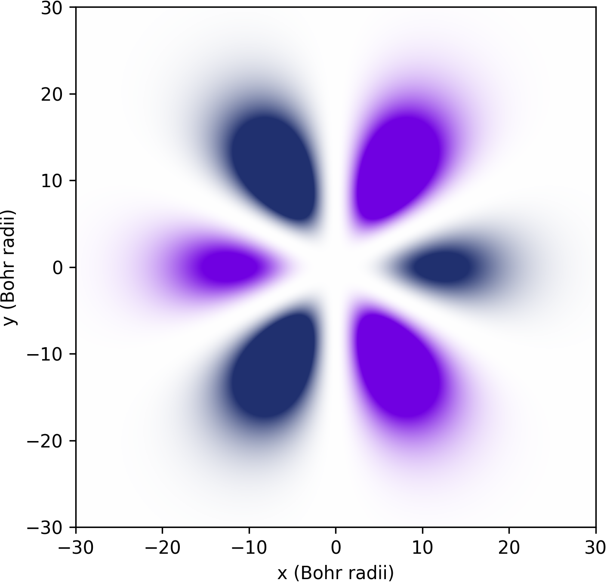

.. _H2:

Simulating the dynamics of the $H_2$ molecule
=============================================

Quantum computing offers a promising avenue for simulating complex molecular systems, potentially revolutionizing fields like drug discovery, materials science, and chemical engineering. At the heart of this capability lies Hamiltonian simulation, a powerful technique that allows us to model the quantum behavior of molecules with exponentially less resources compared to classical computers.
In this tutorial, we'll explore how to simulate molecules using Hamiltonian simulation techniques implemented in Qrisp. Since version 0.5, Qrisp provides a user-friendly interface for simulating quantum many body systems, making it a suitable tool for tackling complex quantum chemistry problems.
We'll cover the following key aspects:

* :ref:`The fundamentals of Hamiltonian simulation and the second quantization <ham_sim_fundamentals>`
* :ref:`Loading molecular data into Qrisp <molecular_data_tut>`
* :ref:`Performing Hamiltonian simulation <ham_sim_tut>`

By the end of this tutorial, you'll have a solid understanding of how to leverage Qrisp's capabilities to perform molecular simulations on quantum computers. 
Let's dive in and discover how Qrisp can help us unlock the quantum secrets of molecules!

.. _ham_sim_fundamentals:

The fundamentals of Hamiltonian simulation and the second quantization
----------------------------------------------------------------------

To understand what "second quantization" means it might be helpful to start with the **first quantization**. The idea behind this is that physical systems containing only a single particale are described by a Hilbert space $\mathcal{H}$, which consits of a set of basis vectors:

.. math::
    \mathcal{H} = \text{span}(\ket{\psi_i} \mid i \in \mathcal{N})

An arbitrary state $\ket{\phi}$ can therefore be represented by a linear combination of these basis vectors:

.. math::
    \ket{\phi} = \sum_{i = 0}^\infty a_i \ket{\psi_i},\quad a_i \in \mathbb{C}

What these particular $\ket{\psi_i}$ represent depends on the system. For instance for the Hydrogen atom these basis vectors represent the `atomic orbitals <https://en.wikipedia.org/wiki/Atomic_orbital>`_. If you participated in a course for atomic physics before, you might have seen pictures like this:

This plot represents the real part of the amplitude of one of the basis vectors (the one with $n = 4, k = 3, l = 1$ to be precise).

The **second quantization** now describes how systems including *multiple particles* are treated. For this the so called ladder operators are introduced, that is, for each basis state $\ket{\psi_i}$ there is an operator $a_i^\dagger$, which creates a particle in state $\ket{\psi_i}$. A creative notation for this might be:

.. math::
    a_i^\dagger \ket{\phi} = \ket{\phi \text{ + a particle in state i}}

For this reason, this operator is called the "creator". Similarly there is also the "annihilator" $a_i$, which destroys the particle.

The ladder operators therefore determine the intrinsic interaction behavior of the particles. Observations from experiments show that there are two types of particles whose ladder operators follow different sets of laws.

For **Bosons** the ladder operators obey `commutator <https://en.wikipedia.org/wiki/Commutator>`_ laws:

.. math::
    [a_i, a^\dagger_j] = a_i a^\dagger_j - a_j a^\dagger_i = \delta_{ij}\\
    [a^\dagger_i, a^\dagger_j] = [a_i, a_j] = 0

For **Fermions** the ladder operators obey anti-commutator laws:

.. math::
    \{a_i, a^\dagger_j\} = a_i a^\dagger_j + a_j a^\dagger_i = \delta_{ij}\\
    \{a^\dagger_i, a^\dagger_j\} = \{a_i, a_j\} = 0

Note that the fermionic laws imply $a_i^\dagger a_i^\dagger = 0$. This means that an operator, which tries to insert two particles in the same state will immidiately become 0 and therefore not contribute. This is known as `Pauli exclusion principle <https://en.wikipedia.org/wiki/Pauli_exclusion_principle>`_.

Within Qrisp it is currently only possible to model **fermions**, which is for many applications in chemistry the more important case. A modelling framework for bosons will follow in a future release. To start building a fermionic operator, we import the functions ``c`` and ``a`` for creators and annihilators.

::
    
    from qrisp.operators import c, a
    O = a(0)*c(1) + a(1)*a(2)
    print(O)
    # Yields: a0*c1 + a1*a2
    
To learn more how to build and manipulate these expressions, please look at the documentation page of :ref:`FermionicOperator`. For instance, the hermitian conjugate can be computed using the :meth:`.dagger <qrisp.operators.fermionic.FermionicOperator.dagger>` method.

::

    print(O.dagger())
    # Yields: a1*c0 + c2*c1

To apply the Pauli exclusion principle but also other anti-commutation laws for simplifaction, you can call the :meth:`reduce <qrisp.operators.FermionicOperator.reduce>` method.

::

    O = a(0)*a(0) + a(1)*a(2) - a(2) * a(1)
    print(O.reduce())
    #Yields 2*a1*a2
    
The Jordan-Wigner embedding
^^^^^^^^^^^^^^^^^^^^^^^^^^^

A natural question that comes up is how to represent the ladder operators and the corresponding states on a quantum computer. The most established way to do this is to use the `Jordan-Wigner embedding <https://en.wikipedia.org/wiki/Jordan%E2%80%93Wigner_transformation>`_ (even though there are several `interesting alternatives <https://arxiv.org/abs/2212.09731>`_). The Jordan-Wigner embedding identifies each ladder term with an operator that acts on a qubit space:

.. math::
    a_k = A_k \prod_{i = 0}^{k-1} Z_i

Where $A_k = \ket{0}\bra{1}$ and $Z_i$ are the Pauli-Z Operators. Feel free to verify that this indeed satisfies the anti-commutator relations! We can apply the Jordan-Wigner embedding with the corresponding method:

::

    O_fermionic = a(4)
    O_qubit = O_fermionic.to_qubit_operator(mapping_type = "jordan_wigner")
    print(O_qubit)
    # Yields: Z_0*Z_1*Z_2*Z_3*A_4

This gives us an instance of the :ref:`QubitOperator` class. What is the difference to a :ref:`FermionicOperator`? While FermionicOperators model the more abstract fermion space, qubit operators represent operators on the qubit space $(\mathbb{C}^2)^{\otimes n}$ and can be simulated and evaluated efficiently using a quantum computer. In particular, QubitOperators can represent tensor products of the following operators $X,Y,Z,A,C,P^0,P^1,I$. Make sure to read the :ref:`documentation <QubitOperator>` to learn about their definition!

Dynamics
^^^^^^^^

Both boson and fermion systems evolve under the Schrödinger equation:

.. math::
    i \hbar \frac{d}{dt}\ket{\phi} = H \ket{\phi}
    
Where $H$ is a hermitian operator called Hamiltonian. *Hamiltonian simulation* is the procedure of mimicing the dynamics of a physical system described by a Hamiltonian $H$ using a quantum computer. In other words: creating the state $\ket{\phi, t} = \text{exp}(iHt)\ket{\phi, 0}$ artificially to evaluate some of its properties.

For bosonic systems, the Hamiltonian can only be a linear combination of products of the bosonic ladder operators. The equivalent holds for fermionic systems.

.. math::
    H = \sum_{n=0}^{\infty} \sum_{i_1, \ldots, i_n} \sum_{j_1, \ldots, j_n} h_{i_1 \ldots i_n, j_1 \ldots j_n} a_{i_1}^{\dagger} \ldots a_{i_n}^{\dagger} a_{j_1} \ldots a_{j_n}
    
Where all $h \in \mathbb{R}$. An example Hamiltonian could therefore look like this

.. math::
    H = h_{01}(a_0a^\dagger_1 + a_1a^\dagger_0) + h_{00}a_0a^\dagger_0
    
The particular values of the coefficients (like $h_{01}$ and $h_{00}$) are determined by the specifics of the system. For many systems of interest these numbers involve the computation of some integrals - a task that can be efficiently performed on the classical computer.

.. _molecular_data_tut:

Loading molecular data into Qrisp
=================================

If you don't feel like solving integrals right now, we've got you covered! Qrisp has a convenient interface to `PySCF <https://pyscf.org/>`_, which loads the molecular data directly as :ref:`FermionicOperator`. For that you need PySCF installed (``pip install pyscf``). If you're on Windows you might need to do some `WSL gymnastics <https://harshityadav95.medium.com/jupyter-notebook-in-windows-subsystem-for-linux-wsl-8b46fdf0a536>`_.

::

    from pyscf import gto
    mol = gto.M(atom = '''H 0 0 0; H 0 0 0.74''', basis = 'sto-3g')
    H_ferm = FermionicOperator.from_pyscf(mol)
    print(H_ferm)

This snippet uses the :meth:`.from_pyscf <qrisp.operators.fermionic.FermionicOperator.from_pyscf>` method to load the :ref:`FermionicOperator` representing the orbitals of the Dihydrogen molecule $H_2$. Or to be more precise, two hydrogen nuclei seperated by $0.74$ Angstrom. We take a look at the ladder operators:
    
::

    -0.181210462015197*a0*a1*c2*c3 + 0.181210462015197*a0*c1*c2*a3 
    - 1.25330978664598*c0*a0 + 0.674755926814448*c0*a0*c1*a1 
    + 0.482500939335616*c0*a0*c2*a2 + 0.663711401350814*c0*a0*c3*a3 
    + 0.181210462015197*c0*a1*a2*c3 - 0.181210462015197*c0*c1*a2*a3
    - 1.25330978664598*c1*a1 + 0.663711401350814*c1*a1*c2*a2 
    + 0.482500939335616*c1*a1*c3*a3 - 0.475068848772178*c2*a2 
    + 0.697651504490463*c2*a2*c3*a3 - 0.475068848772178*c3*a3

Or if preferred, the Jordan-Wigner embedding:

::

    H_qubit = H_ferm.to_qubit_operator()
    print(H_qubit)

::
    
    0.181210462015197*A_0*A_1*C_2*C_3 - 0.181210462015197*A_0*C_1*C_2*A_3 
    - 0.181210462015197*C_0*A_1*A_2*C_3 + 0.181210462015197*C_0*C_1*A_2*A_3
    - 1.25330978664598*P^0_0 + 0.674755926814448*P^0_0*P^0_1 
    + 0.482500939335616*P^0_0*P^0_2 + 0.663711401350814*P^0_0*P^0_3 
    - 1.25330978664598*P^0_1 + 0.663711401350814*P^0_1*P^0_2 
    + 0.482500939335616*P^0_1*P^0_3 - 0.475068848772178*P^0_2 
    + 0.697651504490463*P^0_2*P^0_3 - 0.475068848772178*P^0_3
   
.. _ham_sim_tut:

Performing Hamiltonian simulation
=================================

To perform Hamiltonian simulation, we use the :meth:`.trotterization <qrisp.operators.qubit.QubitOperator.trotterization>` method, which gives us a Python function that performs a simulation of the Hamiltonian on a :ref:`QuantumVariable`.

::

    from qrisp import QuantumVariable
    
    electron_state = QuantumVariable(4)
    electron_state[:] = {"1100": 2**-0.5, "0001": 2**-0.5}

This snippet initializes the state $\ket{\phi, t = 0}$, which is a superposition of 2 electrons in the lower two orbitals and a state of 1 electron in the highest orbital. We now perform the Hamiltonian simulation:

::
    
    U = H_ferm.trotterization()
    U(electron_state, t = 100, steps = 20)
    
This snippets simulates the Dihydrogen molecule for $t = 100$ Angstrom seconds, i.e. 

.. math::
    \begin{align}
    \ket{\phi, t = 100} &= U(t = 100)\ket{\phi, t =0}\\
    &= \text{exp}(100iH)\ket{\phi, t =0}
    \end{align}
    
Finally, we want to extract some physical quantity from our simulation. Our quantity of choice is the particle number operator:

.. math::

    N = \sum_{i = 0}^n a^\dagger_i  a_i

In python code:

::

    N = sum(c(i)*a(i) for i in range(4))

For each state $i$, this operator leaves the "electron at $i$" state invariant (i.e. a +1 contribution) and maps the "no electron at $i$" state to a 0 contribution. Its eigenvalues therefore indicate the number of electrons in the system. To evaluate the expectation value $\bra{\phi} N \ket{\phi}$, we call the :meth:`.get_measurement <qrisp.operators.qubit.QubitOperator.get_measurement>` method.

::

    expectation_value = N.get_measurement(electron_state, precision = 0.01)
    print(expectation_value)
    # Yields: 1.50440973329083
    
We see that the expectaction value is (almost) 1.5 because $(2+1)/2 = 1.5$, which is expected assuming that the dynamics under the given Hamiltonian doesn't create particles out of nowhere (or destroys them).
The value is not exact because of statistical noise - we can increase the precision (which will however require more measurements from the backend!):

::

    print(N.get_measurement(electron_state, precision = 0.0001))
    # Yields: 1.4999799028124874
    
This concludes our little tutorial on Hamiltonian simulation. We hope you could learn something and feel motivated to explore more systems and techniques! Make sure to also check out the :ref:`MolecularPotentialEnergyCurve` example to learn how to compute the ground state for both types of operators!

For your reference, we give the full code below:

::

    # Loading molecular data
    from qrisp.operators import a,c, FermionicOperator
    from pyscf import gto
    mol = gto.M(atom = '''H 0 0 0; H 0 0 0.74''', basis = 'sto-3g')
    H_ferm = FermionicOperator.from_pyscf(mol)
    
    # Initializing the quantum state
    from qrisp import QuantumVariable
    electron_state = QuantumVariable(4)
    electron_state[:] = {"1100": 2**-0.5, "0001": 2**-0.5}

    # Performing the simulation
    U = H_ferm.trotterization()
    U(electron_state, t = 100, steps = 20)
    
    # Evaluating the number operator
    N = sum(c(i)*a(i) for i in range(4))
    expectation_value = N.get_measurement(electron_state, precision = 0.01)
    print(expectation_value)
    
    
    
    
