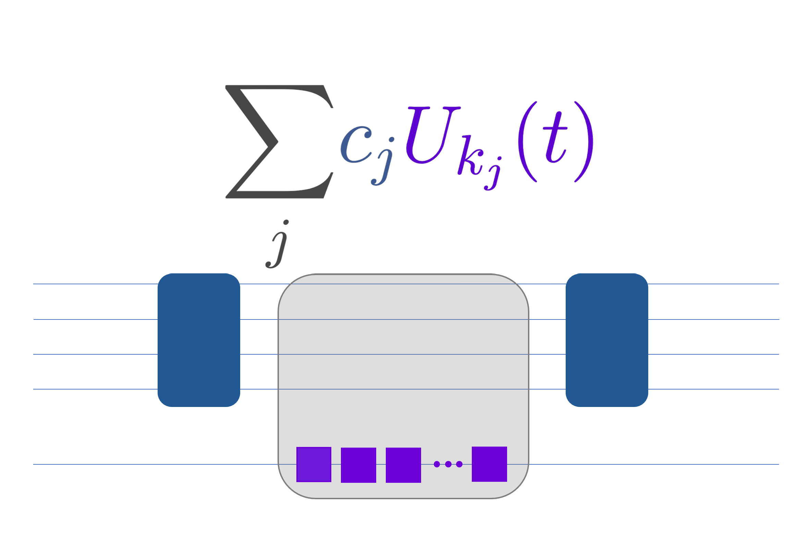

.. _LCU_tutorial:

Linear Combination of Unitaries (LCU) primitive and its applications
====================================================================

If you’ve ever wondered how to bend the rules of quantum mechanics (without actually breaking them), you’re in the right place. This tutorial is your roadmap to the Linear Combination of Unitaries (LCU) protocol—a powerful tool that lets you simulate non-unitary operations by cleverly mixing unitaries, opening doors to advanced quantum algorithms and simulations.

Here’s what you’ll discover as you journey through this tutorial:

- We’ll start by demystifying the LCU protocol: why it’s needed and what problems it solves. You’ll learn the core ideas behind representing complex quantum operations as sums of simpler, unitary building blocks aka block encodings.

- Next, we’ll roll up our sleeves and see how LCU comes alive in Qrisp (Frankenstein intensifies). This section is hands-on: you’ll explore annotated code examples, understand the structure of Qrisp’s LCU implementation, and see how to prepare ancilla variables, orchestrate controlled unitaries, and interpret the results.

- We won't stop at just understanding LCU, but instead also use it as an algorithmic building block (primitive) to perform another algorithm. In our final section, we combine the strengths of Trotterization and LCU to unlock the Linear Combination of Hamiltonian Simulation (LCHS) protocol. Here, you’ll learn how to simulate functions of Hamiltonians—like $\cos(H)$.

If all goes well (if not, let us know about which parts should be elaborated upon further), you'll be motivated to apply LCU and extend it to tackle `Quantum Signal
Processing (QSP) <https://journals.aps.org/prxquantum/abstract/10.1103/PRXQuantum.5.020368>`_, and/or `Quantum Singular Value Transformation (QSVT) <https://dl.acm.org/doi/abs/10.1145/3313276.3316366>`_. Until the implementation in Qrisp, the proof to this is left for the reader (which is not a broad time-window).

Nothing more to say other than let's go!

LCU in theory
-------------

So, you want to perform operations that aren't strictly allowed by the quantum computing rulebook?

Enter the Linear Combination of Unitaries (LCU) protocol—a foundational quantum algorithmic primitive that lets you implement a non-unitary operator $A$ by cleverly expressing it as a weighted sum of unitary operators: 

.. math::
    A=\sum_ic_iU_i

This is the quantum equivalent of ordering a custom pizza: you pick your favorite toppings (unitaries), assign them weights (coefficients), and hope the outcome is deliciously non-classical.

Core components
^^^^^^^^^^^^^^^

The LCU protocol works by embedding your non-unitary operator into a larger, unitary quantum circuit. The magic happens in three acts, known as **block encoding**:

- **PREPARE**: Prepares an ancilla quantum variable in a superposition encoding the normalized coefficients $c_i\geq0$ of the target operator

.. math ::

        \mathrm{PREPARE}|0\rangle=\sum_i\sqrt{\frac{c_i}{\lambda}}|i\rangle

- **SELECT**: Applies the unitary $U_i$ to the input state $\ket{\psi}$, controlled on the ancilla variable being in state $|i\rangle$.

.. math ::

    \mathrm{SELECT}|i\rangle|\psi\rangle=|i\rangle U_i|\psi\rangle

- **PREPARE** $^\dagger$: Applies the inverse prepartion to the ancilla.

Success condition
^^^^^^^^^^^^^^^^^

The LCU protocol is deemed successful only if the ancilla variable is measured in the $\ket{0}$ state, which occurs with a probability proportional to :math:`\frac{\langle\psi|A^{\dagger}A|\psi\rangle}{\lambda^2}` where $\lambda=\sum_ic_i$.
The :func:`qrisp.inner_LCU` does not perform the measurement; it returns the ancilla variable and the transformed target variable.

The approach you’ve just studied was pioneered by Nathan Wiebe, whose contributions have fundamentally shaped the field of quantum algorithm design, particularly in Hamiltonian simulation and quantum linear systems.

If you’re eager for more than equations and want intuition delivered with clarity, Nathan Wiebe’s YouTube seminar series is a goldmine. His channel is packed with lucid explanations of quantum primitives and routines, making even the most complex ideas accessible. The video below, authored by Wiebe himself, distills the essence of the LCU protocol and its applications—so whether you’re seeking a first encounter or a deeper understanding, this is a resource not to miss.

.. youtube:: irMKrOIrHP4

LCU in Qrisp
------------

With the theoretical foundation of the Linear Combination of Unitaries (LCU) protocol in place, it’s time to see how these abstract concepts translate into practical quantum programming using Qrisp. This section will connect the dots between the block-encoding theory and Qrisp’s implementation, showing how to realize LCU’s power on real quantum programms and simulations.

Qrisp provides a collection of functions, three to be exact, that directly mirror the theoretical structure of LCU, allowing you to implement, visualize, and experiment with the protocol as described in the previous section. Let's take a closer look and disect the inner workings of these aforementioned functions.

Underlying protocol in two lines of code in :func:`qrisp.inner_LCU`
^^^^^^^^^^^^^^^^^^^^^^^^^^^^^^^^^^^^^^^^^^^^^^^^^^^^^^^^^^^^^^^^^^^

:func:`qrisp.inner_LCU` implements the core LCU protocol (prepare-select/qswitch-unprepare) without the Repeat-Until_Success (RUS) protocol validating the correct execution of the primitive.

At its core, the LCU protocol in Qrisp is realized by two key operations: preparing the ancilla in the right superposition (encoding the coefficients) and applying the controlled unitaries. The function inner_LCU exposes this structure directly, without any success-checking or repetition logic.

In order to have this tutorial reproduceable, this is the entire :func:`qrisp.inner_LCU`, as it is defined in the Qrisp repository:
::

    def inner_LCU(operand_prep, state_prep, unitaries, num_unitaries=None, oaa_iter=0):

        if not callable(unitaries):
            if not isinstance(unitaries, list):
                raise TypeError("unitaries must be callable or list[callable].")
            num_unitaries = len(unitaries)
        else:
            if num_unitaries == None:
                raise ValueError(
                    "The number of unitiaries must be specified if unitaries is callable."
            )

        # Prepare the operand (target quantum variable)
        operand = operand_prep()

        # Prepare the ancilla variable (case indicator)
        n = np.int64(np.ceil(np.log2(num_unitaries))) # n = number of ancilla qubits needed
        case_indicator = QuantumFloat(n)  

        # PREPARE + SELECT + PREPARE† (block encoding)
        def LCU_state_prep(case_indicator, operand):
            with conjugate(state_prep)(case_indicator):
                qswitch(operand, case_indicator, unitaries)

        def oracle_func(case_indicator, operand):
            tag_state({case_indicator: 0})

        LCU_state_prep(case_indicator, operand)

        if oaa_iter > 0:
            amplitude_amplification(
                [case_indicator, operand],
                LCU_state_prep,
                oracle_func,
                reflection_indices=[0],
                iter=oaa_iter,
            )

        return case_indicator, operand

Unpacking the code (which pack a hefty punch) becomes self explenatory because of the modularity that Qrisp offers through various modules. Let's unveil the concepts bit by bit.

First we have to prepare the ancilla variables with ``state_prep(case_indicator)``. This step transforms the ancilla in a superposition reflecting the coefficients $c_i$. 

We already learned about the SELECT operator in the theoretical overview. Here we put it in action using :func:`qrisp.qswitch` ``(operand, case_indicator, unitaries)``. This applies the correct unitary $U_i$ controlled on the ancilla.

the ``qrisp.conjugate`` environment ensures the inverse preparation (PREPARE $^\dagger$) is applied after SELECT, matching the block-encoding structure.

The probability of success in LCU can be low, especially for certain coefficient choices. Qrisp allows you to boost this probability using oblivious amplitude amplification (OAA), which iteratively amplifies the "good" outcome. This is done by
:func:`qrisp.amplitude_amplification`, which repeatedly applies the LCU block and a reflection (oracle) to amplify the amplitude of the $\ket{0}$ state. The ``oaa_iter`` keyword controls how many amplification iterations are performed. 
The oracle tags the success state, and the reflection boosts its amplitude, increasing the chance of success in fewer repetitions.

It is also possible to do too many iterations and therefore getting a lower probability of success, when we reflect beyond the ideal state.

For more information on Oblivious Amplitude Amplification, here is Nathan Wiebe's seminar on this primitive:

.. youtube:: FmZcj7O4U2w

Exactly this is done in the ``oracle_func``, where we tag the state where ``measure(case_indicator) == 0``. As we will see, this is equivalent to successfully adding the unitaries
to our ``operand`` QuantumVariable.

The oblivious amplitude amplification is then performed based on how many iterations we have specified in the ``oaa_iter`` keyword.

Success condition with :func:`qrisp.LCU`
^^^^^^^^^^^^^^^^^^^^^^^^^^^^^^^^^^^^^^^^
:func:`qrisp.LCU` wraps inner_LCU with a :ref:`repeat-until-success (RUS) routine <RUS>` protocol, repeatedly running the circuit until the ancilla is measured in the $\ket{0}$ state (the success condition described in theory). This matches the probabilistic nature of LCU’s success and automates the process for the user.

The LCU protocol is only "successful" if, after running the block-encoded circuit, the ancilla is measured in the $\ket{0}$ state. Qrisp's LCU function wraps inner_LCU with :ref:`RUS <RUS>`, automating this process.

:: 

    @RUS
    def LCU(operand_prep, state_prep, unitaries, num_unitaries=None, oaa_iter=0):
        case_indicator, qv = inner_LCU(
        operand_prep, state_prep, unitaries, num_unitaries, oaa_iter
        )

        # Success condition
        success_bool = measure(case_indicator) == 0
        return success_bool, qv

The ``measure(case_indicator) == 0`` checks if the ancillae are in the $\ket{0}$ state, signalling success. If not, the protocol is repeated (handled by the :func:`RUS` in Qrisp). This matches the theoretical requirement that the LCU protocol only works when the ancillae are measured in the $\ket{0}$ state.

Underlying circuit (purely educational) with :func:`qrisp.view_LCU`
^^^^^^^^^^^^^^^^^^^^^^^^^^^^^^^^^^^^^^^^^^^^^^^^^^^^^^^^^^^^^^^^^^^

For educational and debugging purposes, Qrisp provides :func:`qrisp.view_LCU`, which constructs and returns the explicit quantum circuit corresponding to your LCU protocol. This lets you see how the ancilla preparation, controlled unitaries, and inverse preparation are realized at the gate level.

::

    def view_LCU(operand_prep, state_prep, unitaries, num_unitaries=None):

        if not callable(unitaries):
            if not isinstance(unitaries, list):
                raise TypeError("unitaries must be callable or list[callable].")
            num_unitaries = len(unitaries)
        else:
            if num_unitaries == None:
                raise ValueError(
                    "The number of unitiaries must be specified if unitaries is callable."
                )

        jaspr = make_jaspr(inner_LCU)(operand_prep, state_prep, unitaries, num_unitaries)

        # Convert Jaspr to quantum circuit and return the circuit
        return jaspr.to_qc(num_unitaries)[-1].transpile(3)

``make_jaspr(inner_LCU)`` wraps the protocol for circuit extraction. ``to_qc`` converts the protocol to a quantum circuit object. ``.transpile(3)`` optimizes and formats the circuit for visualization. Printing ``qc`` reveals the gate sequence showing PREPARE, qswitch, and PREPARE$^\dagger$ as described in theory.

Trotterization + LCU = LCHS
---------------------------