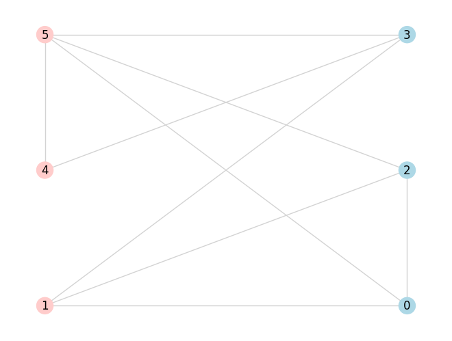

.. _QUBOQAOAdoc:

QAOA QUBO
=========

The QUBO problem and its QAOA implementation is discussed in plenty of detail in the :ref:`QUBO tutorial <QUBOQAOA>`.
All the necessary ingredients and required steps to run QAOA are elaborated on in an easy to grasp manner.

Here, we provide a condensed implementation of QAOA for QUBO using all of the predefined functions.

.. currentmodule:: qrisp.qaoa.problems.QUBO

Problem description
-------------------

Given a Graph  :math:`G = (V,E)` find a maximum cut, i.e., a bipartition $S$, $V\setminus S$ of the set of vertices $V$ such that the number of edges between $S$ and $V\setminus S$ is maximal.

Solve QUBO
----------

.. autofunction:: solve_QUBO

Cost operator
-------------

.. autofunction:: create_QUBO_cost_operator

Classical cost function
-----------------------

.. autofunction:: create_QUBO_cl_cost_function

QUBO problem
------------

.. autofunction:: QUBO_problem

Example implementation
----------------------

::

    from qrisp import QuantumVariable
    from qrisp.qaoa import QAOAProblem, RX_mixer, create_maxcut_cl_cost_function, create_maxcut_cost_operator
    import networkx as nx

    G = nx.erdos_renyi_graph(6, 0.7, seed =  133)
    qarg = QuantumVariable(G.number_of_nodes())

    qaoa_maxcut = QAOAProblem(cost_operator=create_maxcut_cost_operator(G),
                            mixer=RX_mixer, 
                            cl_cost_function=create_maxcut_cl_cost_function(G))
    results = qaoa_maxcut.run(qarg=qarg, depth=5, max_iter=50)

That's it! In the following, we print the 5 most likely solutions together with their cost values.

::
   
    cl_cost = create_maxcut_cl_cost_function(G)

    print("5 most likely solutions")
    max_five = sorted(results.items(), key=lambda item: item[1], reverse=True)[:5]
    for res, prob in max_five:
        print(res, prob, cl_cost({res : 1}))

Finally, we visualize the most likely solution.

::

    most_likely = max_five[0][0]
    nx.draw(G, with_labels = True,
            node_color=['#FFCCCB' if most_likely[node]=='0' else '#ADD8E6' for node in G.nodes()],
            edge_color='#D3D3D3',
            pos = nx.bipartite_layout(G, [node for node in G.nodes() if most_likely[node]=='0']))

